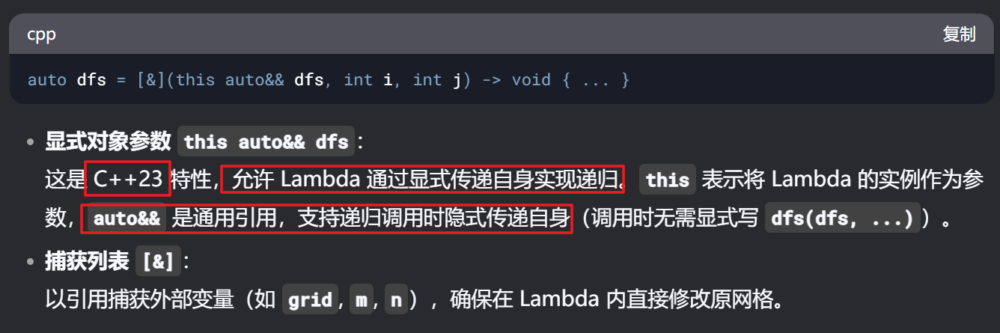

```cpp
class Solution {
public:
    int numIslands(vector<vector<char>>& grid) {
        int m = grid.size(), n = grid[0].size();

        auto dfs = [&](this auto&& dfs, int i , int j) ->void {
            //边界条件 ： 出界 不是'1'
            if(i < 0 || i >= m || j < 0 || j >= n || grid[i][j] != '1') return;

            // 标记
            grid[i][j] = '2';
            
            //上下左右
            dfs(i - 1, j); //上
            dfs(i + 1, j); //下
            dfs(i, j - 1); //左
            dfs(i, j + 1); //右

        };


        int ans = 0;
        for(int i = 0; i < m; i++){
            for(int j = 0; j < n; j++){
                if(grid[i][j] == '1'){ //找到新大陆
                    dfs(i,j);//走遍新大陆，留下标记
                    ans++;
                }

            }

        }

        return ans;

    }

};

```