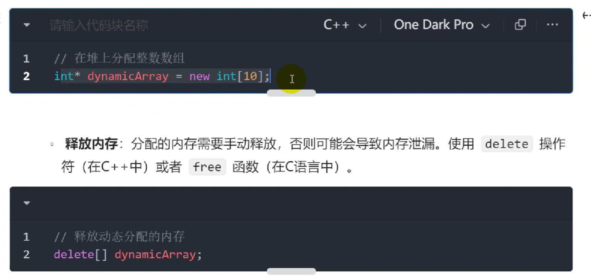

[TOC]

### 整体结构

> 局部变量放入栈中，由编译器和操作系统决定它的生命周期
> 程序员 new一个变量或者自己分配的内存放入堆

### 内存结构详解
#### 代码区

> 4、5指令放到代码段中，“”数据放入只读数据段中。

> 函数的代码段地址与 压栈出栈有关

#### 常量存储区

#### 全局/静态存储区

#### 栈

#### 堆

#### 小结

> 内存泄漏new delete
> 野指针 初始化
> 栈溢出 陷于死循环 大量局部变量压栈
> 悬空指针 指针指向的内存被释放了但指针还未被删除
> 智能指针 本质封装了一个原始C++指针的类模板，释放原理是依靠类对象的析构函数实现的
>

