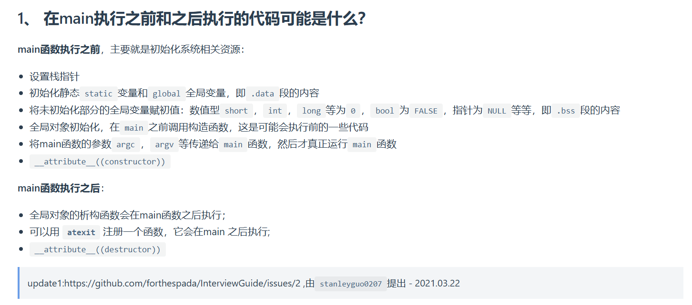

根据图片内容，以下是关于程序中 `main` 函数执行前后可能执行的代码的分析：

---

### **一、main 函数执行前的代码**
#### 1. **系统资源初始化**
   - **栈指针设置**：操作系统为进程分配内存后，初始化栈指针（SP），为函数调用和局部变量准备存储空间。
   - **CPU/寄存器初始化**：设置初始指令指针（IP），跳转到程序入口（通常是 `_start`）。

#### 2. **全局变量与静态变量的初始化**
   - **.data 段初始化**：已初始化的全局变量（如 `int a = 10;`）会被复制到 `.data` 段，并赋予初始值。
   - **.bss 段清零**：未初始化的全局变量（如 `int b;`）会被分配到 `.bss` 段，并在程序启动时自动清零（C/C++默认行为）。
   - **全局对象的构造函数调用**（C++特性）：
     - 静态对象（包括全局对象和命名空间内的对象）的构造函数会在 `main` 前按编译器定义的顺序执行。
     - 注意：不同编译器对静态初始化顺序的处理可能不一致，可能导致依赖问题（如静态对象间的相互引用）。

#### 3. **main 参数传递**
   - 操作系统将命令行参数（`argc`, `argv`）传递给 `main` 函数，参数存储在栈或寄存器中（取决于架构和编译选项）。

#### 4. **构造函数属性（GCC扩展）**
   ```cpp
   __attribute__((constructor)) void before_main() {
       // 在 main 前执行的代码
   }
   ```
   - 通过 `__attribute__((constructor))` 标记的函数会在 `main` 前被自动调用，常用于初始化全局资源。

---

### **二、main 函数执行后的代码**
#### 1. **全局对象的析构函数调用**
   - 所有全局对象的析构函数会在 `main` 返回后按相反顺序执行（构造顺序的逆序，但不同编译器可能有差异）。
   - 示例：
     ```cpp
     class MyClass {
     public:
         ~MyClass() { /* 清理代码 */ }
     };
     MyClass obj; // 析构函数在 main 后执行
     ```

#### 2. **atexit 注册的函数**
   ```cpp
   #include <stdlib.h>
   
   void exit_func() {
       // 在 main 后执行的代码
   }
   
   int main() {
       atexit(exit_func); // 注册退出函数
       return 0;
   }
   ```
   - `atexit` 注册的函数会在 `main` 结束后按注册顺序的逆序执行（后进先出）。
   - 注意：最多可注册 `32` 个函数（Linux 系统默认限制）。

#### 3. **析构函数属性（GCC扩展）**
   ```cpp
   __attribute__((destructor)) void after_main() {
       // 在 main 后执行的代码
   }
   ```
   - 通过 `__attribute__((destructor))` 标记的函数会在 `main` 返回后被调用，类似于 `atexit`，但更底层。

---

### **三、其他需要注意的细节**
1. **程序入口**：
   - 实际程序入口是 `_start`（由链接器设置），而非 `main`。`_start` 负责初始化环境（如堆栈、全局变量）后调用 `main`。

2. **C/C++ 差异**：
   - **C语言**：无全局对象构造/析构，但可通过 `static` 变量初始化和 `atexit` 实现类似功能。
   - **C++**：依赖编译器的静态初始化顺序（如 GCC 的 `__CTOR__` 和 `__DTOR__` 符号表）。

3. **动态库初始化**：
   - 动态链接的库（`.so` 或 `.dll`）的 `init` 和 `fini` 函数也会在 `main` 前后执行，但具体顺序由动态链接器管理。

---

### **总结**
`main` 函数的执行前后涉及底层初始化、全局资源管理和扩展属性的使用。理解这些机制对调试程序启动/终止问题、优化内存使用（如静态变量初始化开销）以及编写可维护代码至关重要。