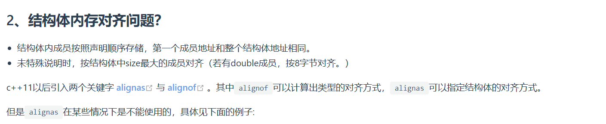
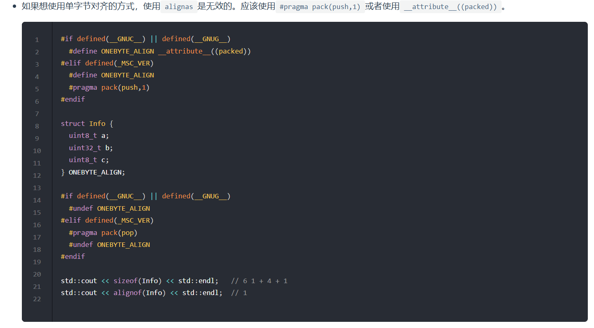
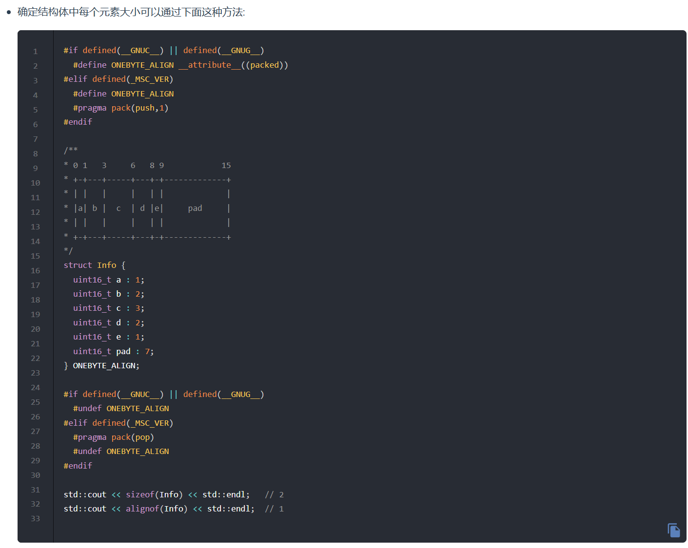

**结构体的内存对齐规则。结构体成员的内存通常按照它们的自然对齐方式来排列，也就是每个成员的起始地址必须是其大小的整数倍。然后整个结构体的大小必须是所有成员最大对齐值的倍数。**

``` C++
// alignas 生效的情况

struct Info {
  uint8_t a;
  uint16_t b;
  uint8_t c;
};

std::cout << sizeof(Info) << std::endl;   // 6  2 + 2 + 2
std::cout << alignof(Info) << std::endl;  // 2

struct alignas(4) Info2 {
  uint8_t a;  //1字节 占 偏移量0-3中的0
  uint16_t b;   //2字节 占偏移量0、1/2、3中的2、3
  uint8_t c;   //1字节 占偏移量4-7中的4
};

std::cout << sizeof(Info2) << std::endl;   // 8  2 + 2 + 4(2+2)
std::cout << alignof(Info2) << std::endl;  // 4


若 *alignas* 小于自然对齐的最小单位则被忽略。
// alignas 失效的情况
显式指定结构体或变量的对齐要求（覆盖默认对齐）。
注意：alignas 的值不能小于成员的最大对齐值，否则会导致未定义行为。

struct Info {
  uint8_t a;
  uint32_t b;
  uint8_t c;
};

std::cout << sizeof(Info) << std::endl;   // 12  4 + 4 + 4
std::cout << alignof(Info) << std::endl;  // 4

struct alignas(2) Info2 {
  uint8_t a;
  uint32_t b;
  uint8_t c;
};

std::cout << sizeof(Info2) << std::endl;   // 12  4 + 4 + 4
std::cout << alignof(Info2) << std::endl;  // 4
```



``` C++
#if defined(__GNUC__) || defined(__GNUG__)
  #define ONEBYTE_ALIGN __attribute__((packed))
#elif defined(_MSC_VER)
  #define ONEBYTE_ALIGN
  #pragma pack(push,1)
#endif

struct Info {
  uint8_t a;
  uint32_t b;
  uint8_t c;
} ONEBYTE_ALIGN;

#if defined(__GNUC__) || defined(__GNUG__)
  #undef ONEBYTE_ALIGN
#elif defined(_MSC_VER)
  #pragma pack(pop)
  #undef ONEBYTE_ALIGN
#endif

std::cout << sizeof(Info) << std::endl;   // 6 1 + 4 + 1
std::cout << alignof(Info) << std::endl;  // 1

```
---

```C++
#if defined(__GNUC__) || defined(__GNUG__)
  #define ONEBYTE_ALIGN __attribute__((packed))
#elif defined(_MSC_VER)
  #define ONEBYTE_ALIGN
  #pragma pack(push,1)
#endif

/**
* 0 1   3     6   8 9            15
* +-+---+-----+---+-+-------------+
* | |   |     |   | |             |
* |a| b |  c  | d |e|     pad     |
* | |   |     |   | |             |
* +-+---+-----+---+-+-------------+
*/
struct Info {
  uint16_t a : 1;
  uint16_t b : 2;
  uint16_t c : 3;
  uint16_t d : 2;
  uint16_t e : 1;
  uint16_t pad : 7;
} ONEBYTE_ALIGN;

#if defined(__GNUC__) || defined(__GNUG__)
  #undef ONEBYTE_ALIGN
#elif defined(_MSC_VER)
  #pragma pack(pop)
  #undef ONEBYTE_ALIGN
#endif

std::cout << sizeof(Info) << std::endl;   // 2
std::cout << alignof(Info) << std::endl;  // 1

```