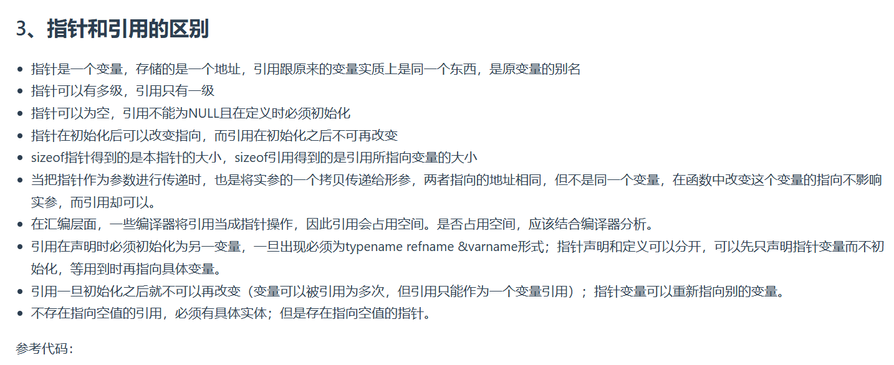

```C++
void test(int *p)
{
　　int a=1;
　　p=&a;
　　cout<<p<<" "<<*p<<endl;
}

int main(void)
{
    int *p=NULL;
    test(p);
    if(p==NULL)
    cout<<"指针p为NULL"<<endl;
    return 0;
}
//运行结果为：
//0x22ff44 1
//指针p为NULL


void testPTR(int* p) {
	int a = 12;
	p = &a;

}

void testREFF(int& p) {
	int a = 12;
	p = a;

}
void main()
{
	int a = 10;
	int* b = &a;
	testPTR(b);//改变指针指向，但是没改变指针的所指的内容
	cout << a << endl;// 10
	cout << *b << endl;// 10

	a = 10;
	testREFF(a);
	cout << a << endl;//12
}

```
