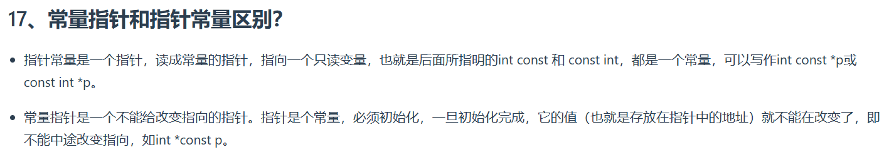

``` C++
C++ primer 第五版 -- P57

**指针和const**
> 指针本身是一个对象，它又可以指向另一个对象。因此，指针本身是不是常量与指针所指的是不是一个常量 是相互独立的两个问题。
---
> 顶层const表示指针本身是常量 - * const 常量指针
> 底层const表示指针所指的对象是一个常量 - const * 指针常量

注意：有关知识还有很多为表述可以看一看书！
```