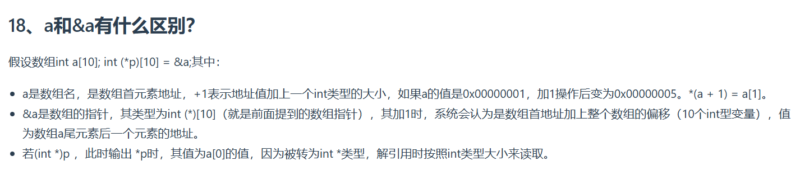

---
根据图片中关于数组名 `a` 和数组指针 `&a` 的对比分析，以下是详细的代码解释和内存行为总结：

---

### **核心概念区分**
#### **1. 数组名 `a` vs 数组指针 `&a`**
| **特性**           | **数组名 `a`**                          | **数组指针 `&a`**                      |
|--------------------|---------------------------------------|---------------------------------------|
| **类型**           | `int*`（隐式退化为指针）                | `int(*)[10]`（指向包含10个int的数组）  |
| **存储内容**       | 首元素地址（如 `0x00000001`）          | 整个数组的起始地址                    |
| **加减操作的语义**   | 指向元素的偏移（按单个元素大小）        | 指向数组的偏移（按整个数组大小）        |

---

### **代码示例分析**
```cpp
int a[10];                   // 假设 a 的首地址为 0x00000001
int (*p)[10] = &a;           // p 是指向数组 a 的指针，类型为 int(*)[10]

// 示例1：数组名 a 的行为
printf("%p\n", (void*)a);     // 输出 0x00000001（首元素地址）
printf("%p\n", (void*)(a+1));   // 输出 0x00000005（+4 字节）

// 示例2：数组指针 &a 的行为
printf("%p\n", (void*)p);     // 输出 0x00000001（与 a 相同的首地址）
printf("%p\n", (void*)(p+1));   // 输出 0x00000051（+40 字节，整个数组长度）

// 示例3：类型转换的副作用
int* q = (int*)p;            // 将数组指针强制转换为 int*
printf("%d\n", *q);           // 输出 a[0] 的值（正确）
printf("%p\n", (void*)(q+1)); // 输出 0x00000005（按 int* 加4）
```

---

### **关键差异详解**
#### **1. 地址计算方式**
- **`a + 1`**：
  - 数组名 `a` 退化为 `int*`，`a+1` 表示首元素地址增加一个 `int` 的大小（4字节）。
  - **结果**：指向 `a[1]` 的地址（如 `0x00000005`）。

- **`&a + 1`**：
  - 数组指针 `&a` 类型为 `int(*)[10]`，`+1` 表示跳过整个数组（10个 `int`，共40字节）。
  - **结果**：指向数组末尾下一个元素的地址（如 `0x00000051`，假设原地址为 `0x00000001`）。

#### **2. 类型转换的影响**
- **`(int*)p` 的风险**：
  - 将数组指针 `p`（类型 `int(*)[10]`）强制转换为 `int*`，得到的是数组首元素的地址。
  - 解引用 `(int*)p` 得到 `a[0]` 的值（正确）。
  - 但继续对 `(int*)p + 1` 操作时，会按 `int*` 的步长（4字节）移动，可能导致越界访问。

#### **3. 内存布局示意图**
```plaintext
// 数组 a 的内存分布（假设从 0x00 开始）
0x00  0x01  0x02 ... 0x09  0x0A  0x0B ... 
a[0] a[1] ... a[9] (未定义区域)
```

- **`a` 的值**：`0x00`（首元素地址）。
- **`a+1` 的值**：`0x04`（指向 `a[1]`）。
- **`&a` 的值**：`0x00`（整个数组起始地址）。
- **`&a+1` 的值**：`0x40`（跳过整个数组后的地址）。

---

### **注意事项**
1. **数组名与指针的陷阱**：
   - `a` 和 `&a` 的值相同（都指向首地址），但它们的类型和加减语义完全不同。
   - 错误示例：`int* p = &a;` 会导致类型不匹配（`int*` vs `int(*)[10]`），需通过显式转换。

2. **类型转换的安全性**：
   - 将数组指针转换为元素指针（如 `(int*)p`）是合法的，但需谨慎后续操作，避免越界。
   - 反之，将元素指针转换为数组指针（如 `(int(*)[10])q`）是未定义行为。

---

### **总结**
- **数组名 `a`**：隐式作为元素指针使用，适合逐个访问元素。
- **数组指针 `&a`**：用于整体操作（如传参给需要数组指针的函数），步长以整个数组为单位。
- **类型转换**：需明确目的，避免因类型掩盖导致的逻辑错误（如指针越界）。

通过理解这些差异，可以更安全地编写涉及数组和指针的代码，尤其是在处理多维数组和函数接口时。