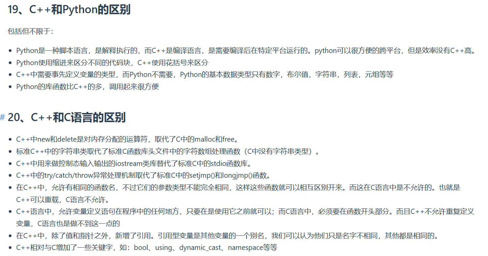

---
以下是基于图片内容的 **C++/Python 与 C++/C 语言对比分析**，结合技术细节和实际应用场景的扩展解读：

---

## **一、C++ vs Python 的核心差异**

### **1. 执行方式与性能**
- **Python**  
  - **解释型语言**：代码逐行执行，依赖解释器（如CPython）。  
  - **跨平台性**：通过虚拟机抽象底层硬件，实现“一次编写，到处运行”。  
  - **性能劣势**：动态类型和解释执行导致运行效率较低，适合快速开发而非高频计算场景（如算法竞赛或实时系统）。

- **C++**  
  - **编译型语言**：需预处理、编译生成机器码，直接运行于操作系统。  
  - **高效性与控制力**：接近硬件层操作，内存管理和指令优化能力极强，适合系统编程、游戏引擎等性能敏感领域。

---

### **2. 语法特性**
#### **(1) 代码结构**
- **Python**：使用 **缩进** 定义代码块（如 `if a > 0:` 后的冒号及对齐缩进）。  
  ```python
  def func():
      print("Hello")  # 缩进标识代码块
  ```
- **C++**：强制使用 **花括号 `{}`** 包裹代码块，语法更严格。  
  ```cpp
  void func() {
      std::cout << "Hello"; // 花括号明确作用域
  }
  ```

#### **(2) 变量声明**
- **Python**：动态类型，无需显式声明类型，支持多态数据结构（如列表、字典）。  
  ```python
  x = 5         # int类型
  x = "hello"   # 字符串类型
  arr = [1, 2, 3] # 动态数组
  ```
- **C++**：静态类型，需提前定义变量类型，类型不可变（如 `int x = 5;`）。  
  ```cpp
  int x = 5;
  std::vector<int> arr = {1, 2, 3}; // C++动态数组需显式包含头文件和命名空间
  ```

---

### **3. 内存管理**
#### **Python**
- **自动垃圾回收（GC）**：内置内存管理机制，开发者无需手动释放内存。  
  ```python
  a = [1, 2, 3]  # Python自动分配内存
  del a           # GC回收内存
  ```
- **潜在问题**：大对象或高频创建/销毁可能导致GC延迟，影响性能。

#### **C++**
- **手动内存管理**：开发者需通过 `new/delete` 或 `malloc/free` 分配/释放内存。  
  ```cpp
  int* ptr = new int(42);  // 动态分配
  delete ptr;             // 手动释放
  ```
- **灵活性与风险**：高效控制内存，但易出现内存泄漏或悬空指针问题。

---

### **4. 标准库与生态**
- **Python**  
  - **丰富的内置库**：如 `collections`（数据结构）、`requests`（网络请求）、`pandas`（数据分析）。  
  - **简洁的API调用**：例如文件操作仅需 `with open()`，无需底层系统调用。  

- **C++**  
  - **STL（标准模板库）**：提供容器（如 `std::vector`）、算法（如 `std::sort`）和迭代器，但代码量较大。  
  - **系统级接口**：可直接调用 POSIX 或 Windows API，适合操作系统、驱动开发。

---

## **二、C++ vs C 的核心差异**

### **1. 内存管理**
#### **(1) 动态分配**
- **C++**  
  - 使用 `new/delete` 运算符管理对象生命周期，支持构造函数/析构函数的调用。  
  ```cpp
  MyClass* obj = new MyClass(); // 调用构造函数
  delete obj;                  // 调用析构函数
  ```
- **C**  
  - 依赖 `malloc/free` 手动分配内存，无对象生命周期管理。  
  ```c
  MyClass* obj = (MyClass*)malloc(sizeof(MyClass));
  free(obj);
  ```

#### **(2) 字符串处理**
- **C++**  
  - 引入 `std::string` 类，封装字符串操作（拼接、查找等），避免缓冲区溢出。  
  ```cpp
  std::string s1 = "Hello";
  std::string s2 = s1 + ", World!"; // 安全拼接
  ```
- **C**  
  - 使用 `char*` 和 C 标准库函数（如 `strlen`, `strcpy`），需手动管理长度。  
  ```c
  char s1[100] = "Hello";
  strcat(s1, ", World!"); // 可能导致缓冲区溢出
  ```

---

### **2. 异常处理**
- **C++**  
  - 支持 `try/catch/throw` 机制，允许函数抛出异常并由调用者捕获。  
  ```cpp
  void func() {
      throw std::runtime_error("Error occurred");
  }
  int main() {
      try {
          func();
      } catch (const std::exception& e) {
          std::cerr << e.what() << std::endl;
      }
  }
  ```
- **C**  
  - 无内置异常机制，依赖 `setjmp/longjmp` 实现类似功能，但代码复杂度高且难以维护。  
  ```c
  if (error_occurred) {
      longjmp(jmp_buf, 1);
  }
  ```

---

### **3. 函数重载与多态**
#### **函数重载**
- **C++**  
  - 允许同一函数名但参数类型不同，编译器根据调用参数选择最优匹配。  
  ```cpp
  void print(int x) { /* ... */ }
  void print(double x) { /* ... */ }
  ```
- **C**  
  - 不支持函数重载，需通过不同函数名区分功能。

#### **多态**
- **C++**  
  - 支持虚函数（`virtual`）和派生类，实现运行时多态（如接口继承）。  
  ```cpp
  class Base {
  public:
      virtual void func() = 0;
  };
  class Derived : public Base {
  public:
      void func() override { /* ... */ }
  };
  ```
- **C**  
  - 仅通过函数指针或结构体模拟多态，需手动管理类型信息（如 `void*` 泛型指针）。

---

### **4. 语言特性扩展**
#### **C++ 新增特性**
- **引用（Reference）**：作为变量的别名，与指针类似但更安全。  
  ```cpp
  int a = 10;
  int& ref = a; // ref 是 a 的引用
  ```
- **模板（Template）**：泛型编程支持，实现代码复用（如 `std::vector<T>`）。  
- **命名空间（Namespace）**：避免全局符号冲突。  
  ```cpp
  namespace MyNamespace {
      void foo() { /* ... */ }
  }
  ```
- **RAII（资源获取即初始化）**：通过对象的生命周期管理资源（如文件句柄、锁）。  

#### **C 的局限性**
- **无面向对象支持**：需通过结构体和函数指针模拟类行为。  
- **类型安全较弱**：隐式类型转换可能导致未定义行为（如 `int` 转 `float`）。

---

## **三、总结与适用场景**

| **对比维度**       | **C++**                                | **Python**                              | **C**                                  |
|--------------------|---------------------------------------|---------------------------------------|---------------------------------------|
| **执行效率**       | 高（编译型，接近硬件）                | 低（解释型，动态类型）                | 中等（编译型，无高级抽象）            |
| **开发复杂度**     | 高（手动内存管理、复杂语法）          | 低（自动GC、简洁语法）                | 中等（低级操作灵活，但功能有限）        |
| **适用领域**       | 系统编程、游戏引擎、高性能计算        | Web开发、数据分析、脚本自动化        | 嵌入式系统、操作系统内核、设备驱动    |

---

### **四、实际开发建议**
1. **选 Python 的情况**：  
   - 快速原型开发、Web API 编写、数据科学任务（如使用 NumPy/Pandas）。  
   - 需要跨平台兼容性且对性能要求不高的场景。

2. **选 C++ 的情况**：  
   - 游戏开发、实时系统、高性能计算（如机器学习框架底层）。  
   - 需要精细控制内存或直接访问硬件资源的场景。

3. **选 C 的情况**：  
   - 嵌入式设备、操作系统内核、对内存占用极度敏感的项目。  
   - 需要兼容旧系统或特定硬件API的场景。

通过理解语言特性差异，开发者可针对项目需求选择最优工具，或在混合编程中合理组合（如 C++ 核心模块 + Python 脚本接口）。