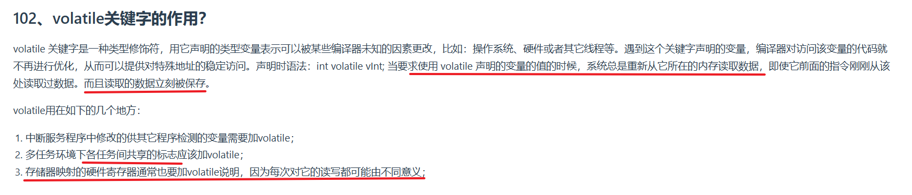

---

### **一、`volatile`关键字的核心作用**
`volatile` 是一种类型修饰符，用于告诉编译器：**该变量的值可能被程序之外的不可控因素（如硬件、操作系统、中断或其他线程）随时修改**。它的核心作用是**禁止编译器对该变量的访问进行优化**，确保每次访问都直接从内存中读取或写入，而不是依赖寄存器或缓存中的临时值。

#### **关键特性**：
1. **强制内存访问**：每次读写操作都直接访问内存，而非使用编译器优化后的缓存值。
2. **防止指令重排**：编译器不会对涉及`volatile`变量的代码进行指令重排优化（但需注意，`volatile`不提供内存屏障语义，需结合其他机制实现线程安全）。

---

### **二、`volatile`的典型使用场景**
根据图中内容，`volatile`主要用于以下场景：

#### **1. 中断服务程序（ISR）中的变量**
• **场景**：在嵌入式开发中，中断服务程序可能修改某个变量，主程序需要检测该变量的变化。
• **问题**：若变量未声明为`volatile`，编译器可能优化主程序对该变量的访问（如重复读取时直接从寄存器取值），导致主程序无法感知中断中的修改。
• **示例**：
  ```c
  volatile bool flag = false;  // 中断可能修改此标志

  void ISR() {
      flag = true;  // 中断触发时修改标志
  }

  int main() {
      while (!flag);  // 必须声明为volatile，否则可能死循环
      // 执行后续操作
  }
  ```

#### **2. 多任务环境下的共享标志**
• **场景**：多线程或多核环境中，多个任务共享某个状态标志。
• **问题**：若未声明为`volatile`，编译器可能优化掉对标志的重复检查（如认为标志不会改变），导致线程间通信失败。
• **示例**：
  ```c
  volatile int shared_counter = 0;  // 多线程共享的计数器

  void thread1() {
      while (shared_counter < 100) {
          // 执行任务
      }
  }

  void thread2() {
      while (true) {
          shared_counter++;
          sleep(1);
      }
  }
  ```
  **注意**：`volatile`不能替代锁或原子操作！它仅保证内存可见性，不保证操作的原子性。并发写入仍需同步机制（如互斥锁、原子类型）。

#### **3. 存储器映射的硬件寄存器**
• **场景**：在嵌入式系统中，硬件寄存器通过内存地址映射到程序空间，每次读写操作可能触发硬件行为。
• **问题**：若未声明为`volatile`，编译器可能合并多次读写操作（如优化掉“冗余”写操作），导致硬件行为不符合预期。
• **示例**：
  ```c
  volatile uint32_t* const HW_REGISTER = (uint32_t*)0x40001000;  // 硬件寄存器地址

  void configure_hardware() {
      *HW_REGISTER = 0x01;  // 写入配置命令
      *HW_REGISTER = 0x80;  // 必须直接写入内存，不可被优化合并
  }
  ```

---

### **三、`volatile`与编译器的优化**
#### **编译器优化示例**：
```c
int normal_var = 0;
volatile int volatile_var = 0;

void test() {
    // 普通变量可能被优化为单次读取
    if (normal_var) { /* ... */ }
    if (normal_var) { /* ... */ }  // 编译器可能认为条件不变，直接跳过

    // volatile变量强制每次读取内存
    if (volatile_var) { /* ... */ }
    if (volatile_var) { /* ... */ }  // 必须重新读取
}
```

#### **反汇编对比（伪代码）**：
• **普通变量**：
  ```asm
  load normal_var -> register R0
  compare R0, 0
  jump if zero
  compare R0, 0  ; 直接复用寄存器中的值，未重新读取内存
  jump if zero
  ```
• **volatile变量**：
  ```asm
  load volatile_var -> register R0
  compare R0, 0
  jump if zero
  load volatile_var -> register R1  ; 强制重新读取内存
  compare R1, 0
  jump if zero
  ```

---

### **四、`volatile`的局限性**
1. **不保证原子性**：对`volatile`变量的复合操作（如`i++`）仍可能被中断，需结合锁或原子操作。
2. **不替代同步机制**：多线程环境下，`volatile`无法解决竞态条件，仍需使用互斥锁、信号量等。
3. **与内存屏障的区别**：`volatile`不提供内存屏障（Memory Barrier）语义，无法强制多核间的执行顺序。

---

### **五、常见误区**
#### **误区1：用`volatile`实现线程安全**
• **错误示例**：
  ```c
  volatile int counter = 0;
  void increment() { counter++; }  // 多线程调用时仍可能丢失更新
  ```
• **正确做法**：使用原子操作（如C11的`atomic_int`）或锁。

#### **误区2：过度使用`volatile`**
• **问题**：不必要的`volatile`会降低性能（强制内存访问比寄存器操作慢）。
• **建议**：仅在必要时使用，避免滥用。

---

### **六、总结**
• **核心作用**：禁止编译器优化，强制内存访问。
• **适用场景**：中断变量、共享标志、硬件寄存器。
• **注意事项**：不保证原子性，不替代同步机制。

---

通过合理使用`volatile`，可以确保程序在特定场景下的正确性，但需结合其他机制实现完整的线程安全和硬件交互逻辑。