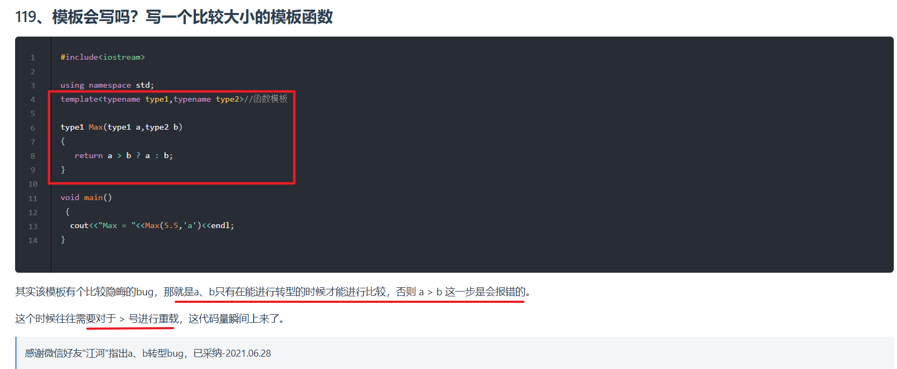

---

### **一、原始代码的问题分析**
#### **1. 原始模板函数的潜在问题**
```cpp
template<typename type1, typename type2>
type1 Max(type1 a, type2 b) {
    return a > b ? a : b;
}
```
• **类型不匹配风险**：当`type1`和`type2`不同时（如`double`和`char`），比较操作可能导致**隐式类型转换**，引发逻辑错误。
• **返回值类型问题**：强制返回`type1`类型可能导致**精度丢失**（例如，若`b`是更大的`double`值，但被截断为`type1`类型）。
• **语法错误**：图中 `cout<<"Max="<<Max(5.5," a');<<endl;` 存在引号不匹配和多余的分号。

---

### **二、改进方案：类型安全的重载函数**
#### **1. 使用函数重载替代模板**
通过**重载不同参数类型的比较函数**，明确比较逻辑，避免隐式转换：
```cpp
#include <iostream>
using namespace std;

// 重载1：比较同类型数值（int/double等）
template<typename T>
T Max(T a, T b) {
    return a > b ? a : b;
}

// 重载2：比较char和int（避免ASCII码误用）
int Max(char a, int b) {
    return static_cast<int>(a) > b ? static_cast<int>(a) : b;
}

// 重载3：比较字符串（按字典序）
const char* Max(const char* a, const char* b) {
    return strcmp(a, b) > 0 ? a : b;
}

int main() {
    // 正确调用示例
    cout << "Max(5, 3) = " << Max(5, 3) << endl;          // 输出5
    cout << "Max('a', 97) = " << Max('a', 97) << endl;    // 输出97（'a' ASCII码为97）
    cout << "Max(\"apple\", \"banana\") = " << Max("apple", "banana") << endl; // 输出banana
    return 0;
}
```

#### **2. 改进点说明**
| 改进方向          | 原始代码问题                           | 改进后代码优势                           |
|-------------------|---------------------------------------|------------------------------------------|
| **类型安全**      | 不同类型比较导致隐式转换（如`double`和`char`） | 明确参数类型，避免意外转换                |
| **返回值精度**    | 强制返回`type1`类型可能丢失精度        | 通过重载确保返回类型合理（如`char`转`int`）|
| **可读性**        | 通用模板可能导致歧义                  | 重载函数命名清晰，职责单一                |
| **错误预防**      | 无法比较字符串                        | 提供字符串专用重载，避免直接比较指针地址  |

---

### **三、进一步优化建议**
#### **1. 使用 `auto` 和 `decltype`（C++11及以上）**
若需保留模板的通用性，可以通过 `decltype` 自动推导返回类型，避免强制类型转换：
```cpp
template<typename T1, typename T2>
auto Max(T1 a, T2 b) -> decltype(a > b ? a : b) {
    return a > b ? a : b;
}
```

#### **2. 添加类型约束（C++20概念）**
使用 `concepts` 限制模板参数类型，禁止不合理的比较（如指针未重载`>`）：
```cpp
template<typename T>
requires std::totally_ordered<T> // 要求类型支持 > 操作
T Max(T a, T b) {
    return a > b ? a : b;
}
```

#### **3. 修正主函数错误**
```cpp
// 修正后的主函数调用
cout << "Max(5.5, 'a') = " << Max(5.5, static_cast<int>('a')) << endl; 
// 显式转换避免隐式类型问题
```

---

### **四、总结**
通过**函数重载**替代原始的通用模板，您可以：
1. **避免隐式类型转换**导致的逻辑错误。
2. **明确不同类型比较规则**，提升代码可维护性。
3. **增强类型安全性**，减少运行时风险。

建议根据实际需求选择重载或模板特化方案，并结合C++11/14/17特性进一步优化代码健壮性。