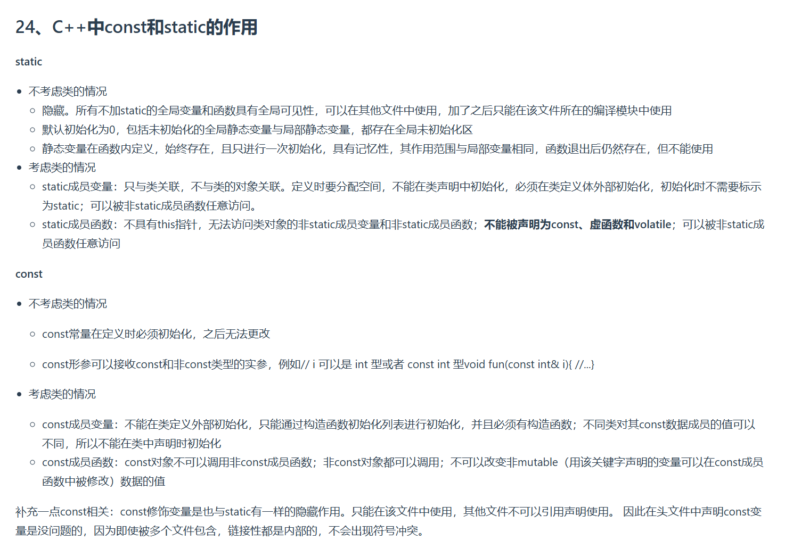

根据你提供的文档内容，以下是对C++中`const`和`static`作用的详细解析：

---

## **一、`static`的作用**

### **1. 不考虑类的情况**
#### （1）全局变量/函数
- **隐藏性**：
  ```cpp
  // file1.cpp
  static int global_var = 10;  // 仅在本文件可见
  void static_func() {}         // 仅在本文件可见

  // file2.cpp
  // 错误！无法访问file1中的static变量和函数
  cout << global_var << endl;
  static_func();
  ```
- **默认初始化**：
  - 全局静态变量（存储在全局未初始化区）和局部静态变量（存储在堆区）**自动初始化为0**。
  ```cpp
  static int a;       // a = 0
  void func() {
      static int b;   // 第一次调用func时b=0，之后保留值
      b++;
  }
  ```

---

#### （2）局部变量
- **记忆性**：
  ```cpp
  void func() {
      static int count = 0; // 只初始化一次，后续保留值
      count++;
      cout << count << endl;
  }
  // 调用多次func，输出：1, 2, 3...
  ```

---

### **2. 考虑类的情况**
#### （1）静态成员变量
- **特性**：
  - 属于类而非对象，所有对象共享同一份存储。
  - **必须在类外定义并初始化**，且不能在类声明中初始化。
  ```cpp
  class MyClass {
  public:
      static int static_var; // 声明，不分配空间
  };
  // 类外定义和初始化
  int MyClass::static_var = 42;

  // 访问方式
  MyClass obj;
  cout << obj.static_var << endl; // 输出42
  ```
- **内存分配**：
  - 静态成员变量在程序启动时分配，程序结束时释放。

#### （2）静态成员函数
- **特性**：
  - 无`this`指针，无法访问非静态成员变量/函数。
  - 不能被声明为`const`、`virtual`或`volatile`。
  ```cpp
  class MyClass {
  public:
      static void static_func() {
          // 错误！无法访问非静态成员
          // cout << instance_var << endl;
      }
      int instance_var;
  };
  ```

---

## **二、`const`的作用**

### **1. 不考虑类的情况**
- **常量定义**：
  ```cpp
  const int MAX = 100;       // 必须初始化，不可修改
  const double PI = 3.14159; // 同上
  ```
- **函数参数**：
  ```cpp
  void print(const string& s) { // 接受const和非const字符串
      // s = "hello"; // 错误！不能修改const参数
  }
  ```

---

### **2. 考虑类的情况**
#### （1）常量成员变量
- **初始化要求**：
  - 必须通过**构造函数初始化列表**初始化，不能在类外赋值。
  ```cpp
  class MyClass {
  public:
      const int const_member;
      MyClass(int val) : const_member(val) {} // 初始化列表
  };
  // 错误！不能通过赋值初始化
  // MyClass obj;
  // obj.const_member = 5;
  ```
- **独立性**：
  - 每个对象的`const`成员可以有不同的值。
  ```cpp
  MyClass obj1(10);
  MyClass obj2(20);
  ```

#### （2）常量成员函数
- **限制**：
  - 不能修改非`mutable`成员变量。
  - `const`对象只能调用`const`成员函数。
  ```cpp
  class MyClass {
  public:
      mutable int mutable_member; // 可在const函数中修改
      void non_const_func() { /* 修改普通成员 */ }
      void const_func() const {
          mutable_member = 100; // 允许
          // non_const_func();      // 错误！不能调用非const函数
      }
  };
  ```
- **调用规则**：
  ```cpp
  const MyClass obj;
  obj.const_func();       // 正确
  obj.non_const_func();    // 错误！const对象不能调用非const函数
  ```

---

## **三、补充说明**
1. **`const`的隐藏性**：
   - 类似`static`，`const`全局变量/函数也具有**内部链接性**（仅在当前文件可见）。
   ```cpp
   // 头文件.h
   const int SECRET = 42; // 多个包含该头文件的文件各有自己的SECRET副本
   ```

2. **`static` vs `const`**：
   - `static`控制**作用域和存储**（隐藏、内存分配）。
   - `const`控制**值的不可变性**。

---

通过合理使用`static`和`const`，可以提升代码的封装性、安全性和可维护性。例如：
- **封装类内部状态**：用`static`管理类共享资源。
- **保护数据不被修改**：用`const`限制成员变量的读写权限。