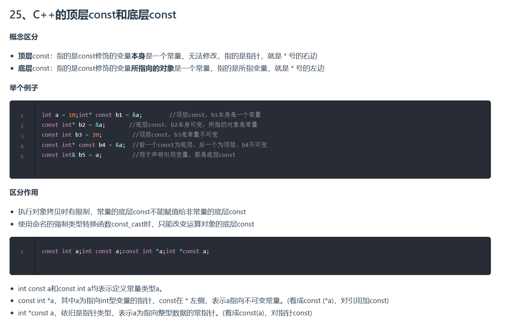

根据图片内容，以下是C++中**顶层const**和**底层const**的详细解释：

---

## **一、概念区分**
| **类型**       | **定义**                                                                 | **修饰对象**                     | **典型场景**                     |
|----------------|-------------------------------------------------------------------------|----------------------------------|----------------------------------|
| **顶层const**  | 直接修饰变量本身，表示变量是一个常量，无法修改。                           | 变量本身（包括指针变量）           | `int const a = 10;`、`int*const ptr = &a;` |
| **底层const**  | 修饰变量所指向的对象，表示对象不可修改，但变量本身可以改变（如指针的指向）。 | 指针所指向的数据或引用绑定的对象     | `const int* ptr = &a;`、`const int& ref = a;` |

---

## **二、代码示例解析**
### **示例1：顶层const修饰指针本身**
```cpp
int a = 10;
int** const b1 = &a; // 顶层const：b1是常量指针，不能修改（如 `b1 = nullptr;` 会报错）
// *b1 可以修改（如 `*b1 = 20;` 是允许的）
```
- **关键点**：指针 `b1` 的地址不可变，但通过它间接访问的值（如 `*b1`）可以修改。

---

### **示例2：底层const修饰指针指向的值**
```cpp
const int* b2 = &a; // 底层const：b2指向的值不可变（`*b2 = 20;` 报错）
// b2本身可以修改（如 `b2 = &another_int;` 是允许的）
```
- **关键点**：指针 `b2` 可以指向其他变量，但当前绑定的变量值不可修改。

---

### **示例3：顶层const修饰基本类型**
```cpp
const int b3 = 20; // 顶层const：b3是常量，无法修改
```

---

### **示例4：混合使用顶层/底层const**
```cpp
const int* const b4 = &a; // 前一个`const`为底层（*b4不可变），后一个为顶层（b4不可变）
// *b4 = 30;          // 错误！底层const限制
// b4 = &another_int;  // 错误！顶层const限制
```

---

### **示例5：底层const与引用**
```cpp
const int& b5 = a; // 底层const：b5绑定到a的值，但a的值不可通过b5修改
// b5 = 30;        // 错误！底层const保护a的值
```

---

## **三、核心作用与限制**
### **1. 对象拷贝的限制**
- **底层const不可覆盖**：
  ```cpp
  const int x = 5;
  int y = x;       // 允许：底层const可以被剥离（隐式转换）
  const int* px = &x;
  int* py = px;    // 错误！底层const不允许赋值给非常量指针
  ```

### **2. 类型转换规则**
- **`const_cast` 的作用**：
  ```cpp
  const int* ptr = &x;
  int* non_const_ptr = const_cast<int*>(ptr); // 仅移除底层const（合法但危险）
  // *non_const_ptr = 10; // 可能破坏原有const约束，导致未定义行为
  ```

---

## **四、语法等价性说明**
1. `int const a` 与 `const int a` 等价，均表示“a是常量整数”。
2. `const int* a` 表示“a是指向常量整数的指针”（底层const）。
3. `int* const a` 表示“a是指向整数的常量指针”（顶层const）。

---

## **五、总结**
- **顶层const** ≈ “变量本身不可变”（如指针地址不可变）。
- **底层const** ≈ “变量指向的内容不可变”（如指针指向的值不可变）。
- **使用原则**：
  - 优先使用底层const保护数据不变性。
  - 顶层const用于限制指针或对象的绑定关系。