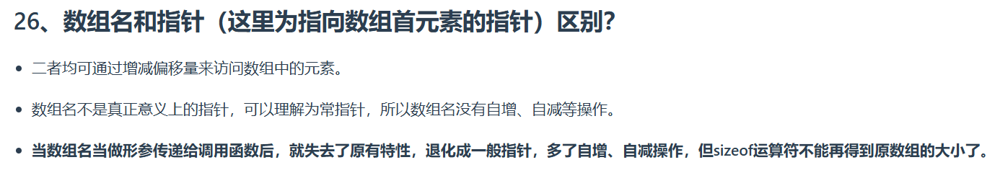

根据图片内容，以下是对C++中**数组名**与**指向数组首元素的指针**的详细解释：

---

## **一、核心区别总结**
| **特性**               | **数组名**                                | **指向数组首元素的指针**          |
|------------------------|-----------------------------------------|--------------------------------|
| **本质**               | 数组的名称（隐式转换为指针，但非真正指针）      | 真实的指针变量                   |
| **自增/自减**           | 不可自增/自减（常指针性质）                    | 可以自增/自减（普通指针行为）       |
| **作为函数参数**         | 退化为普通指针，失去原特性                     | 直接作为指针传递                 |
| **`sizeof`运算**        | 返回整个数组的大小                          | 返回指针本身的大小（4/8字节）      |

---

## **二、详细解析**

### **1. 访问元素的相似性**
- **数组名**和**指针**均可通过偏移访问元素：
  ```cpp
  int arr[5] = {1, 2, 3, 4, 5};
  int* ptr = arr; // ptr指向arr的首元素

  cout << arr[0] << endl;    // 输出1
  cout << ptr[0] << endl;    // 输出1
  cout << *(arr + 1) << endl; // 输出2
  cout << *(ptr + 1) << endl; // 输出2
  ```

---

### **2. 数组名的特殊性**
#### （1）**常指针属性**：
- 数组名是**不可修改的地址常量**，不能直接进行自增/自减操作：
  ```cpp
  int arr[5];
  arr++; // 错误！数组名不能自增
  int* ptr = arr;
  ptr++; // 正确！指针可以自增
  ```

#### （2）**隐式转换为指针**：
- 数组名在大多数情况下会**隐式转换为指向首元素的指针**（如赋值给指针变量或传递给函数）：
  ```cpp
  int* ptr = arr; // 隐式转换合法
  void func(int* p) { /* ... */ }
  func(arr);       // 隐式转换合法
  ```

---

### **3. 函数参数传递的退化**
#### （1）**传递后的行为变化**：
- 当数组名作为函数参数传递时，**退化为普通指针**，失去原特性：
  ```cpp
  void print_arr(int arr[], int size) {
      // arr此时是普通指针，可以自增：
      for (int i = 0; i < size; ++i) {
          cout << arr[i] << endl;
      }
  }

  int main() {
      int arr[5];
      print_arr(arr, 5); // 传递数组名，退化为指针
      return 0;
  }
  ```

#### （2）`sizeof`的失效：
- 在函数参数中，数组名退化为指针，因此`sizeof(arr)`返回的是**指针大小**而非数组总大小：
  ```cpp
  void func(int arr[]) {
      cout << sizeof(arr) << endl; // 输出4（假设int*为4字节）
  }

  int main() {
      int arr[100];
      cout << sizeof(arr) << endl; // 输出400（假设int为4字节）
      func(arr);                  // 输出4
      return 0;
  }
  ```

---

## **三、关键注意事项**
1. **数组名与指针的等价性**：
   - 数组名不是指针类型，但可以**隐式转换为指针**（除了`&arr`这种取地址操作）。
   ```cpp
   int* ptr = &arr; // 错误！&arr是int(*)[5]类型，与int*不兼容
   int (*ptr)[5] = &arr; // 正确！需显式声明指针数组类型
   ```

2. **指针运算的限制**：
   - 指针的加减必须**在合法范围内**，否则会导致未定义行为：
   ```cpp
   int arr[5];
   int* ptr = arr + 5; // 指向最后一个元素的下一个位置
   *ptr = 10;          // 未定义行为（越界访问）
   ```

---

## **四、总结**
- **数组名**是固定地址的常量，**指针**是可变的变量。
- 在函数参数传递时，数组名退化为普通指针，失去长度信息和自增能力。
- 使用指针操作数组时需谨慎，避免越界和语义混淆。

通过合理利用两者的特性，可以高效完成数组操作，但在涉及类型安全和内存管理时需格外注意。