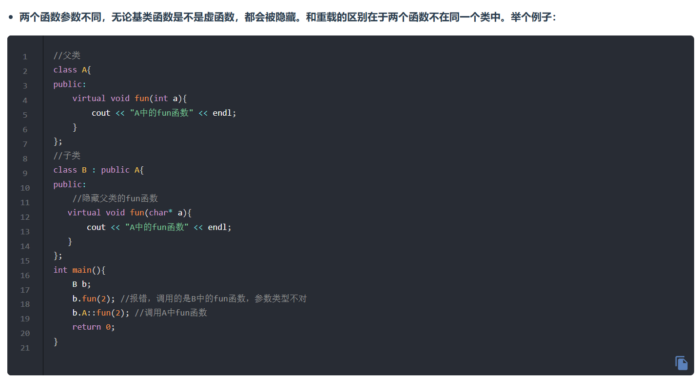

```cpp
//父类
class A{
public:
    virtual int fun(int a){}
}
//子类
class B : public A{
public:
    //重写,一般加override可以确保是重写父类的函数
    virtual int fun(int a) override{}
}

```




``` cpp
// 父类
class A {
public:
    virtual void fun(int a) { // 虚函数
        cout << "This is A fun " << a << endl;
    }  
    void add(int a, int b) {
        cout << "This is A add " << a + b << endl;
    }
};

// 子类
class B: public A {
public:
    void fun(int a) override {  // 覆盖
        cout << "this is B fun " << a << endl;
    }
    void add(int a) {   // 隐藏
        cout << "This is B add " << a + a << endl;
    }
};

int main() {
    // 基类指针指向派生类对象时，基类指针可以直接调用到派生类的覆盖函数，也可以通过 :: 调用到基类被覆盖
    // 的虚函数；而基类指针只能调用基类的被隐藏函数，无法识别派生类中的隐藏函数。

    A *p = new B();
    p->fun(1);      // 调用子类 fun 覆盖函数
    p->A::fun(1);   // 调用父类 fun
    p->add(1, 2);
    // p->add(1);      // 错误，识别的是 A 类中的 add 函数，参数不匹配
    // p->B::add(1);   // 错误，无法识别子类 add 函数
    return 0;
}
```