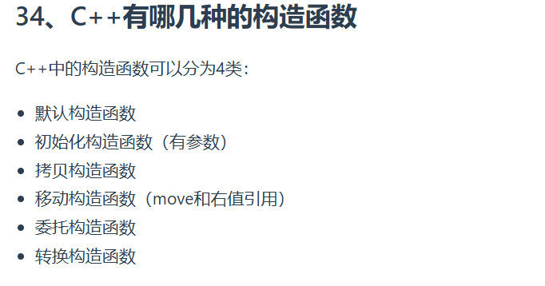
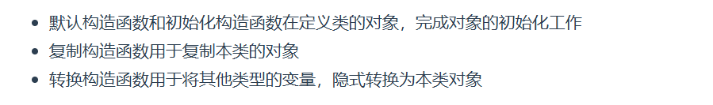

```cpp
#include <iostream>
using namespace std;

class Student{
public:
    Student(){//默认构造函数，没有参数
        this->age = 20;
        this->num = 1000;
    };  
    Student(int a, int n):age(a), num(n){}; //初始化构造函数，有参数和参数列表
    Student(const Student& s){//拷贝构造函数，这里与编译器生成的一致
        this->age = s.age;
        this->num = s.num;
    }; 
    Student(int r){   //转换构造函数,形参是其他类型变量，且只有一个形参
        this->age = r;
		this->num = 1002;
    };
    Student(const char* name, double score)// 接受任意类型指定参数的构造函数，
    {
        this->age = 0;
        this->num = (int)score;
    }
    Student(double r){   //转换构造函数,形参是其他类型变量，且只有一个形参
        this->age = (int)r * 10;
		this->num = 1003;
    };
    ~Student(){}
public:
    int age;
    int num;
};

int main(){
    Student s1;
    Student s2(18,1001);//初始化构造函数调用
    int a = 10;
    Student s3(a);//重载构造函数调用,传参数形式
    Student s4(s3);
    Student s5("Demo",56.45);//重载构造函数调用
    Student s6 = 85.63;//证明为转换构造函数调用
    float b = 5.2;
    Student s7 = b;//为转换构造函数调用，带有隐式类型转换
	
    
    printf("s1 age:%d, num:%d\n", s1.age, s1.num);
    printf("s2 age:%d, num:%d\n", s2.age, s2.num);
    printf("s3 age:%d, num:%d\n", s3.age, s3.num);
    printf("s4 age:%d, num:%d\n", s4.age, s4.num);
    printf("s5 age:%d, num:%d\n", s5.age, s5.num);
    printf("s6 age:%d, num:%d\n", s6.age, s6.num);
    printf("s7 age:%d, num:%d\n", s7.age, s7.num);
    return 0;
}
//运行结果
//s1 age:20, num:1000
//s2 age:18, num:1001
//s3 age:10, num:1002
//s4 age:10, num:1002
//s5 age:0, num:56
//s6 age:850, num:1003
//s7 age:50, num:1003

```
