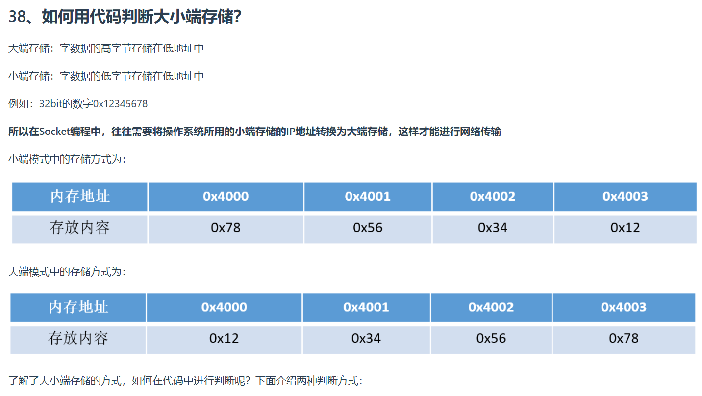
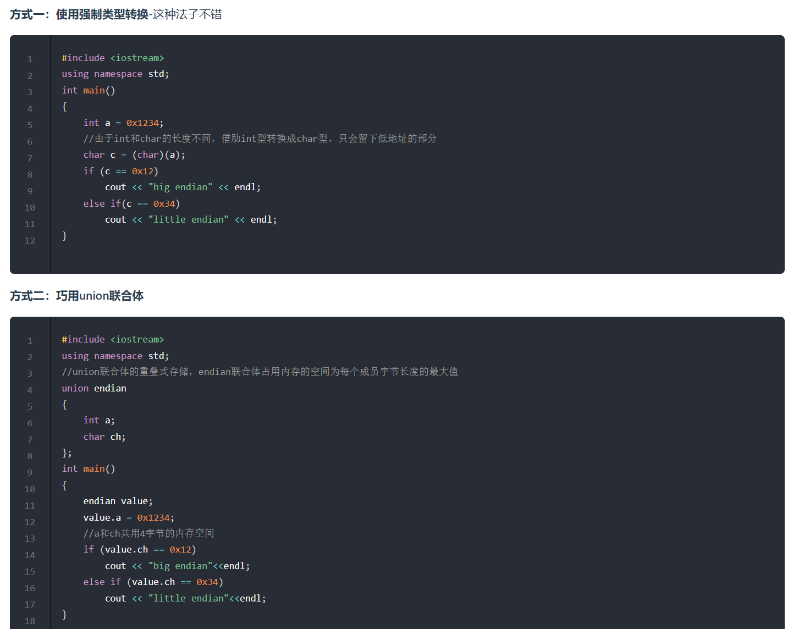

---

低地址：数值更小的地址（如 0X1000）。
​高地址：数值更大的地址（如 0X1004）。
在内存中，数据通常按递增顺序连续存储（从低地址到高地址）。

---

1. 直接数值比较
- **0X1234** → 十进制 `4660`
- **0X12**  → 十进制 `18`
- **0X34**  → 十进制 `52`

- **结论**：  
  **`0X1234` 是最大的值**，因此它是高字节。

（1）多字节数据的组成
假设存在一个 16 位的数据 `0X1234`，它可以拆分为两个字节：
- **高字节（High Byte）**: `0X12`（左半部分）
- **低字节（Low Byte）**: `0X34`（右半部分）

此时，`0X12 < 0X34` 是错误的，正确的高字节应为 `0X12`，低字节为 `0X34`。  
但这里的矛盾点在于：**单独比较数值时，0X34 大于 0X12**，但在多字节数据中，高字节的位置决定了它的优先级（即使数值较小）。

---

 （2）关键区分点
- **高字节 vs 低字节**：取决于数据在内存中的**存储顺序**（大端/小端），而非单纯数值大小。
- **数值大小**：直接比较十六进制值的数值即可确定高低。
