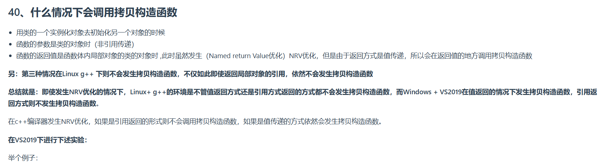

---
根据图片内容，以下是C++中拷贝构造函数调用的详细解释：

---

## **一、拷贝构造函数的触发条件**
拷贝构造函数主要用于**复制对象的状态**，以下三种场景会显式或隐式调用：
1. **对象初始化**：
   ```cpp
   MyClass obj1;           // 默认构造
   MyClass obj2(obj1);     // 调用拷贝构造函数（直接初始化）
   MyClass obj3 = obj1;    // 调用拷贝构造函数（复制初始化）
   ```

2. **函数参数传递（非引用）**：
   ```cpp
   void func(MyClass obj) { /* ... */ }
   MyClass a;
   func(a);               // 传递a的副本，调用拷贝构造函数
   ```

3. **函数返回值是类的对象（值传递）**：
   ```cpp
   MyClass func() {
       MyClass localVar;
       return localVar;  // 返回值是值类型，可能触发拷贝构造函数
   }
   MyClass result = func(); // 可能调用拷贝构造函数
   ```

---

## **二、NRV优化与编译器差异**
### **1. NRV优化（Named Return Value Optimization）**
- **目的**：消除函数返回值时的冗余拷贝。
- **适用条件**：
  - 返回值是**局部对象**或**临时对象**。
  - 编译器能够直接在函数返回的位置构造对象（无需额外拷贝）。

### **2. Linux g++的特殊性**
- **现象**：
  ```cpp
  MyClass func() {
      MyClass a;  // 局部对象
      return a;  // Linux g++ 不调用拷贝构造函数（即使通过值返回）
  }
  ```
- **原因**：
  - g++采用**栈展开（Stack Unwinding）**技术，直接在返回地址处构造对象，跳过拷贝步骤。
  - 即使尝试返回局部对象的引用（需注意合法性），也不会触发拷贝构造函数：
    ```cpp
    MyClass& func() {
        MyClass a;
        return a;  // Linux g++ 允许返回局部变量引用（但行为未定义！）
    }
    ```

### **3. VS2019的行为**
- **现象**：
  ```cpp
  MyClass func() {
      MyClass a;
      return a;  // VS2019 调用拷贝构造函数（即使有NRV优化）
  }
  ```
- **原因**：
  - MSVC默认不开启NRV优化（或仅在特定条件下开启），即使满足优化条件也会生成拷贝代码。
  - 引用返回时不会触发拷贝构造函数：
    ```cpp
    MyClass& func() {
        MyClass a;
        return a;  // 不调用拷贝构造函数
    }
    ```

---

## **三、关键对比总结**
| **场景**               | **Linux g++**               | **VS2019**                |
|------------------------|----------------------------|---------------------------|
| **返回值是局部对象（值传递）** | 不调用拷贝构造函数（NRV优化） | 调用拷贝构造函数（无NRV优化） |
| **返回值是局部对象引用**   | 允许但行为未定义（不调用拷贝） | 不允许（编译警告或错误）    |

---

## **四、实验验证（VS2019示例）**
```cpp
#include <iostream>
using namespace std;

class MyClass {
public:
    MyClass() { cout << "Default Constructor" << endl; }
    MyClass(const MyClass& other) { cout << "Copy Constructor" << endl; }
};

MyClass func() {
    MyClass a;  // 调用默认构造函数
    return a;  // VS2019 输出：Copy Constructor
}

int main() {
    MyClass obj = func();  // 可能触发拷贝构造函数
    return 0;
}
```

- **输出结果**（VS2019默认配置）：
  ```
  Default Constructor
  Copy Constructor
  ```

---

## **五、深入理解与注意事项**
1. **编译器优化差异**：
   - g++倾向于使用激进优化（如栈展开），而MSVC对NRV优化的支持较保守。
   - 可通过编译器开关（如 `g++ -fno-elide-constructors`）强制关闭NRV优化。

2. **返回局部对象引用**：
   - C++标准禁止返回局部对象的引用（可能导致悬空引用），但编译器可能允许（如g++的`-Wreturn-local`仅警告）。

3. **移动构造函数的影响**：
   - 若类定义了移动构造函数，现代编译器会优先调用移动构造函数（而非拷贝构造函数）。

---

## **六、最佳实践**
1. **优先使用引用传递**：
   ```cpp
   void func(const MyClass& obj) { /* 避免拷贝 */ }
   ```

2. **返回值优化**：
   - 设计函数时优先返回值类型为`const`或引用，减少拷贝需求。

3. **编译器选项配置**：
   - 在VS2019中启用优化（如 `/O2`）可能促进NRV优化。

通过理解编译器差异和优化机制，可以编写更高效且可移植的C++代码。