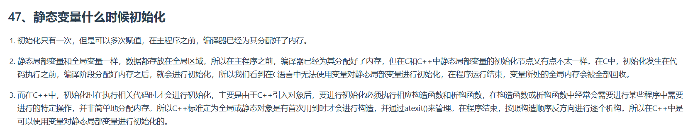

---
在 C/C++ 中，`atexit()` 函数用于注册程序正常终止时（如 `main()` 返回或 `exit()` 调用）自动执行的清理函数。这些函数按**逆序**调用（后注册的先执行）。


### **1. 函数原型**
```cpp
#include <cstdlib> // C++ 中的头文件
// 或 #include <stdio.h> 在 C 中

int atexit(void (*func)(void));
```
- **功能**：将 `func` 函数注册到程序终止时的调用列表。
- **返回值**：
  - `0`：注册成功。
  - 非零值：注册失败（如超出最大注册数量限制）。

---

### **2. 使用示例**
```cpp
#include <iostream>
#include <cstdlib>

using namespace std;

void cleanup1() {
    cout << "Cleanup function 1 called." << endl;
}

void cleanup2() {
    cout << "Cleanup function 2 called." << endl;
}

int main() {
    // 注册清理函数（逆序执行）
    if (atexit(cleanup1) != 0) {
        cerr << "Failed to register cleanup1." << endl;
        return 1;
    }
    if (atexit(cleanup2) != 0) {
        cerr << "Failed to register cleanup2." << endl;
        return 1;
    }

    cout << "Program is running. Press Enter to exit..." << endl;
    cin.get();

    return 0; // 触发 atexit 注册的函数
}
```

**输出结果**：
```
Program is running. Press Enter to exit...
Cleanup function 1 called.
Cleanup function 2 called.
```

---

### **3. 注意事项**
1. **调用顺序**：
   - 后注册的函数先执行（类似栈的顺序）。
2. **函数要求**：
   - `func` 必须是无参数且返回 `void` 的函数。
   - `func` 内部不能调用 `exit()` 或 `_exit()`（否则会导致递归调用）。
3. **全局变量**：
   - 若 `func` 访问全局变量，需确保其生命周期在程序终止时仍有效。
4. **注册限制**：
   - 系统通常限制可注册的 `atexit` 函数数量（如 Linux 默认最多 32 个）。
5. **线程安全**：
   - `atexit` 注册的函数在多线程程序中是**单线程**调用的。

---

### **4. 常见错误**
- **重复注册同一函数**：
  ```cpp
  if (atexit(func) != 0); // 第二次注册失败，返回非零值
  ```
- **函数指针类型错误**：
  ```cpp
  int (*func)(int); // 错误类型！必须匹配 void (*)(void)
  ```

---

### **5. 替代方案（C++ 特性）**
在 C++ 中，更推荐使用 **RAII（资源获取即初始化）** 或 **智能指针** 进行资源管理，例如：
```cpp
class Resource {
public:
    ~Resource() {
        cout << "Resource released automatically." << endl;
    }
};

int main() {
    Resource res; // 析构函数在 main 结束时自动调用
    return 0;
}
```

---

### **6. 总结**
- **适用场景**：简单的清理操作（如关闭文件、释放内存）。
- **局限性**：无法处理异常退出（如 `abort()`）。
- **调试技巧**：可通过 `setenv("LD_DEBUG=libs", 1)`（Linux）跟踪动态库的 `atexit` 调用。