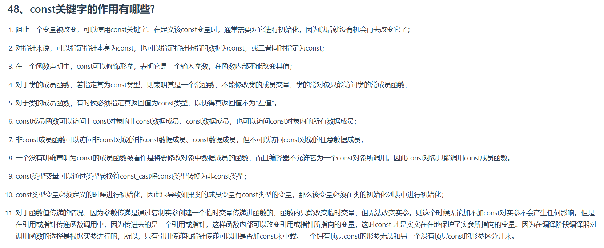

---
涵盖了const的不同应用场景，比如变量、指针、函数参数、类成员函数等。

第一个要点指出const阻止变量被改变，需要在定义时初始化。这里可能需要强调初始化的重要性，以及未初始化可能导致的问题。

第二个要点涉及指针的const修饰，需要区分指针本身、指针所指数据和两者都为const的情况，可能用例子说明三种不同的写法及其含义。

第三个要点是关于函数参数的const修饰，这里应该说明参数作为输入参数时，使用const可以防止函数内部意外修改，提高代码安全性。同时，可能需要提到const引用传递的优势，比如传递大型对象时避免拷贝。

第四到第八点涉及类成员函数中的const使用。这部分比较复杂，需要解释常函数的定义、常对象只能调用常成员函数的原因，以及const成员函数内部对数据成员的访问规则。可能需要举例子说明非const成员函数和const成员函数的区别，以及常对象调用时的限制。

第九点提到类型转换，这里需要谨慎说明const_cast的使用场景和潜在风险，强调只能用于转换const和非const之间的类型，并且不能改变原本的const性带来的保护。第十点关于类成员变量的初始化，需要解释为什么必须在初始化列表中进行，因为编译器无法在构造函数体内对const成员进行赋值。

第十一点讨论函数传递的不同方式对const的影响，特别是引用和指针传递时const的作用。这里需要对比值传递、引用传递和指针传递的区别，说明在引用或指针传递时，const如何保护实参的数据不被修改，以及在函数重载中的应用。

---

### **1. const 的基本作用**
- **阻止变量被修改**  
  `const` 声明的变量必须在定义时初始化，且其值在程序运行期间不可更改。  
  ```cpp
  const int a = 10; // 正确，a 的值为 10，不可修改
  a = 20;         // 错误：试图修改 const 变量
  ```

---

### **2. 对指针的约束**
| 语法形式               | 含义                                                                 |
|-----------------------|----------------------------------------------------------------------|
| `const int *p;`       | 指针 `p` 所指向的数据是 `const`（不能通过 `p` 修改数据）。           |
| `int *const p;`       | 指针 `p` 本身是 `const`（不能改变 `p` 的指向，但可通过 `p` 修改数据）。 |
| `const int *const p;` | 指针 `p` 和 `p` 所指向的数据均为 `const`。                          |

**示例**：  
```cpp
int arr[] = {1, 2, 3};
const int *p = arr; // *p = 4; // 错误，不能修改数据
p++;              // 正确，可以改变指针指向的位置

int *const q = &arr[0];
*q = 5;            // 正确，可以修改数据
q++;              // 错误，不能改变指针指向的位置
```

---

### **3. 函数参数修饰**
- **输入参数保护**  
  在函数声明中，用 `const` 修饰参数表示该参数是“只读”输入，防止函数内部意外修改。  
  ```cpp
  void print(const string& s) {
      // s = "Hello"; // 错误，不能修改 const 参数
      cout<< s << endl;
  }
  ```

- **引用/指针传递时的保护**  
  当通过引用或指针传递参数时，`const` 可以保护实参的数据不被修改：  
  ```cpp
  void modify(int* ptr) { *ptr = 10; }
  void modify(const int* ptr) { /* 不能修改 *ptr */ }

  int x = 5;
  modify(&x);          // 传入非 const 指针，可调用第一个函数
  modify(&x);          // 传入 const 指针，只能调用第二个函数（函数重载）
  ```

---

### **4. 类成员函数的限制**
#### **(1) 常成员函数**
- **定义**：用 `const` 修饰的成员函数称为常函数，承诺不会修改类的成员变量。  
  ```cpp
  class MyClass {
  public:
      void setValue(int val) { value = val; } // 非常函数
      void getValue() const { return value; } // 常函数
  private:
      int value;
  };
  ```
- **调用限制**：  
  常对象只能调用常成员函数，非常对象可以调用所有成员函数。  
  ```cpp
  const MyClass obj;        // 常对象
  obj.getValue();           // 正确
  obj.setValue(10);        // 错误：常对象不能调用非常函数
  ```

#### **(2) 返回值类型为 const**
- **作用**：禁止将函数的返回值作为左值（即不能对其赋值）。  
  ```cpp
  const string getName() { return "Alice"; }
  getName() = "Bob";       // 错误：不能将 const 返回值赋值给左值
  ```

#### **(3) 成员函数对数据的访问规则**
- **const 成员函数**：  
  可以访问非 `const` 成员变量（但不可修改）、`const` 成员变量，以及 `const` 对象的所有成员。
- **非 const 成员函数**：  
  可以访问所有类型的成员变量，但不能访问 `const` 对象的任何成员。

---

### **5. 其他关键作用**
#### **(1) 类型转换**
- 通过 `const_cast` 可以移除 `const` 属性（需谨慎使用）：  
  ```cpp
  const int c = 5;
  int* p = const_cast<int*>(&c);
  *p = 10; // 危险操作！可能导致未定义行为
  ```

#### **(2) 初始化要求**
- `const` 成员变量必须在类的初始化列表中初始化：  
  ```cpp
  class MyClass {
  public:
      MyClass(int x) : constVar(x) {} // 正确
      const int constVar;           // 必须初始化
  };
  ```

#### **(3) 函数重载**
- `const` 可用于函数重载的区分条件：  
  ```cpp
  void foo(int& x) { x = 10; }
  void foo(const int& x) { /* 不会修改 x */ }
  ```

---

### **6. 总结**
- **核心目的**：通过编译期检查，确保数据不被意外修改，提高代码安全性和可维护性。
- **典型应用场景**：  
  - 保护全局或局部变量不被修改。  
  - 保护指针和引用传递的参数。  
  - 类的常成员函数和不可变对象设计。  
- **注意事项**：  
  - `const` 不影响内存分配，只是编译时的约束。  
  - `const` 不能修饰局部变量本身（除非使用 `const` 限定符结合初始化）。

希望这些解释能帮助你深入理解 `const` 关键字的使用！如果有具体问题，欢迎继续提问。