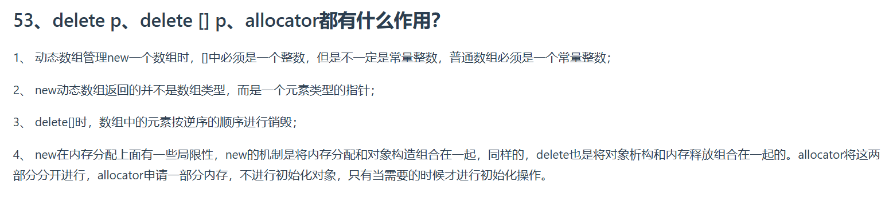

---

### **1. 动态数组管理（`new` 和 `delete[]`）**
#### **(1) `new` 语法要求**
- **动态数组声明**：  
  ```cpp
  int* p = new int[5];         // 合法，数组大小为常量
  int n = 10;
  int* p2 = new int[n];       // 合法！C++ 允许变量作为数组大小（非 VLA，但编译器支持）
  ```
  - **注意**：C++ 标准要求数组大小为 **整型常量表达式**，但多数编译器（如 GCC、Clang）扩展支持变量长度数组（VLA）。

#### **(2) `new` 的返回值类型**
- **返回值**：`new` 操作符返回的是 **元素类型的指针**，而非数组类型。  
  ```cpp
  int (*arr_ptr)[10] = new int[10]; // arr_ptr 是指向数组的指针
  int* p = new int[10];           // p 是指向 int 的指针
  ```

#### **(3) `delete[]` 的作用**
- **逆序析构元素**：  
  ```cpp
  class Obj { public: ~Obj() { cout << "Destroyed"; } };
  Obj* objs = new Obj[3];
  delete[] objs; // 输出顺序：Obj2 的析构 → Obj1 → Obj0
  ```
  - **原理**：数组元素的构造是按顺序进行的，析构时需逆序调用析构函数，以确保依赖关系正确解除（如基类先析构）。

---

### **2. `new` 和 `delete` 的局限性**
#### **(1) 内存分配与对象构造绑定**
- **问题**：`new` 会将 **内存分配** 和 **对象构造** 组合在一起，无法单独控制。  
  ```cpp
  int* p = new int;        // 分配内存 + 初始化 int 对象（默认初始化）
  delete p;               // 调用 int 的析构函数 + 释放内存
  ```
- **不足**：某些场景需要先分配内存再延迟构造（如对象池、内存预分配）。

#### **(2) 类型依赖**
- `new` 需要知道具体类型才能正确构造对象，无法实现通用内存管理。

---

### **3. `allocator` 的作用**
#### **(1) 分离分配与构造**
- **`allocator` 接口**：  
  ```cpp
  #include <memory>
  using Allocator = std::allocator<int>;

  int* p = Allocator::allocate(10 * sizeof(int)); // 仅分配内存（未初始化）
  for (int i = 0; i < 10; ++i) {
      new(p + i) int(i); // 在已分配内存上手动构造对象
  }
  for (int i = 9; i >= 0; --i) {
      (p + i)->~int();     // 手动析构对象
  }
  Allocator::deallocate(p, 10 * sizeof(int)); // 释放内存
  ```
- **优势**：
  - **灵活性**：分离内存分配与对象生命周期控制。
  - **性能优化**：适用于大规模内存管理（如容器实现）。
  - **自定义分配器**：可替换 `malloc/free` 或实现特定内存策略。

#### **(2) 应用场景**
- **STL 容器**：如 `std::vector` 使用 `allocator` 动态管理内存。
- **对象池**：预分配内存并复用对象，减少 `new/delete` 开销。
- **内存池**：为特定类型分配固定大小的内存块。

---

### **4. 关键对比总结**
| 操作符       | 功能                          | 执行步骤                              |
|--------------|-----------------------------|---------------------------------------|
| `new T`      | 单个对象分配+构造            | 分配内存 → 调用构造函数                |
| `new T[]`     | 数组分配+构造                | 分配连续内存 → 顺序调用构造函数        |
| `delete p`    | 单个对象析构+释放内存         | 调用析构函数 → 释放内存                |
| `delete[] p`   | 数组析构+释放内存            | 逆序调用析构函数 → 释放内存            |
| `allocator`  | 仅分配内存（不构造对象）     | 返回原始指针，需手动管理生命周期      |

---

### **5. 最佳实践**
1. **匹配 `new` 与 `delete`**：  
   - 对数组使用 `new[]` 和 `delete[]`，否则可能导致内存泄漏或未定义行为。
2. **避免裸指针**：  
   - 使用智能指针（如 `std::unique_ptr`、`std::shared_ptr`）或容器管理动态内存。
3. **优先使用 `allocator`**：  
   - 在需要精细控制内存的场景下（如高性能代码），利用 `allocator` 分离分配与构造。

---

### **示例代码（Allocator 使用）**
```cpp
#include <iostream>
#include <memory>

struct Obj {
    Obj(int x) : value(x) { std::cout << "Constructed: " << value << std::endl; }
    ~Obj() { std::cout << "Destroyed: " << value << std::endl; }
};

int main() {
    using Allocator = std::allocator<Obj>;

    // 分配内存
    Obj* objs = Allocator::allocate(3); 

    // 手动构造对象
    new(objs) Obj(1);
    new(objs + 1) Obj(2);
    new(objs + 2) Obj(3);

    // 手动析构对象（逆序）
    objs[2].~Obj();
    objs[1].~Obj();
    objs[0].~Obj();

    // 释放内存
    Allocator::deallocate(objs, 3);

    return 0;
}
```

**输出**：
```
Constructed: 1
Constructed: 2
Constructed: 3
Destroyed: 3
Destroyed: 2
Destroyed: 1
```

---

通过 `allocator`，可以完全控制内存的分配、构造和销毁流程，适用于复杂的内存管理需求。理解这些机制有助于编写高效、健壮的 C++ 程序！