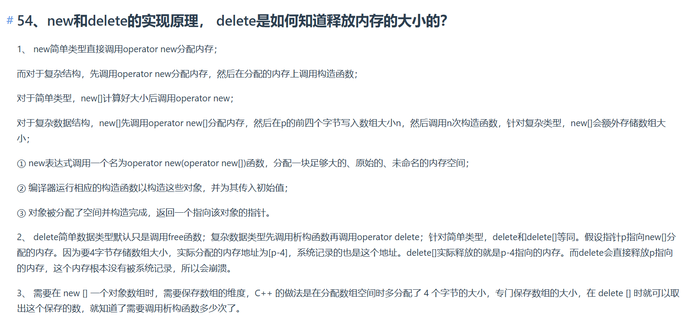

---
几个关键点：
1. new[]在分配内存时确实会在数组前添加一个长度字段，这个字段的位置和大小可能因编译器和平台而异，常见的有4字节或8字节。
2. delete[]在释放内存时，会读取这个长度字段，以确定需要销毁多少个元素，并依次调用它们的析构函数。
3. 这个**额外的存储空间是由编译器自动处理**的，程序员不需要显式管理它，因此在使用delete[]时无需关心它的存在，编译器会保证正确释放。

此外，用户可能担心这额外的4字节内存是否会被正确释放，或者是否会导致内存泄漏。这时候需要明确说明，当使用delete[]时，编译器不仅会释放用户分配的数组内存，还会释放那4字节的长度字段所占用的内存，从而避免泄漏。

还需要提到，虽然这4字节的存在对程序员来说是透明的，但在某些情况下（如内存分析工具）可能会被检测到，但这并不影响程序的正确性。同时，**如果误用delete而不是delete[]来释放new[]分配的内存，会导致未定义行为，因为此时编译器不会读取长度字段，可能导致提前释放或遗漏析构调用。**


---

### **1. `new[]` 的内存布局**
当使用 `new[]` 分配动态数组时，编译器会在实际数组内存的**前端**额外分配一段固定大小的空间（通常为 **4 字节**或 **8 字节**，取决于平台和编译器），用于记录数组的长度。例如：
```cpp
int* p = new int[5]; // 编译器实际分配的内存结构：
// [4字节长度字段] + int[5]
```
- **作用**：这段空间存储的整数是数组的元素个数（这里是 `5`），供 `delete[]` 在释放内存时使用。

---

### **2. `delete[]` 的工作原理**
当调用 `delete[] p` 时，编译器会执行以下步骤：
1. **读取长度字段**：从 `p` 指针指向的位置的前面（即那 4 字节）读取数组长度。
2. **逆序析构元素**：根据长度字段的值，依次对数组元素调用析构函数（从最后一个元素到第一个）。
3. **释放内存**：释放整个数组所占用的内存（包括长度字段和实际元素）。

**示例**：
```cpp
int* p = new int[5]; // 分配内存：[4][5个int]
delete[] p;          // 编译器读取前4字节的"5"，销毁5个int，然后释放全部内存。
```

---

### **3. 关键结论**
#### **(1) 4 字节长度字段的归属**
- 这段存储数组长度的空间是 **由编译器自动管理的**，程序员无需显式操作。
- 当 `delete[]` 执行时，它会自动包含这部分内存的释放，不会导致泄漏。

#### **(2) 为什么 `delete[]` 必须知道长度？**
- 若不记录长度，编译器无法确定需要调用多少次析构函数。例如：
  ```cpp
  Obj* objs = new Obj[3]; // 需要调用 3 次 ~Obj()
  delete[] objs;          // 编译器通过长度字段得知要调用 3 次析构函数。
  ```

#### **(3) 为什么 `delete p`（而非 `delete[] p`）会导致错误？**
- 如果用 `delete p` 释放 `new[]` 分配的内存：
  - 编译器不会读取长度字段，只会释放 `p` 指针指向的 **单个元素**（即第一个元素的内存），导致剩余元素和长度字段的内存泄漏。
  - **示例**：
    ```cpp
    int* p = new int[5];
    delete p; // 只释放第一个int，剩下4+4*5=24字节内存泄漏！
    ```

---

### **4. 对比 `new/delete` 与 `allocator`**
| 动作                | `new`/`delete`                          | `allocator`                        |
|---------------------|---------------------------------------|-----------------------------------|
| **内存分配**        | 自动分配并调用构造函数/析构函数         | 仅分配原始内存（不初始化对象）       |
| **长度字段**        | `new[]` 在内存中隐式存储长度字段          | 不记录长度字段（需手动管理）         |
| **灵活性**          | 无法分离分配与构造/析构               | 完全控制内存分配和对象生命周期       |

---

### **5. 实现原理（简化版）**
若你尝试手写类似 `new[]` 和 `delete[]` 的函数：
```cpp
// 手动模拟 new[]
int* my_new(int size) {
    // 分配长度字段 + 数组内存
    int* length_ptr = (int*)malloc(sizeof(int) + size * sizeof(int));
    *length_ptr = size;
    return (int*)(length_ptr + 1);
}

// 手动模拟 delete[]
void my_delete(int* ptr) {
    int* length_ptr = (int*)ptr - 1;
    int size = *length_ptr;
    // 逆序析构元素（此处假设元素是 int，无需析构）
    free(length_ptr); // 释放整个内存块（包括长度字段）
}
```

---

### **总结**
- **透明性**：数组长度的存储对程序员完全透明，`delete[]` 自动处理。
- **安全性**：必须严格匹配 `new[]` 和 `delete[]`，否则会导致未定义行为。
- **内存泄漏风险**：误用 `delete` 会导致长度字段和剩余内存未被释放。

通过这种机制，C++ 确保了动态数组的正确创建和销毁，即使数组大小是运行时确定的（非编译时常量）。