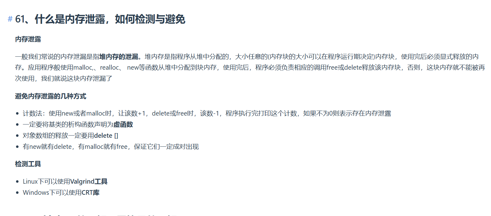

将析构函数声明为虚函数（virtual destructor）的目的是为了解决 **基类指针指向派生类对象时可能引发的资源泄漏问题**。这是C++中多态特性的重要应用场景，以下是详细解释：

---

### **1. 问题的背景**
假设存在以下继承关系：
```cpp
class Base {
public:
    Base() { /* 基类资源分配 */ }
    ~Base() { /* 基类资源释放 */ }  // 非虚析构函数
};

class Derived : public Base {
public:
    Derived() { /* 派生类动态分配内存 */ }
    ~Derived() { /* 派生类内存释放 */ }  // 需要调用此析构函数
};
```

如果用户通过 **基类指针** 操作派生类对象：
```cpp
Base* obj = new Derived();
delete obj;  // 会发生什么？
```

**问题**：  
由于基类 `Base` 的析构函数 **不是虚函数**，`delete obj` 会 **静态绑定** 到 `Base::~Base()`，而不会调用 `Derived::~Derived()`。这会导致：
1. 派生类中动态分配的内存 **未被释放**（内存泄漏）。
2. 仅基类的析构函数被调用，派生类可能残留资源。

---

### **2. 虚析构函数的作用**
将基类的析构函数声明为虚函数：
```cpp
class Base {
public:
    virtual ~Base() { /* 基类资源释放 */ }  // 虚析构函数
};
```

此时通过基类指针 `delete obj` 时：
1. 由于动态绑定（多态），会先调用 `Derived::~Derived()`，再自动调用 `Base::~Base()`。
2. **派生类和基类的资源都会被正确释放**，避免泄漏。

---

### **3. 核心机制**
• **虚函数表（vtable）**：  
  当一个类有虚函数时，编译器会为其生成虚函数表。析构函数若为虚函数，会记录在虚函数表中。
  
• **动态绑定**：  
  通过基类指针删除对象时，实际调用的是 **对象的动态类型**（即派生类）的析构函数，确保完整的析构链。

---

### **4. 何时需要虚析构函数？**
• **规则**：如果一个类 **可能被继承**，且可能通过基类指针删除派生类对象，则基类必须声明虚析构函数。
• **反例**：如果类是 `final` 的（不会被继承），或不会通过基类指针操作对象，则无需虚析构函数（避免虚函数表开销）。

---

### **5. 示例验证**
**错误情况（内存泄漏）**：
```cpp
Base* obj = new Derived();
delete obj;  // 仅调用 Base::~Base()
// Derived 的资源未释放！
```

**正确情况**：
```cpp
class Base {
public:
    virtual ~Base() { /* 基类资源释放 */ }
};

Base* obj = new Derived();
delete obj;  // 调用 Derived::~Derived() → Base::~Base()
```

---

### **总结**
虚析构函数通过 **确保派生类的析构函数被调用**，避免了因多态删除对象而导致的资源泄漏。这是C++中管理多态对象生命周期的关键机制。