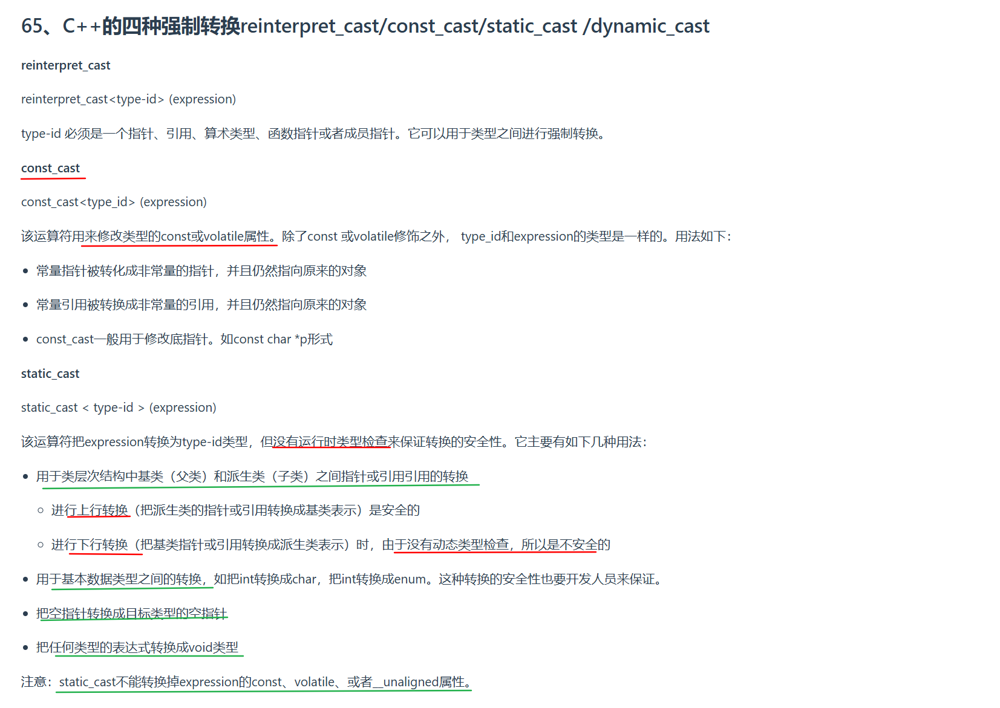
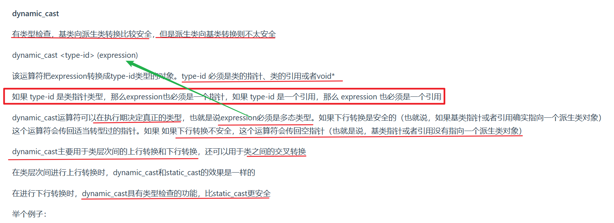

```cpp
#include <bits/stdc++.h>
using namespace std;

class Base
{
public:
	Base() :b(1) {}
	virtual void fun() {};
	int b;
};

class Son : public Base
{
public:
	Son() :d(2) {}
	int d;
};

int main()
{
	int n = 97;

	//reinterpret_cast
	int *p = &n;
	//以下两者效果相同
	char *c = reinterpret_cast<char*> (p); 
	char *c2 =  (char*)(p);
	cout << "reinterpret_cast输出："<< *c2 << endl;
	//const_cast
	const int *p2 = &n;
	int *p3 = const_cast<int*>(p2);
	*p3 = 100;
	cout << "const_cast输出：" << *p3 << endl;
	
	Base* b1 = new Son;
	Base* b2 = new Base;

	//static_cast
	Son* s1 = static_cast<Son*>(b1); //同类型转换
	Son* s2 = static_cast<Son*>(b2); //下行转换，不安全
	cout << "static_cast输出："<< endl;
	cout << s1->d << endl;
	cout << s2->d << endl; //下行转换，原先父对象没有d成员，输出垃圾值

	//dynamic_cast
	Son* s3 = dynamic_cast<Son*>(b1); //同类型转换
	Son* s4 = dynamic_cast<Son*>(b2); //下行转换，安全
	cout << "dynamic_cast输出：" << endl;
	cout << s3->d << endl;
	if(s4 == nullptr)
		cout << "s4指针为nullptr" << endl;
	else
		cout << s4->d << endl;
	
	
	return 0;
}
//输出结果
//reinterpret_cast输出：a
//const_cast输出：100
//static_cast输出：
//2
//-33686019
//dynamic_cast输出：
//2
//s4指针为nullptr

```