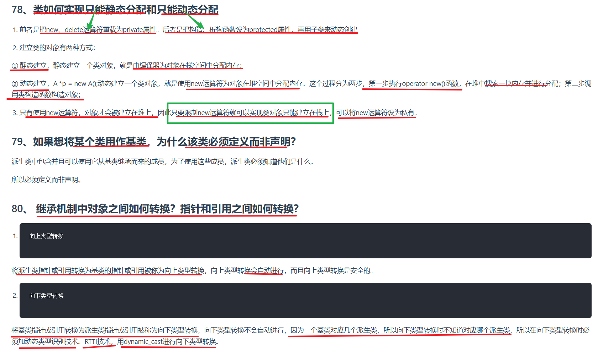

---

当将一个类用作基类时，该类必须被完整**定义**（而不仅仅是声明），原因在于**派生类需要明确基类的内存布局和成员细节**。以下是详细解释：


### **1. 声明 vs. 定义的区别**
• **声明（Declaration）**：仅告诉编译器某个标识符（如类名）的存在，但不提供具体细节。  
  例如：`class Base;`（前向声明）
• **定义（Definition）**：提供完整的类结构，包括成员变量、成员函数、继承关系等。  
  例如：  
  ```cpp
  class Base {
  public:
      void func();  // 成员函数声明
      int data;     // 成员变量定义
  };
  ```

---

### **2. 为什么基类必须被定义？**
#### **(1) 派生类需要知道基类的内存布局**
• 派生类的对象在内存中包含**基类子对象**（继承的成员变量和方法）。  
• 如果基类未定义，编译器无法确定：  
  • 基类的大小（`sizeof(Base)`）  
  • 基类成员的偏移量（用于访问继承的成员变量）  
  • 基类成员函数的存在性（如虚函数表结构）  

**示例**：  
```cpp
class Base; // 仅声明，未定义
class Derived : public Base { // 错误：Base未定义
    // 派生类无法确定基类的内存布局！
};
```

#### **(2) 派生类需要调用基类的构造函数/析构函数**
• 派生类的构造函数会隐式调用基类的默认构造函数（若未显式指定其他构造函数）。  
• 析构函数也需要调用基类的析构函数来释放基类资源。  
• 若基类未定义，编译器无法生成这些调用的代码。

#### **(3) 派生类需要访问基类成员**
• 派生类可能直接使用基类的**成员变量**或**成员函数**。  
• 若基类未定义，编译器无法验证这些成员是否存在或类型是否匹配。  

**示例**：  
```cpp
class Base; // 仅声明
class Derived : public Base {
public:
    void useBase() {
        data = 10; // 错误：编译器不知道Base是否包含data成员
    }
};
```

---

### **3. 例外情况：何时可以仅声明基类？**
如果基类仅在派生类中被**以指针或引用形式使用**（例如前向声明用于声明指针或引用），且不涉及基类的成员访问或对象构造，则基类可以仅声明。  

**示例**：  
```cpp
class Base; // 前向声明
class Derived {
public:
    // 合法：仅使用Base的指针，不涉及基类成员或构造函数
    void process(Base* ptr); 
};
```

---

### **4. 总结**
• **基类必须被定义**：当需要继承基类的成员变量、成员函数，或调用基类构造函数/析构函数时。  
• **基类可仅声明**：当仅使用基类指针或引用，且不涉及基类成员或对象构造时。  

**核心原则**：  
> 派生类需要明确基类的完整结构，以正确生成自身的内存布局和成员访问逻辑。