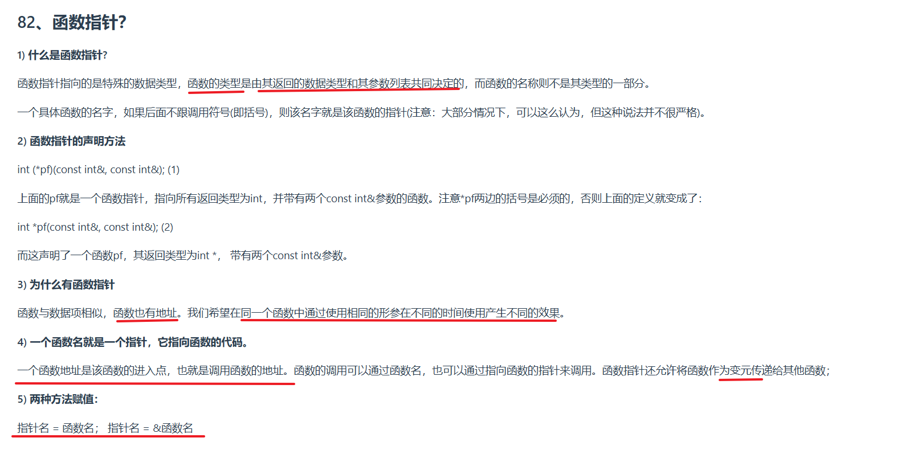

### **3. 为什么有函数指针？**  
函数指针的核心意义是**将函数视为一种可操作的数据**，允许在程序中动态地选择或传递函数逻辑。以下是其存在的具体原因和用途：

#### **（1）动态行为**  
• 函数指针允许程序在运行时根据条件选择不同的函数实现。  
  **示例**：  
  ```c
  int add(int a, int b) { return a + b; }
  int sub(int a, int b) { return a - b; }
  
  int main() {
      int (*operation)(int, int); // 定义函数指针
      int mode = 1;
      
      if (mode == 1) operation = add; // 指向加法函数
      else operation = sub;          // 指向减法函数
      
      int result = operation(3, 2); // 动态调用（结果为5或1）
  }
  ```

#### **（2）回调函数（Callback）**  
• 函数指针可以将函数作为参数传递给其他函数，实现**逻辑解耦**和**模块化设计**。  
  **示例**：排序算法中自定义比较逻辑：  
  ```c
  void sort(int arr[], int size, int (*compare)(int, int)) {
      // 使用compare指针调用具体的比较规则
  }
  
  // 定义比较函数
  int ascending(int a, int b) { return a - b; }
  int descending(int a, int b) { return b - a; }
  
  int main() {
      int arr[] = {5, 2, 8};
      sort(arr, 3, ascending); // 升序排序
      sort(arr, 3, descending); // 降序排序
  }
  ```

#### **（3）运行时决策**  
• 在系统编程或事件驱动模型中，函数指针常用于处理不同事件的分发逻辑（如GUI事件处理、网络请求回调）。

---

### **4. 函数名与指针的关系**  
#### **（1）函数名本质是指针**  
• **函数名**本身是一个指向函数代码入口地址的指针。  
  **示例**：  
  ```c
  void func() { printf("Hello"); }
  void (*pf)() = func; // 函数名直接赋值给指针
  pf(); // 通过指针调用函数（输出Hello）
  ```

#### **（2）调用方式的等价性**  
• 通过函数名或函数指针调用函数，本质是相同的：  
  ```c
  func();    // 直接通过函数名调用
  (*pf)();   // 通过指针解引用调用（传统写法）
  pf();      // 直接通过指针调用（简写形式，C/C++允许）
  ```

#### **（3）函数地址的唯一性**  
• 函数的地址在编译时确定，是其在内存中的唯一入口点。  
  **示例**：  
  ```c
  printf("%p\n", (void*)func); // 输出func的地址
  printf("%p\n", (void*)&func); // 输出相同地址（C语言允许）
  ```

#### **（4）函数作为参数传递**  
• 函数指针允许将函数逻辑作为参数传递给其他函数，实现高度灵活的代码设计。  
  **示例**：数学库中的积分计算函数：  
  ```c
  double integrate(double (*f)(double), double a, double b) {
      // 对函数f在区间[a, b]进行积分计算
  }
  
  double sinx(double x) { return sin(x); }
  double cosx(double x) { return cos(x); }
  
  int main() {
      integrate(sinx, 0, 3.14); // 对sin积分
      integrate(cosx, 0, 3.14); // 对cos积分
  }
  ```

---

### **总结**  
• **第3点核心**：函数指针实现了**逻辑的动态选择**和**模块化设计**，是回调机制、事件处理等高级编程模式的基础。  
• **第4点核心**：函数名本质是指针，通过统一的地址机制，使得函数调用和传递逻辑更加灵活高效。  
• **技术价值**：函数指针是C/C++中实现多态性（如虚函数表）、插件化架构的核心工具。