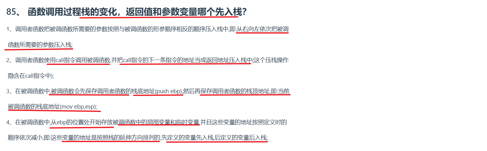

---

### **函数调用过程栈变化的详细解释**

在函数调用过程中，栈内存的变化是程序执行的核心机制之一。以下结合图示内容，逐步解析栈的操作及其原理：

---

#### **1. 参数入栈：从右向左逆序压入**
• **规则**：调用者函数（Caller）将传递给被调函数（Callee）的参数按**从右向左的顺序**压入栈中。  
  **原因**：这种设计（如C语言的`cdecl`调用约定）使得被调函数能够以**声明顺序**访问参数，即第一个参数位于栈顶附近。  
  **示例**：  
  ```c
  // 调用函数：func(a, b, c)
  // 参数压栈顺序：c → b → a
  push c
  push b
  push a
  call func
  ```

---

#### **2. 调用指令与返回地址压栈**
• **`call`指令的作用**：  
  1. 将**返回地址**（即`call`指令下一条指令的地址）压入栈顶。  
  2. 跳转到被调函数的入口地址开始执行。  
  **栈变化**：  
  ```
  栈顶 → 返回地址  
        参数c  
        参数b  
        参数a  
  ```

---

#### **3. 被调函数的栈帧初始化**
被调函数执行时，需保存调用者的栈帧信息，并建立自己的栈帧：  
1. **保存调用者的栈基址（ebp）**：  
   ```assembly
   push ebp        ; 将调用者的ebp压栈保存
   ```
2. **设置当前栈基址（ebp）**：  
   ```assembly
   mov ebp, esp    ; ebp指向当前栈顶（即新栈帧的基址）
   ```
   **此时栈结构**：  
   ```
   栈顶 → 调用者ebp (旧ebp)  
          返回地址  
          参数c  
          参数b  
          参数a  
   ```

---

#### **4. 局部变量与临时变量的分配**
• **分配方式**：从`ebp`向低地址方向依次分配局部变量，**先定义的变量先入栈**。  
  **示例**：  
  ```c
  void func(int a, int b) {
      int x;  // 先定义，地址更低（靠近ebp）
      int y;  // 后定义，地址更高（远离ebp）
  }
  ```
  **栈布局**：  
  ```
  ebp-4 → x  
  ebp-8 → y  
  ```

• **栈生长方向**：栈从高地址向低地址延伸，因此变量地址随着定义的顺序逐渐减小。  
  **意义**：确保变量在栈中连续存储，避免碎片化。

---

#### **5. 返回值传递**
• **返回值的位置**：  
  返回值通常通过**寄存器（如`eax`）**传递，而非通过栈。  
  **示例**：  
  ```assembly
  mov eax, 42    ; 返回值42存入eax
  ret            ; 返回调用者
  ```

---

#### **6. 栈帧的销毁与返回**
被调函数执行完毕后需清理栈帧：  
1. **恢复调用者的栈基址（ebp）**：  
   ```assembly
   mov esp, ebp    ; 将栈顶esp重置到当前ebp（即恢复旧栈顶）
   pop ebp         ; 弹出旧ebp，恢复调用者的栈基址
   ```
2. **返回到调用者**：  
   ```assembly
   ret             ; 弹出返回地址，跳转回调用者
   ```
3. **调用者清理参数**：  
   在`cdecl`约定中，调用者负责清理栈中的参数：  
   ```assembly
   add esp, 12     ; 清理3个int参数（假设每个参数占4字节）
   ```

---

### **关键问题解答**
#### **参数和返回值哪个先入栈？**
• **参数先入栈**：参数在调用前按从右向左顺序压入栈中。  
• **返回值不入栈**：通过寄存器传递，避免栈空间占用。

---

### **栈变化示意图总结**
```
调用前栈布局（Caller）：
        参数a  
        参数b  
        参数c  

调用后栈布局（Callee）：
        ebp-4 → 局部变量x  
        ebp-8 → 局部变量y  
        ebp   → 旧ebp  
        ebp+4 → 返回地址  
        ebp+8 → 参数a  
        ebp+12→ 参数b  
        ebp+16→ 参数c  
```

---

### **实际代码示例（x86汇编）**
```assembly
; 调用者（Caller）
push 3           ; 参数c（从右向左压栈）
push 2           ; 参数b
push 1           ; 参数a
call func        ; 压入返回地址并跳转

; 被调函数（Callee）
func:
    push ebp     ; 保存旧ebp
    mov ebp, esp ; 设置新ebp
    sub esp, 8   ; 分配局部变量空间（x和y）
    ; ... 函数逻辑 ...
    mov eax, 42  ; 返回值存入eax
    mov esp, ebp ; 恢复栈顶
    pop ebp      ; 恢复旧ebp
    ret          ; 返回调用者
```

---

### **总结**
1. **参数逆序压栈**：确保被调函数能按声明顺序访问参数。  
2. **栈帧管理**：通过`ebp`和`esp`维护函数栈的基址和栈顶。  
3. **局部变量分配**：从`ebp`向低地址方向分配，先定义变量地址更低。  
4. **返回值传递**：通过寄存器（而非栈）实现高效返回。  

理解栈帧变化是分析程序行为、调试内存错误（如栈溢出）的关键基础。