[TOC] 


#### C++11有哪些新特性?

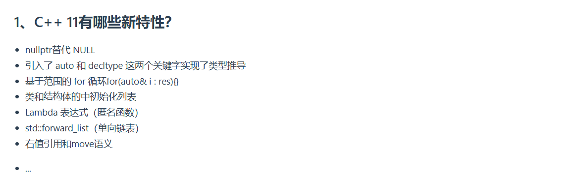

---

#### auto decltype 和decltype(auto) 的用法

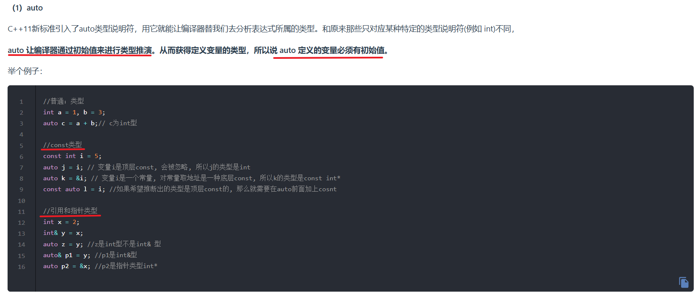

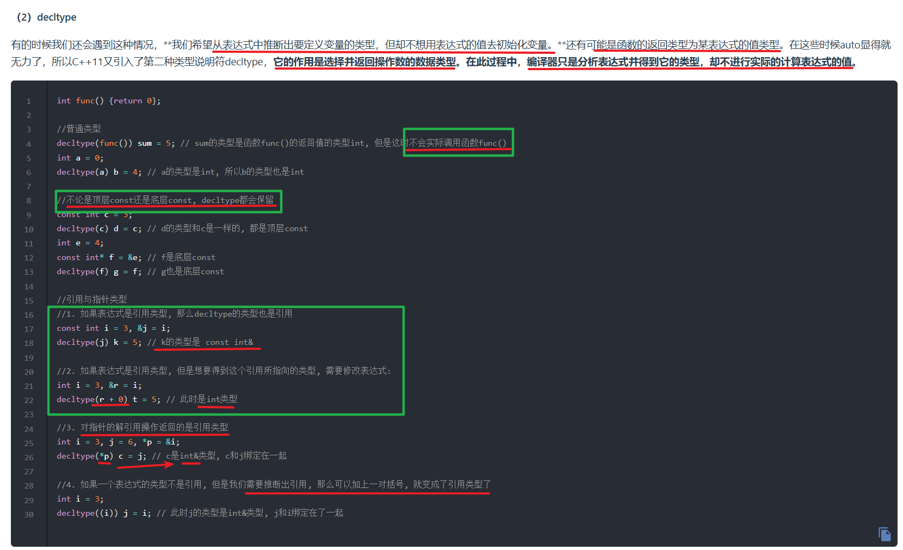

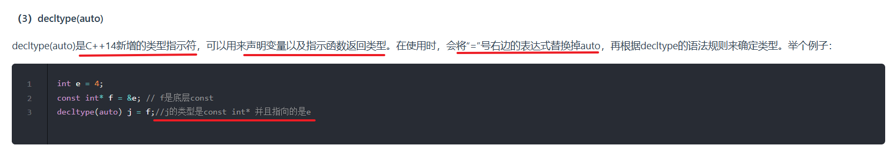

---

#### C++中NULL和nullptr区别
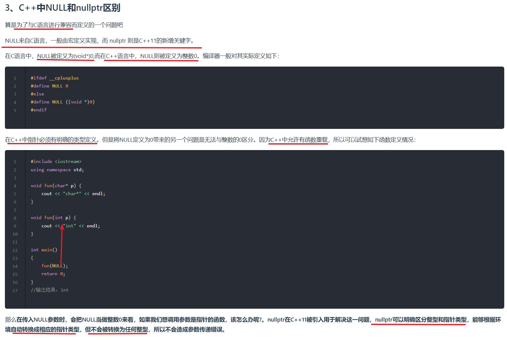

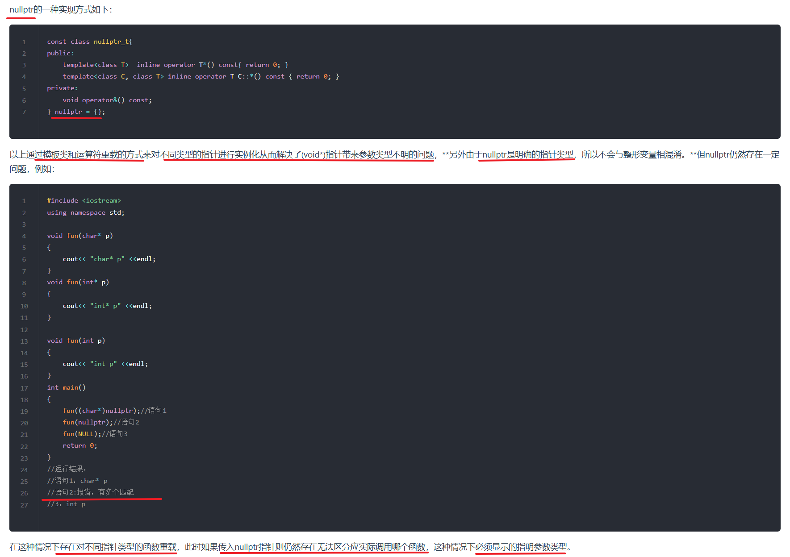

---
#### 智能指针原理，常用的智能指针及实现

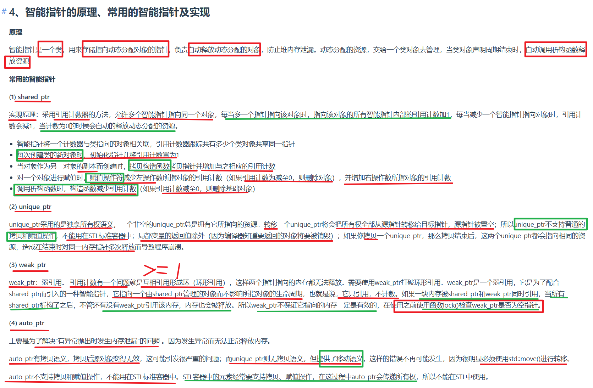

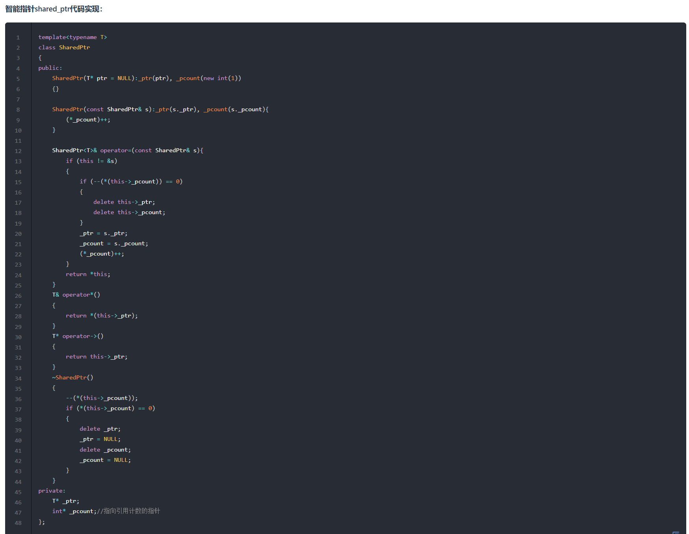

---
#### 说说Lambda函数
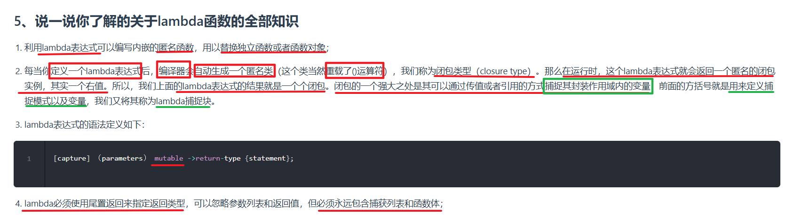

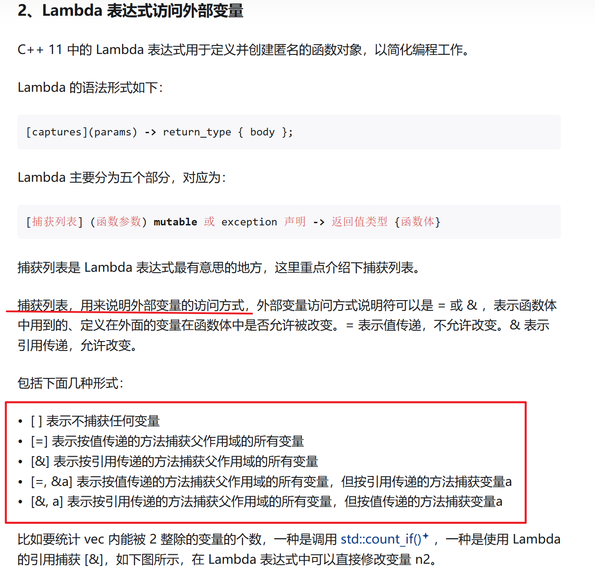

---
#### 智能指针的作用
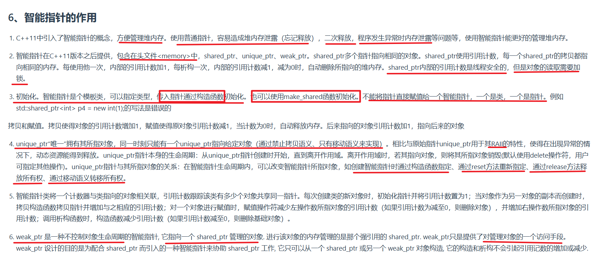

---
#### auto_ptr的作用
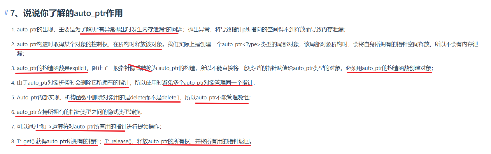

---
#### 智能指针的循环引用
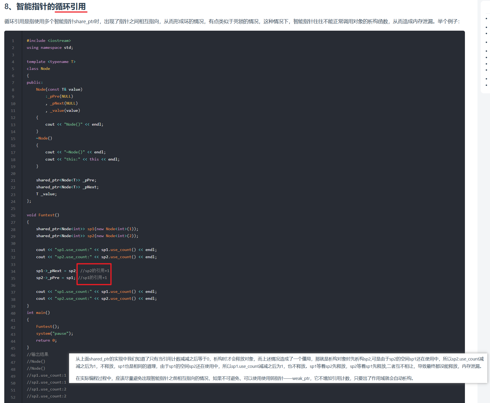

---
#### 手写一个智能指针类需要实现哪些函数？
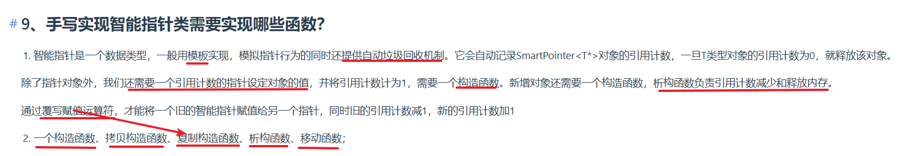

##### 手写代码
---
###### unique_ptr
```cpp

#include <utility> // 用于 std::swap

template <typename T>
class UniquePtr {
private:
    T* ptr_ = nullptr;

    // 禁用拷贝构造和拷贝赋值
    UniquePtr(const UniquePtr&) = delete;
    UniquePtr& operator=(const UniquePtr&) = delete;

public:
    // 默认构造函数（空指针）
    UniquePtr() = default;

    // 显式构造函数（避免隐式转换）
    explicit UniquePtr(T* ptr) : ptr_(ptr) {}

    // 移动构造函数（所有权转移）
    UniquePtr(UniquePtr&& other) noexcept : ptr_(other.ptr_) {
        other.ptr_ = nullptr;
    }

    // 移动赋值运算符
    UniquePtr& operator=(UniquePtr&& other) noexcept {
        if (this != &other) {
            delete ptr_;         // 释放原有资源
            ptr_ = other.ptr_;   // 接管新资源
            other.ptr_ = nullptr;
        }
        return *this;
    }

    // 析构函数
    ~UniquePtr() {
        delete ptr_;
    }

    // 指针运算符重载
    T& operator*() const noexcept { return *ptr_; }
    T* operator->() const noexcept { return ptr_; }

    // 获取原始指针（谨慎使用）
    T* get() const noexcept { return ptr_; }

    // 释放指针所有权
    T* release() noexcept {
        T* ptr = ptr_;
        ptr_ = nullptr;
        return ptr;
    }

    // 重置指针
    void reset(T* ptr = nullptr) noexcept {
        delete ptr_;  // 释放原有资源
        ptr_ = ptr;   // 接管新资源
    }

    // 交换指针
    void swap(UniquePtr& other) noexcept {
        std::swap(ptr_, other.ptr_);
    }

    // 布尔转换（用于条件判断）
    explicit operator bool() const noexcept {
        return ptr_ != nullptr;
    }
};

// 示例用法
int main() {
    UniquePtr<int> p1(new int(42));
    UniquePtr<int> p2(std::move(p1));  // 移动构造

    if (p2) {
        std::cout << *p2 << std::endl;  // 输出 42
    }

    UniquePtr<int> p3;
    p3 = UniquePtr<int>(new int(100)); // 移动赋值

    return 0;
}
```
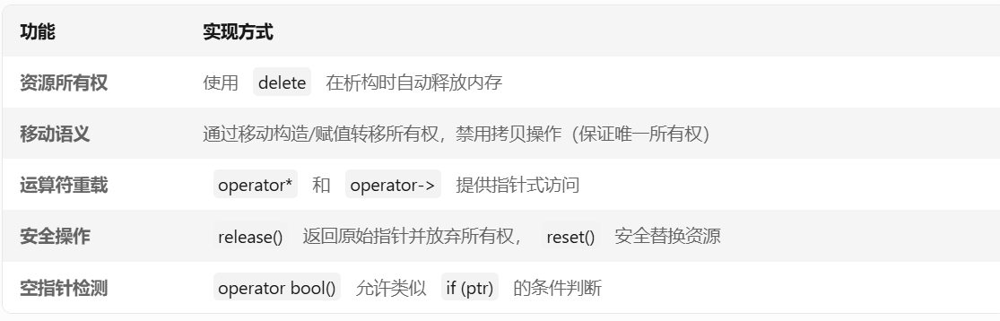
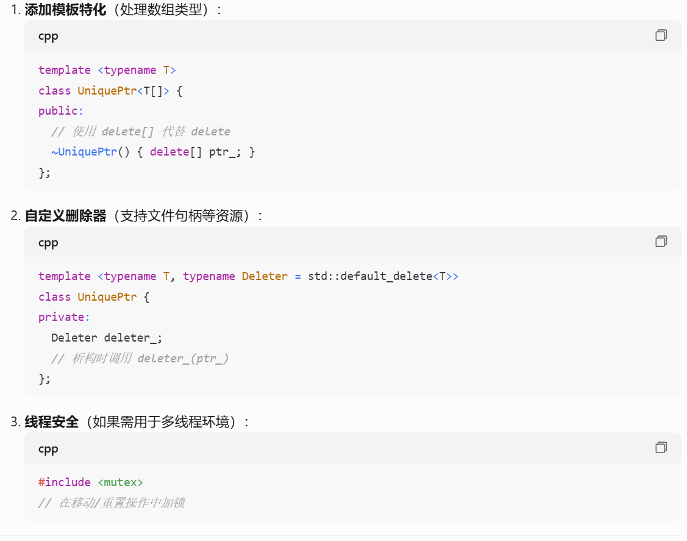
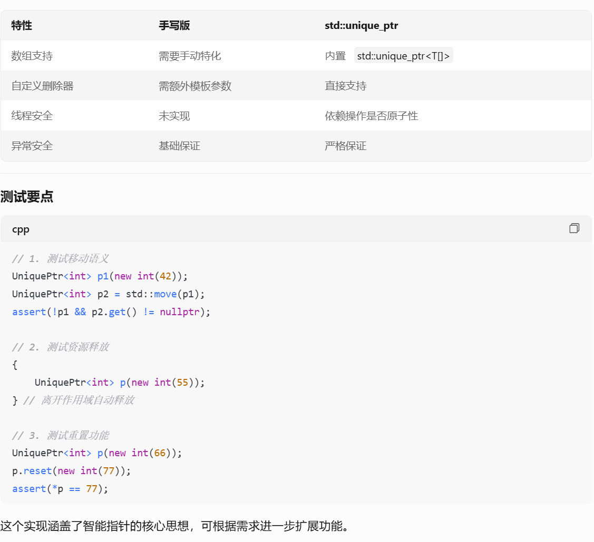

---
###### shared_ptr
```cpp
#include <iostream>

template <typename T>
class SharedPtr {
private:
    T* ptr_ = nullptr;          // 指向管理的对象
    size_t* ref_count_ = nullptr; // 指向引用计数的指针

    // 释放资源并更新引用计数
    void release() {
        if (ref_count_) {
            (*ref_count_)--;
            if (*ref_count_ == 0) {
                delete ptr_;        // 释放对象
                delete ref_count_;  // 释放引用计数
            }
            ptr_ = nullptr;
            ref_count_ = nullptr;
        }
    }

public:
    // 默认构造函数（空指针）
    SharedPtr() = default;

    // 显式构造函数（接管原始指针）
    explicit SharedPtr(T* ptr) : ptr_(ptr), ref_count_(new size_t(1)) {}

    // 拷贝构造函数（共享所有权）
    SharedPtr(const SharedPtr& other) : ptr_(other.ptr_), ref_count_(other.ref_count_) {
        if (ref_count_) (*ref_count_)++;
    }

    // 拷贝赋值运算符
    SharedPtr& operator=(const SharedPtr& other) {
        if (this != &other) {
            release();  // 释放原有资源
            ptr_ = other.ptr_;
            ref_count_ = other.ref_count_;
            if (ref_count_) (*ref_count_)++;
        }
        return *this;
    }

    // 移动构造函数（转移所有权）
    SharedPtr(SharedPtr&& other) noexcept : ptr_(other.ptr_), ref_count_(other.ref_count_) {
        other.ptr_ = nullptr;
        other.ref_count_ = nullptr;
    }

    // 移动赋值运算符
    SharedPtr& operator=(SharedPtr&& other) noexcept {
        if (this != &other) {
            release();
            ptr_ = other.ptr_;
            ref_count_ = other.ref_count_;
            other.ptr_ = nullptr;
            other.ref_count_ = nullptr;
        }
        return *this;
    }

    // 析构函数
    ~SharedPtr() {
        release();
    }

    // 指针运算符重载
    T& operator*() const noexcept { return *ptr_; }
    T* operator->() const noexcept { return ptr_; }

    // 获取引用计数
    size_t use_count() const noexcept {
        return (ref_count_ ? *ref_count_ : 0);
    }

    // 获取原始指针
    T* get() const noexcept { return ptr_; }

    // 重置指针
    void reset(T* ptr = nullptr) {
        release();  // 释放原有资源
        if (ptr) {
            ptr_ = ptr;
            ref_count_ = new size_t(1);
        }
    }

    // 交换指针
    void swap(SharedPtr& other) noexcept {
        std::swap(ptr_, other.ptr_);
        std::swap(ref_count_, other.ref_count_);
    }

    // 布尔转换
    explicit operator bool() const noexcept {
        return ptr_ != nullptr;
    }
};

// 测试示例
int main() {
    SharedPtr<int> p1(new int(42));
    std::cout << "p1 use_count: " << p1.use_count() << std::endl; // 输出 1

    SharedPtr<int> p2 = p1; // 拷贝构造
    std::cout << "p1 use_count: " << p1.use_count() << std::endl; // 输出 2

    {
        SharedPtr<int> p3(p2);
        std::cout << "p1 use_count: " << p1.use_count() << std::endl; // 输出 3
    } // p3 析构，引用计数减为 2

    p2.reset(new int(100)); // p2 指向新对象
    std::cout << "p1 use_count: " << p1.use_count() << std::endl; // 输出 1
    std::cout << "p2 use_count: " << p2.use_count() << std::endl; // 输出 1

    return 0;
}
```

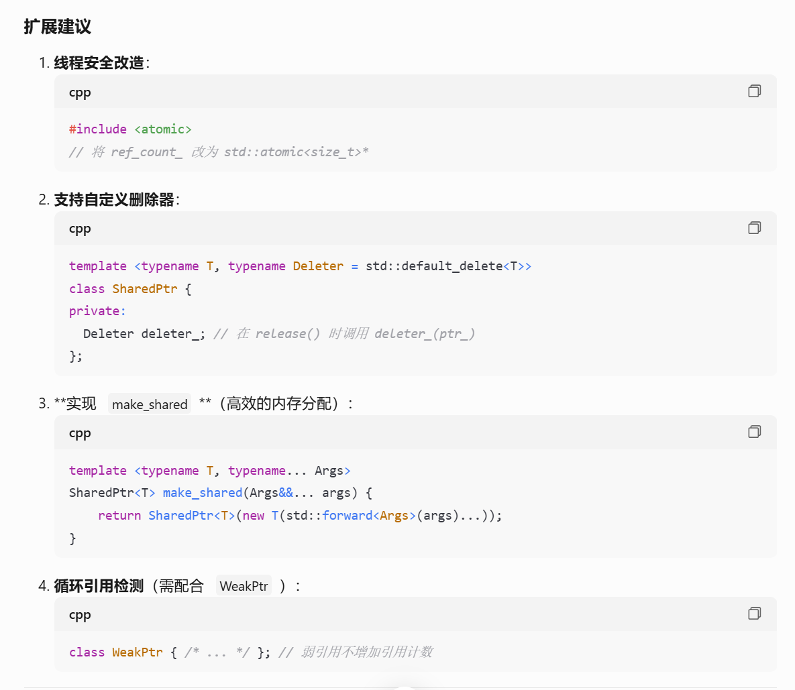
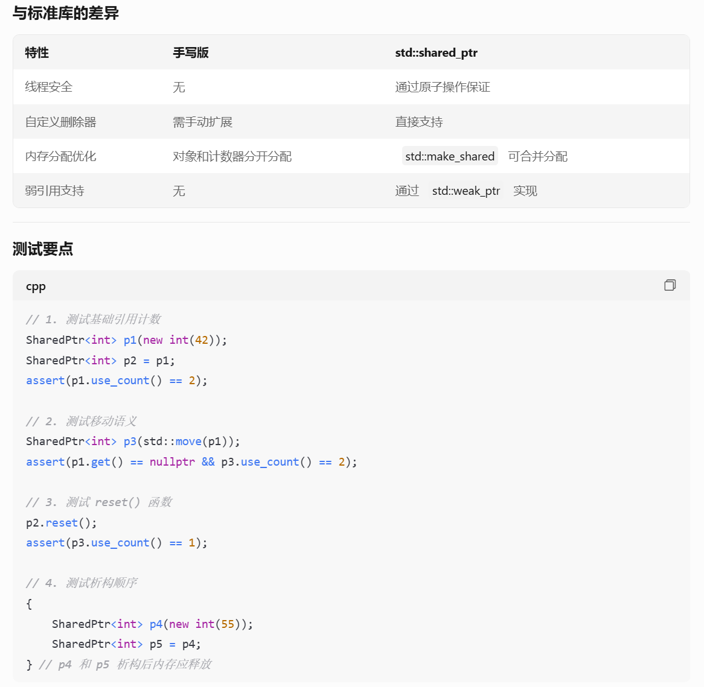


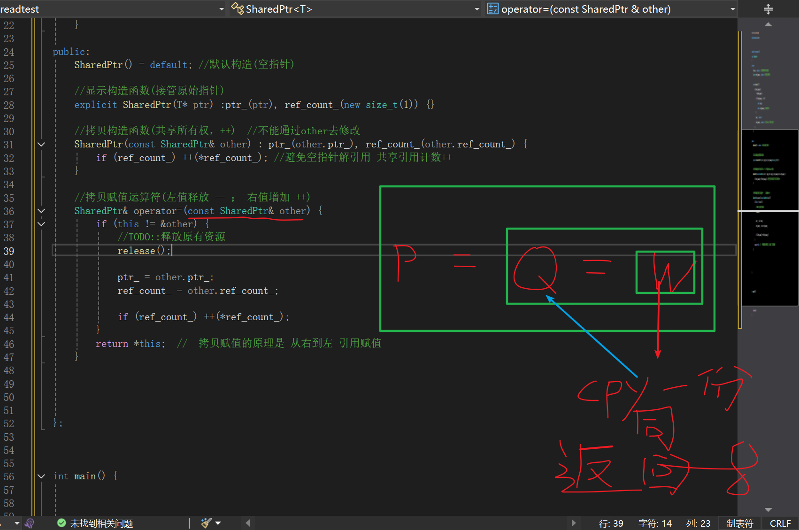
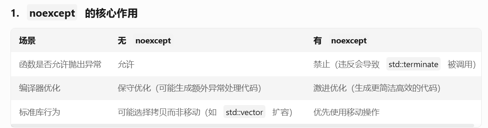

---
###### 测试
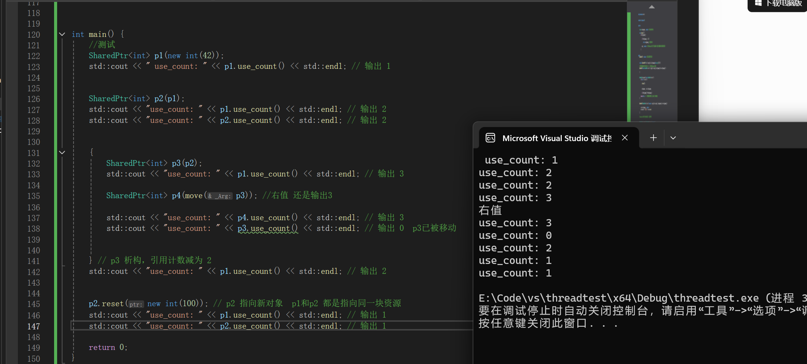


---
#### 弱指针解决智能指针的循环
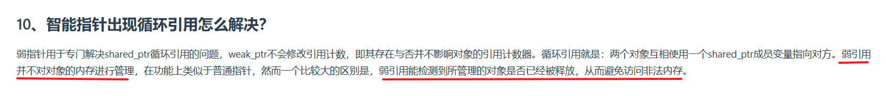