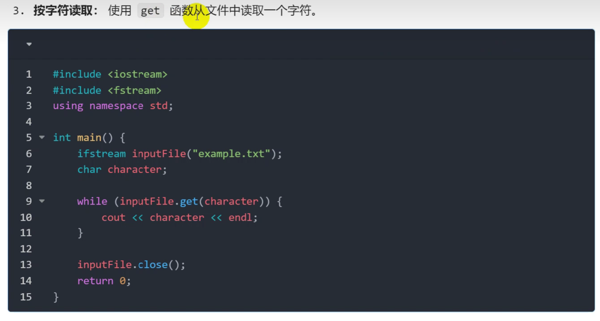

[TOC]

### 重要概念


### 文件的打开和关闭


### 写文件


### 读文件


解决汉字乱码

 >>不读空格 回车
 get()读空格和回车

---

> **代码中存在错误，附加修改和扩展**


> fstream.seekg(0,ios::end);`seekg`是C++中用于移动输入文件流指针的函数，参数`0`表示偏移量，`ios::end`表示相对于文件末尾的位置。
> 
> `tellg()`用于获取当前输入文件流指针的位置，返回类型是`streampos`。
> 
>
> seekg(0, ios::end) 将指针移动到文件末尾
> tellg() 返回当前指针位置（即总字节数）
>


```C++
#include <iostream>
#include <fstream>
using namespace std;

int main() {
    const int bufferSize = 100;
    char buffer[bufferSize];

    ifstream inputFile("data.bin", ios::binary);
    if (!inputFile) {
        cerr << "文件打开失败" << endl;
        return 1;
    }

    // 逐块读取文件
    while (inputFile.read(buffer, bufferSize)) {
        // 处理当前读取的数据块
        streamsize bytesRead = inputFile.gcount();  // ✅ 正确函数名
        for (int i = 0; i < bytesRead; ++i) {
            // 正确处理符号问题
            cout << hex << static_cast<int>(static_cast<unsigned char>(buffer[i])) << " ";
        }
    }

    // 处理最后一次可能未填满缓冲区的读取
    if (inputFile.eof()) {
        streamsize bytesRead = inputFile.gcount();
        for (int i = 0; i < bytesRead; ++i) {
            cout << hex << static_cast<int>(static_cast<unsigned char>(buffer[i])) << " ";
        }
    } else if (inputFile.fail()) {
        cerr << "读取过程中发生错误" << endl;
    }

    inputFile.close();
    return 0;
}
```


#### 异常处理


#### 成员函数


### 文件指针和定位 
指针-> 光标


> seekp的实现会产生覆盖，，我们可以使用拼接的方式插入
>


### 应用案例

