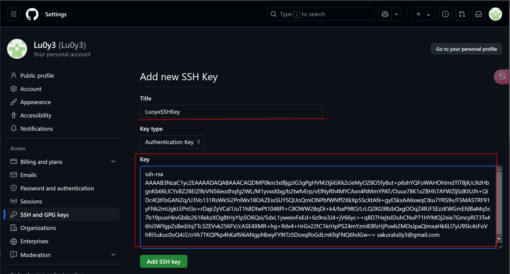
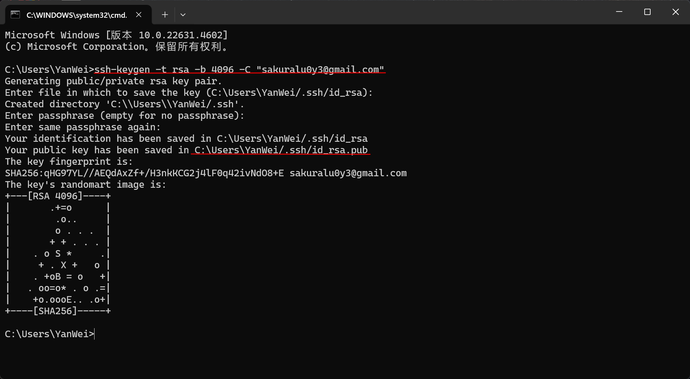
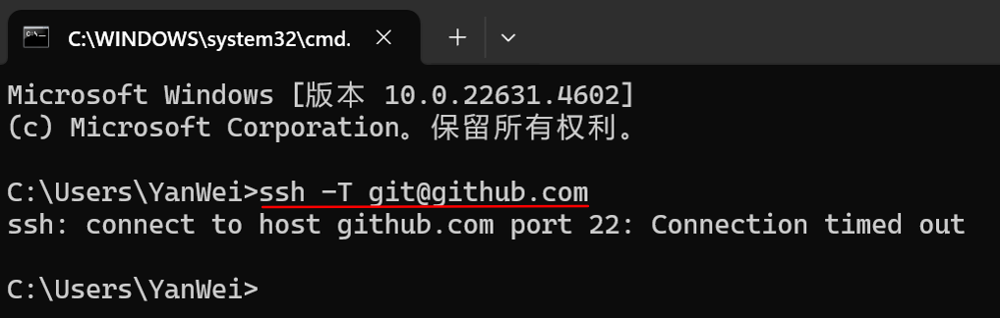
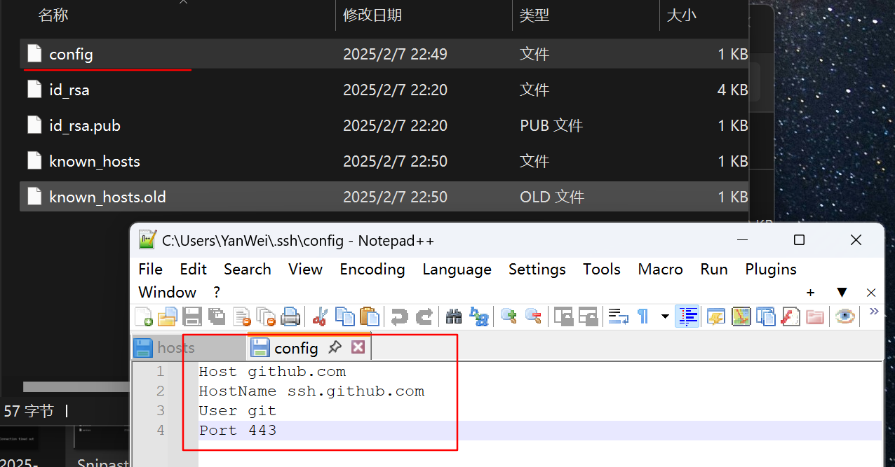
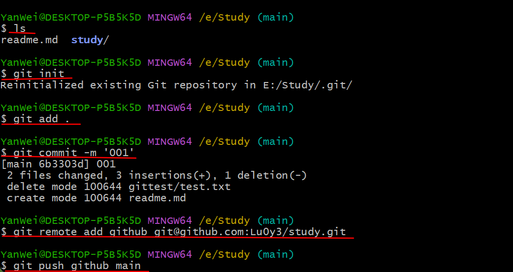

### 生成并配置ssh密钥
首先在GitHub的设置中找到SSH，其中Key部分待定

然后在cmd中输入<p>ssh-keygen -t rsa -b 4096 -C "自己注册GitHub的邮箱"</p>
第二个划线部分则是SSHKey的文件所在，将其中的内容复制到step01的Key区域


### 连接测试
cmd中输入<p>ssh -T git@github.com</p>

若连接失败则在第一步的Key同区域找到config文件(没有就自己创建一个)并输入以下内容
<font size = '3'>
Host github.com
HostName ssh.github.com
User git
Port 443
</font>
然后重新测试


### gitbash 的操作

以下是建立本地 Git 仓库并连接到远程仓库的完整步骤：

## Deepseek
---

### **步骤 1：初始化本地仓库**
1. 打开终端，进入项目目录：
   ```bash
   cd /path/to/your/project
   ```
2. 初始化 Git 仓库：
   ```bash
   git init
   ```

---

### **步骤 2：添加文件并提交**
1. 将所有文件添加到暂存区：
   ```bash
   git add .
   ```
   - 若只需添加特定文件：`git add file1.txt file2.txt`
2. 提交更改到本地仓库：
   ```bash
   git commit -m "Initial commit"
   ```

---

### **步骤 3：关联远程仓库**
1. 添加远程仓库地址（以 GitHub 为例）：
   ```bash
   git remote add origin https://github.com/your-username/your-repo.git
   ```
   - **HTTPS**：适用于简单推送，需输入账号密码。
   - **SSH**（推荐）：需提前配置 SSH 密钥，格式为：`git@github.com:your-username/your-repo.git`

---

### **步骤 4：推送到远程仓库**
1. 首次推送时指定远程分支（默认分支通常是 `main`）：
   ```bash
   git push -u origin main
   ```
   - 若远程仓库为空且未创建 `main` 分支，此命令会自动创建。
   - 如果本地分支名为 `master`，替换为 `git push -u origin master`

---

### **常见问题解决**
1. **分支名称冲突**：  
   - 若远程仓库已存在文件（如 `README.md`），需先拉取合并：
     ```bash
     git pull origin main --allow-unrelated-histories
     ```
   - 再推送：`git push -u origin main`

2. **权限错误**：  
   - 使用 HTTPS 时，确保 GitHub 账号密码正确（或改用 Personal Access Token）。
   - 使用 SSH 时，需提前配置密钥：
     ```bash
     ssh-keygen -t ed25519 -C "your-email@example.com"
     ```
     将公钥 `~/.ssh/id_ed25519.pub` 添加到 GitHub 账户的 SSH Keys 设置中。

---

### **总结命令**
```bash
# 初始化仓库
git init
# 添加文件并提交
git add .
git commit -m "Initial commit"
# 关联远程仓库
git remote add origin https://github.com/your-username/your-repo.git
# 推送代码
git push -u origin main
```

---

通过以上步骤即可完成本地仓库与远程仓库的连接。如果遇到问题，优先检查分支名称是否一致（如 `main` vs `master`）和远程仓库权限配置。