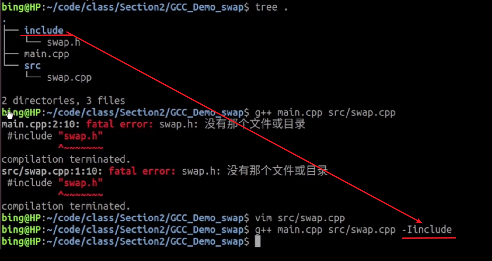
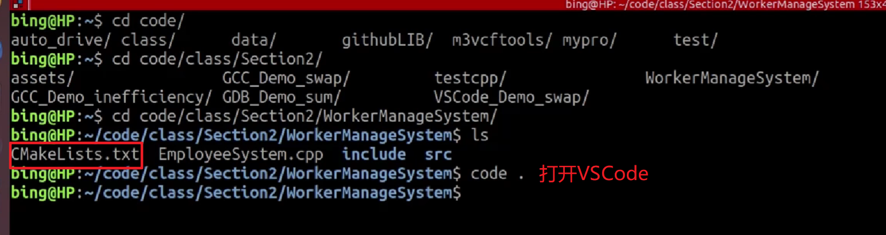
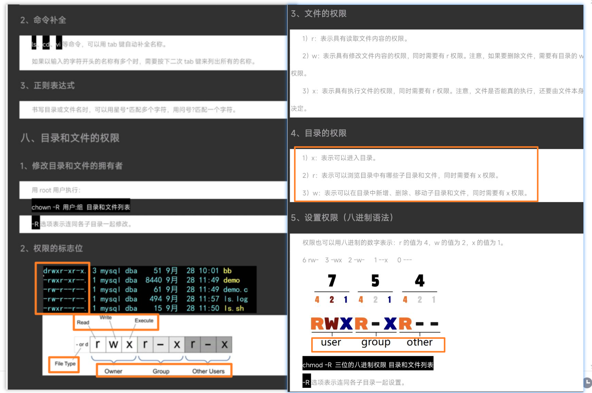
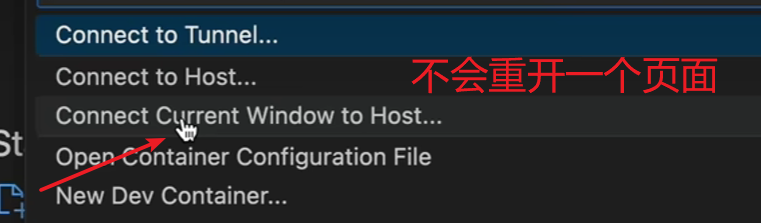

[TOC]

### Linux基础

#### 系统介绍

#### 指令

#### 文件编辑vim

### gcc gdb 和 cmake 的安装

### GCC G++

#### E预处理 S编译 C汇编 链接

---
#### 重要编译参数

---

---
#### 实战

---
#### 生成静态库

#### 生成动态库

---

### GDB调试器

#### 常用调试参数

---
#### 实战

---

### IDE VSCode

#### 界面介绍

#### 插件安装

---

#### 快捷键

---
#### 实战

---

### SSH远程登陆应用指南

#### SSH基础知识

连接远程服务器

#### 免密登录

---

---
#### SCP文件传输

##### SCP命令行传输

---

#### 可视化客户端SSH链接/FTP文件传输

XShell  XFTP

---
#### VSCode[免密]远程开发

---

---

---

---

---
#### Github 免密 Push Pull

---
##### HTTPS

###### push + 密码用户名

---
##### SSH

第一步生成密钥 ssh-keygen

---

免密push

---

git pull / fecth

---
---

### Git与VSCode

git status

U  untracked未被跟踪

M  modified修改

