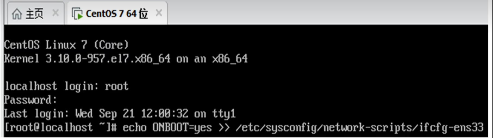

### **VMware的安装**

> 首先登录<a href = 'https://support.broadcom.com/web/ecx/home'>Broadcom</a>官网，找到**VMware Workstation pro**进行下载，

### **CentOS的安装**
> 首先登陆<a href = 'https://www.aliyun.com/'>阿里云</a>官网，找到**镜像站-OS镜像**,如搜寻CentOS7进行下载，
> 然后配置网卡，

### **SecureCRT的安装**
> 个人百度网盘有破解版，或者通过网盘分享的文件:SecureCRT8.5.zip 链接: https://pan.baidu.com/s/19_ON10a9ATvZOTt6pmZn3Q 提取码: 2634 
>
**以上为简略版，详细请b站或CSDN搜索**

---

