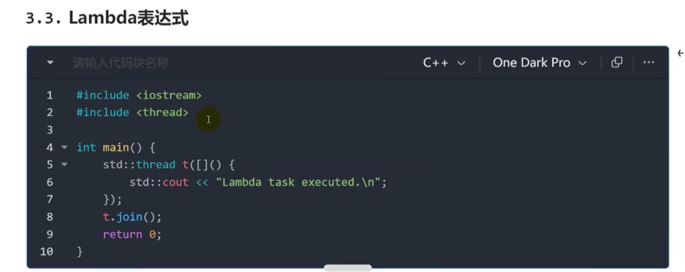
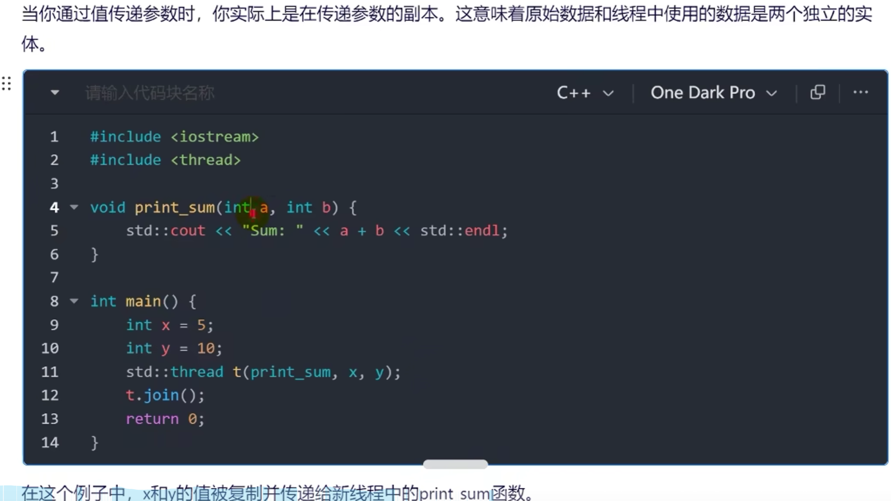
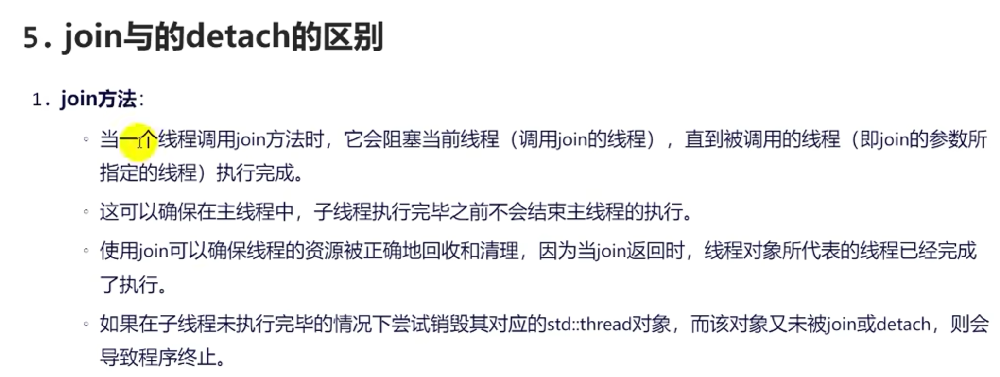
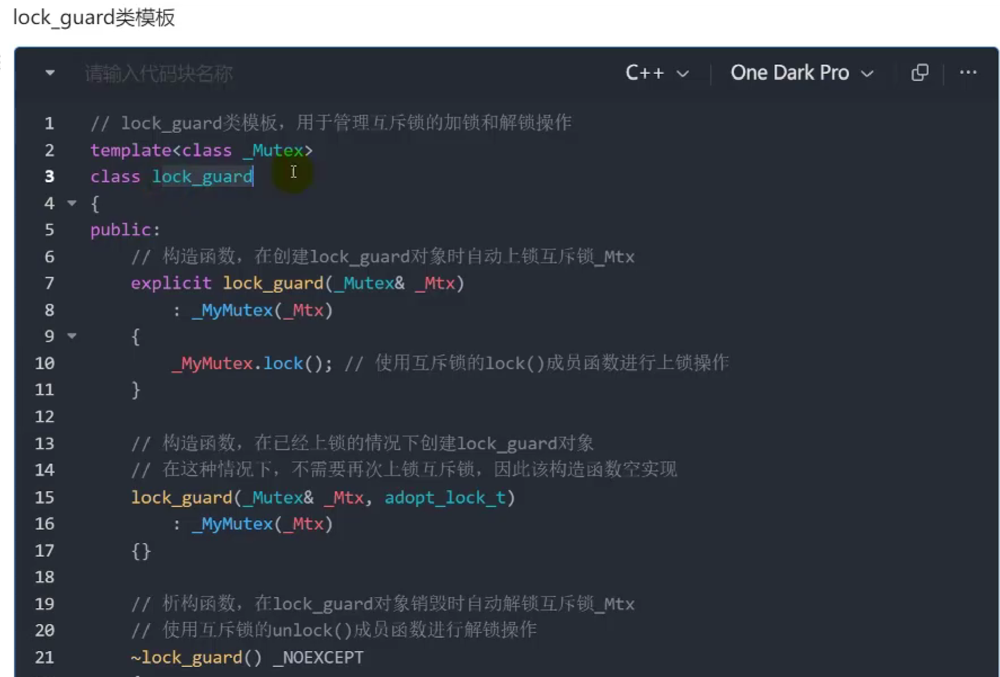
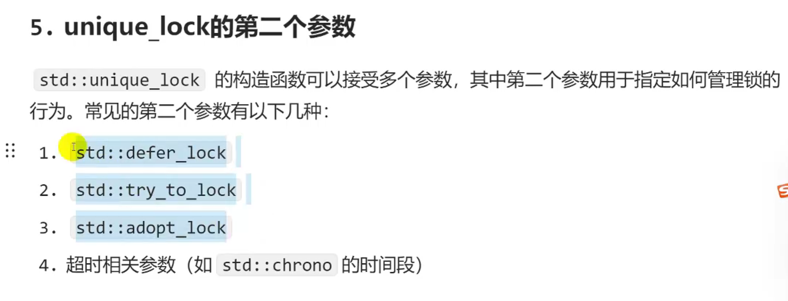
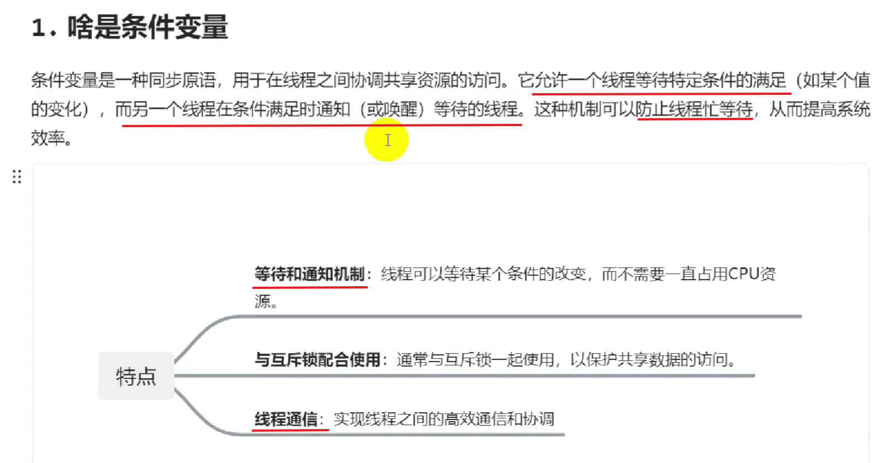
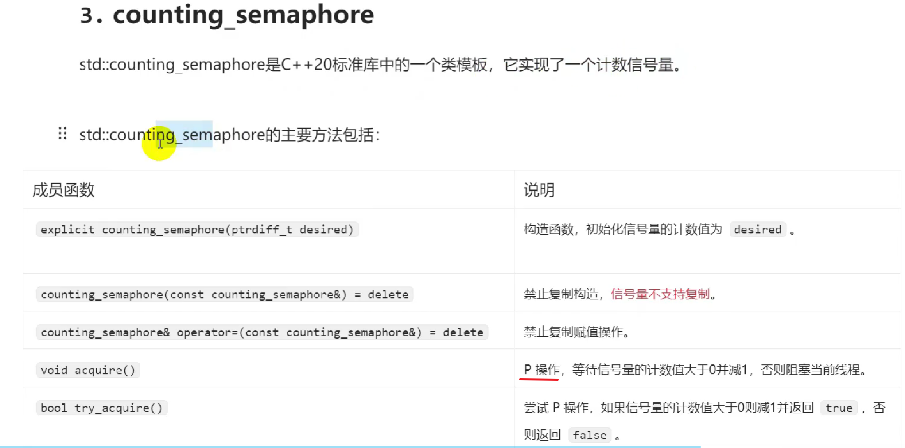
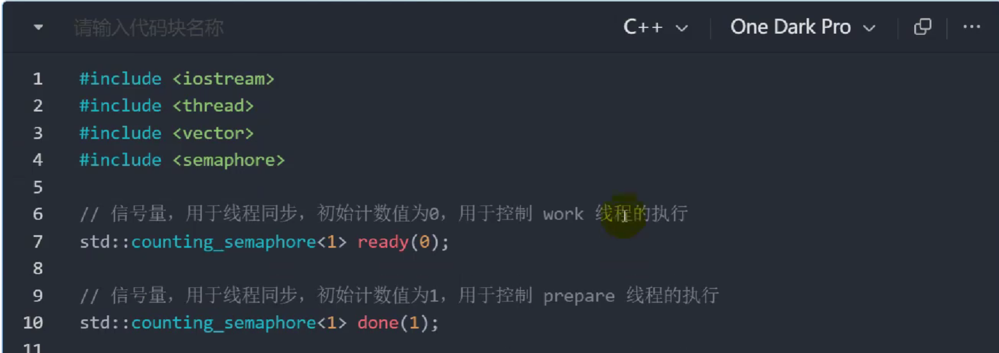
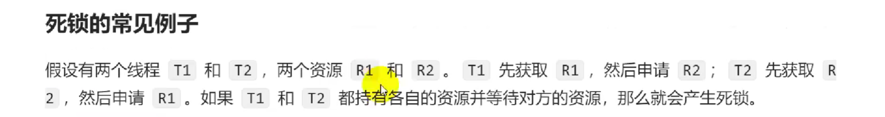
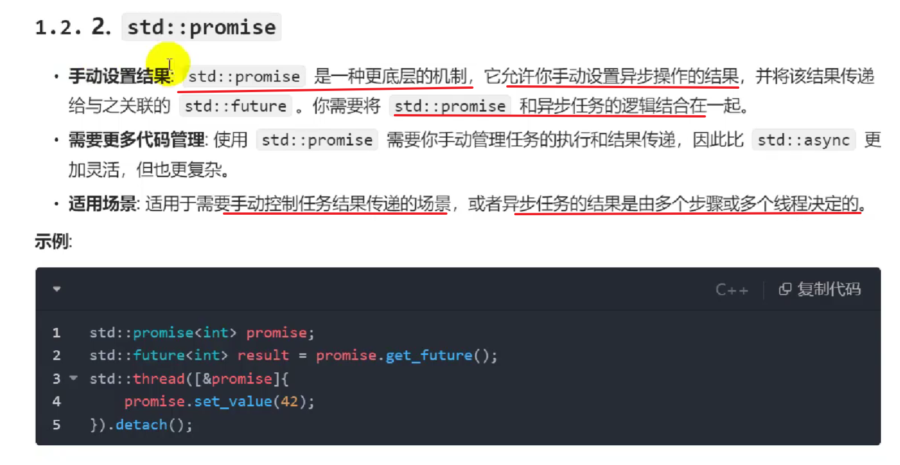

[TOC]

## Thread创建线程

### C++中的多线程


**线程相关知识图谱**


> thread 
> 互斥量和锁mutex 
> 条件变量、异步编程


### 创建一个线程


> join 阻塞主线程
> 可调对象

### 线程的可调用对象


#### 函数指针
上一张图例子

#### 成员函数指针

> 这需要传函数对象 和 成员函数进来

#### Lambda表达式


#### 函数对象(仿函数)


#### 绑定对象(std::bind)


### 如何传参数

#### 值传递

#### 引用传递

#### 注意事项


### join和detach的区别



### 一个线程包含什么东西


### this_thread


---

## 线程同步与mutex


### 线程间同步方式


### 什么是线程同步


### 线程同步机制


### 互斥锁mutex


**代码**
```CPP
#include <iostream>
#include <thread>

// 共享变量（无保护）
int counter = 0;

// 线程函数：对counter递增times次
void increment_counter(int times) {
    for (int i = 0; i < times; ++i) {
        counter++; // ❌ 多线程同时修改导致数据竞争
    }
}

int main() {
    std::thread t1(increment_counter, 100000);
    std::thread t2(increment_counter, 100000);
    
    t1.join();
    t2.join();
    
    // 输出结果随机可能小于200000（典型值：112347）
    std::cout << "最终结果: " << counter << std::endl;
    return 0;
}
```
数据一致性问题
两个线程肯定是都执行了100000次，数据的相互覆盖导致不足2*100000

**进行加互斥锁**
```CPP
#include <iostream>
#include <thread>
#include <mutex>  // 新增头文件

// 共享变量与互斥锁
int counter = 0;
std::mutex mtx;    // 全局互斥锁

// 线程函数：安全递增counter
void safe_increment(int times) {
    for (int i = 0; i < times; ++i) {
        std::lock_guard<std::mutex> lock(mtx); // 自动加锁/解锁
        counter++; // ✅ 受互斥锁保护的原子操作

    }
}

int main() {
    std::thread t1(safe_increment, 100000);
    std::thread t2(safe_increment, 100000);
    
    t1.join();
    t2.join();
    
    // 结果稳定为200000
    std::cout << "安全结果: " << counter << std::endl;
    return 0;
}
```
---
### lock与unlock


#### 注意事项


---

### mutex四种类型 


---
## lock_guard
### 什么是lock_guard


### 为什么需要lock_guard

### lock_guard如何使用


> 线程不可被复制，使用引用
> 

### lock_guard特性


**lock_guard类模板**



### 单一职责


---

## unique_lock
### 为什么会有unique_lock


### lock_guard有什么问题


### 什么是unique_lock


### unique_lock的构造


### unique_lock的第二参数

```cpp
// 超时构造方式 (需要timed_mutex)
std::unique_lock<std::timed_mutex> tl1(t_mtx, std::chrono::seconds(1));  // 5. 1秒超时锁
std::unique_lock<std::timed_mutex> tl2(t_mtx, std::chrono::steady_clock::now() + std::chrono::ms(500));  // 6. 绝对时间锁
```

### unique_lock特点


---

## 条件变量

### 什么是条件变量


### 条件变量的作用


**忙等待 while**


**例子**


### 条件变量定义


### wait和 wait for


### notify_one notify_all


## 两个线程交替执行的案例


## 读写锁
**可能会手写？**
### 什么是读写锁


### 读写锁基本特征


### 读写锁的特点


**修改：独占锁-> unique_lock**

### shared_mutex


### shared_lock


---

## 读写锁的实现

```cpp
#include <iostream>
#include <vector>
#include <thread>
#include <shared_mutex>  // 关键头文件

class ThreadSafeData {
private:
    std::shared_mutex rw_mtx;  // 读写锁
    int data = 0;              // 共享资源

public:
    // 读操作（多个线程可并发访问）
    int read() const {
        std::shared_lock lock(rw_mtx);  // 共享锁
        return data;
    }

    // 写操作（独占访问）
    void write(int new_val) {
        std::unique_lock lock(rw_mtx);  // 独占锁
        data = new_val;
    }
};

int main() {
    ThreadSafeData tsd;
    std::vector<std::thread> readers;

    // 写线程（独占访问）
    std::thread writer([&tsd]{
        for(int i=1; i<=3; ++i) {
            tsd.write(i);
            std::cout << "写入: " << i << std::endl;
            std::this_thread::sleep_for(std::chrono::milliseconds(100));
        }
    });

    // 读线程组（并发访问）
    for(int i=0; i<5; ++i) {
        readers.emplace_back([&tsd, i]{
            for(int j=0; j<3; ++j) {
                int val = tsd.read();
                std::cout << "读者" << i << "读取: " << val << std::endl;
                std::this_thread::sleep_for(std::chrono::milliseconds(50));
            }
        });
    }

    writer.join();
    for(auto& t : readers) t.join();
    
    return 0;
}
```

---

## 原子操作和原子变量

### 原子变量


### 原子操作


**从内存中拿取dword 给eax寄存器 ,然后对eax进行操作+1 ，(中断位置)再将eax寄存器中的值 给内存dword, 上述操作整体--原子性**
**将int声明成原子变量就变成'强制'理想情况,前提是进行的原子操作**


> sum = sum + 1 ->读-改-写


**原子操作**


### 原子操作的内存序问题


>**1编辑器优化** 

>**2处理器优化** ：见疑难
>**3缓存一致性** ：见疑难

---
### 内存序


---
### atomic中的成员函数


#### 原子操作符


#### 原子成员函数


---

## 信号量与counting_semaphore

### 信号量

#### 类型

#### 作用


### 信号量基本操作
#### 工作原理


#### 典型应用


### counting_semaphore

#### 成员函数



#### counting_semaphore实现互斥


#### counting_semaphore实现同步



---

## 栅栏(barrier)
### 栅栏是什么


### 栅栏的作用和特点


### 定义C++20 std::barrier


**见疑难** ：需要实践

---

## 死锁

### 死锁是什么


### 死锁怎么产生


### 死锁例子



### 如何解决死锁


---

## 异步编程 

### 什么是异步

### 异步优点


### C++异步编程


### async和future使用

#### async


**async 更简便的创建线程**


**T async()返回一个 future<T>对象，拿到返回结果**

#### future
> #include < future >


#### 三种启动策略launch


**launch::async线程id不同**

**launch::deferred线程相同**


### promise 使用
#### 概念


#### 定义和使用


**使用move是因为promise不可复制，补充不使用move的版本 使用引用传递**


#### 成员函数


#### 注意事项


---

### packaged_task 使用
#### 概念


#### 基本使用


**封装函数 封装成任务**


#### 主要特性


#### 应用场景


### 三种异步工具的比较





#### 使用样例


## 线程池和实现

### 线程池


### 为什么使用线程池


### 一个线程池应该包含什么东西


### 实现C++线程池


<a herf = 'https://blog.csdn.net/2302_79025454/article/details/146106297?fromshare=blogdetail&sharetype=blogdetail&sharerId=146106297&sharerefer=PC&sharesource=2302_79025454&sharefrom=from_link'>此处CSDN连接</a>
