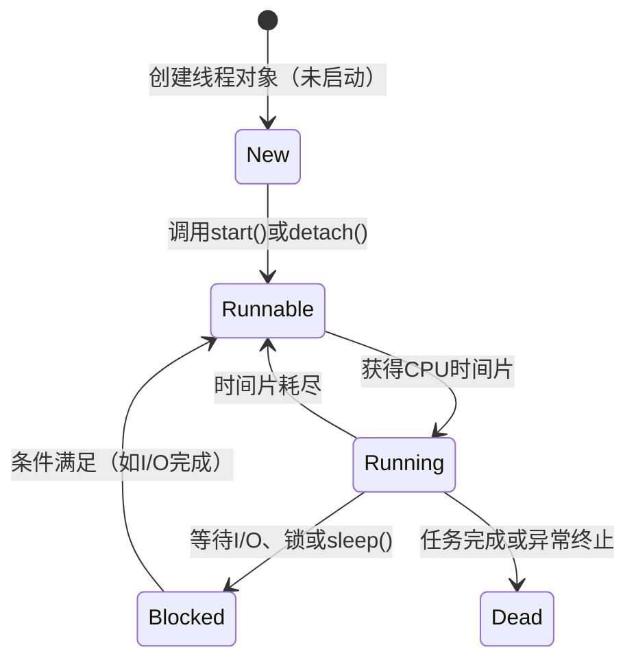

以下是关于多线程基础知识的系统化标准解释：

---

### **多线程基础体系**

#### **1. 线程的基本概念**
**定义**：  
线程（Thread）是操作系统能够进行运算调度的最小单位，属于进程内的一个执行流。一个进程可以包含多个线程，线程共享进程的资源（如内存、文件描述符），但拥有独立的栈空间和线程控制块（TCB）。

**关键特性**：  
- **轻量级**：线程的创建、销毁和切换成本远低于进程。  
- **共享资源**：同一进程内的线程共享代码段、数据段、堆等内存空间。  
- **独立执行**：每个线程拥有独立的程序计数器（PC）、寄存器集合和栈空间。

---

#### **2. 进程与线程的关系**
| **维度**        | **进程（Process）**               | **线程（Thread）**                |
|-----------------|-----------------------------------|-----------------------------------|
| **资源分配**     | 操作系统资源分配的最小单位          | 共享进程资源                       |
| **独立性**       | 独立地址空间，崩溃不影响其他进程      | 依赖进程，线程崩溃可能导致进程终止   |
| **通信方式**     | 管道、共享内存、信号量等（开销大）    | 共享内存 + 同步机制（开销小）        |
| **创建开销**     | 高（需分配独立内存、文件描述符等）    | 低（仅需分配栈和TCB）               |
| **典型场景**     | 独立应用程序（如浏览器、IDE）        | 任务并发（如Web服务器处理请求）      |

**示例**：  
- **进程**：启动一个浏览器程序（Chrome），每个标签页可能是一个独立进程。  
- **线程**：浏览器渲染线程（处理页面布局）与网络线程（下载资源）并发执行。

---

#### **3. 线程的核心特点**
1. **并发与并行**  
   - **并发**：单核CPU通过时间片轮转模拟“同时”执行多个线程（如处理用户输入和文件下载）。  
   - **并行**：多核CPU真正同时执行多个线程（如同时处理多个数学计算任务）。

2. **资源共享与同步**  
   - 共享资源：全局变量、堆内存、文件句柄。  
   - 同步问题：需使用互斥锁（Mutex）或原子操作避免数据竞争。  
   ```cpp
   // C++ 线程同步示例
   #include <mutex>
   std::mutex mtx;
   int shared_data = 0;

   void safe_increment() {
       std::lock_guard<std::mutex> lock(mtx); // 自动加锁/解锁
       shared_data++;
   }
   ```

3. **独立调度**  
   - 线程是CPU调度的基本单位。  
   - 调度策略：基于优先级（实时系统）或时间片轮转（通用系统）。

---

#### **4. 多线程编程的目的**
1. **提升性能**  
   - **CPU密集型任务**：利用多核并行计算（如矩阵乘法）。  
   - **I/O密集型任务**：后台线程处理耗时操作（如文件读写），避免阻塞主线程。

2. **增强响应性**  
   - GUI应用中，主线程负责界面渲染，子线程处理数据加载。

3. **简化设计**  
   - 将复杂任务分解为多个线程（如游戏引擎中物理模拟与渲染分离）。

---

#### **5. 线程同步机制**
| **机制**         | **作用**                         | **C++实现**                     | **适用场景**               |
|------------------|----------------------------------|---------------------------------|--------------------------|
| **互斥锁（Mutex）** | 确保共享资源的独占访问             | `std::mutex` + `std::lock_guard` | 保护临界区（如全局变量）    |
| **条件变量（Condition Variable）** | 线程间事件通知          | `std::condition_variable`       | 生产者-消费者模型          |
| **信号量（Semaphore）** | 控制资源访问数量         | C++20 `std::counting_semaphore`  | 限制并发线程数（如连接池）  |
| **原子操作（Atomic）** | 无锁同步（硬件级保证）    | `std::atomic<int>`               | 计数器、标志位等简单操作    |

**示例（生产者-消费者模型）**：  
```cpp
#include <queue>
#include <mutex>
#include <condition_variable>

std::queue<int> data_queue;
std::mutex mtx;
std::condition_variable cv;

void producer() {
    for (int i = 0; i < 10; ++i) {
        std::lock_guard<std::mutex> lock(mtx);
        data_queue.push(i);
        cv.notify_one(); // 通知消费者
    }
}

void consumer() {
    while (true) {
        std::unique_lock<std::mutex> lock(mtx);
        cv.wait(lock, []{ return !data_queue.empty(); }); // 等待数据
        int data = data_queue.front();
        data_queue.pop();
        lock.unlock();
        // 处理数据...
    }
}
```

---

#### **6. 线程的生命周期**


1. **新建（New）**  
   - 线程对象已创建但未执行（如`std::thread t;`）。

2. **就绪（Runnable）**  
   - 调用`t.start()`后进入就绪队列，等待操作系统调度。

3. **运行（Running）**  
   - 占用CPU执行任务，直至时间片耗尽或被抢占。

4. **阻塞（Blocked）**  
   - 主动等待资源（如`std::this_thread::sleep_for()`）或被动等待锁。

5. **终止（Dead）**  
   - 线程执行完毕或调用`t.join()`回收资源。

---

#### **7. 多线程编程的挑战与应对**
1. **数据竞争（Data Race）**  
   - **问题**：多个线程同时修改共享数据导致结果不可预测。  
   - **解决**：使用互斥锁或原子操作。

2. **死锁（Deadlock）**  
   - **问题**：线程互相等待对方释放锁。  
   - **解决**：按固定顺序加锁，或使用`std::lock()`同时锁定多个互斥量。

3. **资源泄漏（Resource Leak）**  
   - **问题**：线程未正确释放资源（如未解锁互斥量）。  
   - **解决**：使用RAII（如`std::lock_guard`）。

---

#### **8. 线程与CPU架构的关系**
| **CPU类型**      | **线程执行模式**                | **性能优化策略**                |
|------------------|---------------------------------|---------------------------------|
| **单核CPU**       | 并发（时间片轮转）               | 减少线程切换频率（合并任务）      |
| **多核CPU**       | 并行（多核同时执行）             | 线程数 ≈ CPU核心数（计算密集型）  |
| **NUMA架构**      | 内存访问延迟不均                 | 绑定线程到特定CPU核心（亲和性）   |

---

#### **9. 多线程应用场景**
1. **高性能计算**  
   - 多线程并行处理大规模数据（如数值模拟、图像渲染）。

2. **服务器开发**  
   - 每个客户端请求分配独立线程（如Tomcat线程池）。

3. **实时系统**  
   - 高优先级线程处理紧急事件（如机器人控制）。

4. **GUI应用程序**  
   - 主线程更新界面，子线程执行后台任务（如文件下载）。

---

### **总结**
多线程编程通过并发执行提升程序效率和响应性，但需谨慎处理同步问题。核心要点包括：  
1. **线程轻量但共享资源**，需同步机制保障数据一致性。  
2. **区分并发与并行**，合理利用多核CPU。  
3. **优先使用标准库工具**（如C++的`std::thread`和RAII锁），避免手动管理资源。  
4. **性能优化需权衡**线程数量与上下文切换开销。  

通过理解线程生命周期、同步机制与硬件交互原理，开发者可构建高效、稳定的多线程程序。