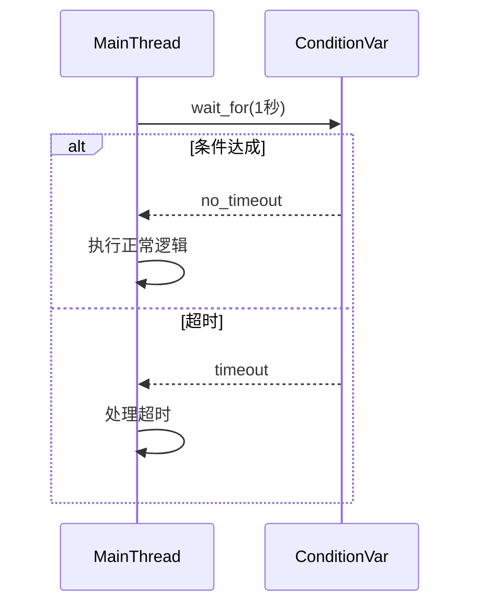

### 核心代码结构还原
```cpp
#include <iostream>
#include <mutex>
#include <condition_variable>
#include <chrono>

std::mutex mtx;
std::condition_variable cv;
bool condition = false;

int main() {
    std::unique_lock<std::mutex> lck(mtx);
    
    // 带超时的条件等待
    auto status = cv.wait_for(lck, 
        std::chrono::seconds(1),  // 等待1秒
        []{ return condition; }   // 条件检查lambda
    );

    if (status == std::cv_status::no_timeout) {
        std::cout << "条件达成，执行核心操作" << std::endl;
    } else {
        std::cout << "超时处理" << std::endl;
    }
    
    return 0;
}
```

---

### 关键机制解析
#### 1. `wait_for` 三参数重载
```cpp
template<class Rep, class Period, class Predicate>
bool wait_for(unique_lock<mutex>& lock,
              const chrono::duration<Rep, Period>& rel_time,
              Predicate pred);
```
• **参数说明**：
  • `lock`：必须是 `unique_lock`（不同于普通`wait`需要`lock_guard`）
  • `rel_time`：相对等待时间（示例中为1秒）
  • `pred`：条件判断谓词（返回`bool`的lambda或函数）

• **等效逻辑**：
```cpp
while (!pred()) {  // 循环防止虚假唤醒
    if (wait_for(lock, rel_time) == cv_status::timeout) {
        return pred();
    }
}
return true;
```

#### 2. 返回值语义
| 返回值类型              | 触发条件                      | 实际含义               |
|-----------------------|-----------------------------|-----------------------|
| `bool` (隐式转换)      | `pred()`返回true             | 条件达成               |
| `std::cv_status`       | 超时且`pred()`仍为false      | 超时触发               |

---

### 执行流程图解


---

### 典型应用场景
1. **网络通信**：等待服务器响应超时
   ```cpp
   if (!cv.wait_for(lock, 5s, []{ return data_ready; })) {
       close_connection();
       throw timeout_exception();
   }
   ```

2. **实时系统**：关键操作时限保障
   ```cpp
   while (!cv.wait_for(lock, 100ms, []{ return sensor_ready; })) {
       emergency_brake();
   }
   ```

3. **任务调度**：弹性等待资源
   ```cpp
   auto start = steady_clock::now();
   while (!cv.wait_for(lock, 500ms, []{ return resource_available; })) {
       if (steady_clock::now() - start > 5s) break;
       try_alternative_resource();
   }
   ```

---

### 注意事项
1. **虚假唤醒防御**：始终使用条件判断循环
   ```cpp
   cv.wait_for(lock, 1s, []{ return condition; });  // ✅ 正确写法
   if (cv.wait_for(lock, 1s) == cv_status::no_timeout) {  // ❌ 风险写法
       /* 可能进入错误状态 */
   }
   ```

2. **时间精度控制**：
   ```cpp
   using namespace std::chrono_literals;
   auto timeout = 500ms;  // 明确时间单位
   ```

3. **性能优化**：避免高频次短时间等待
   ```cpp
   // 不良实践（CPU消耗高）
   while (!condition) {
       cv.wait_for(lock, 1ms);
   }
   ```

---

此模式是多线程开发中**超时控制**的核心方法，建议结合具体的业务场景设计合理的超时策略。需要进一步解释特定使用场景吗？