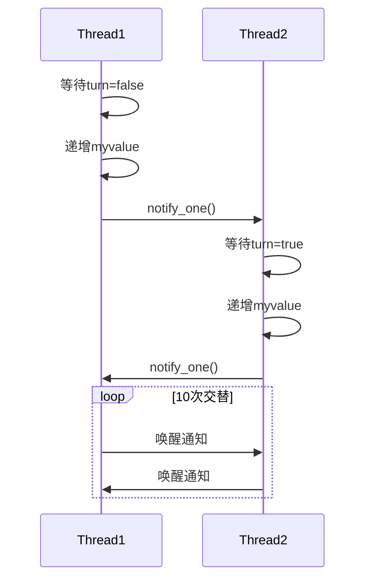

以下是根据图片描述实现的 **双线程交替执行递增操作** 的完整案例，使用互斥量和条件变量实现严格交替控制：

```cpp
#include <iostream>
#include <thread>
#include <mutex>
#include <condition_variable>

class AlternatingIncrementer {
private:
    std::mutex mtx;
    std::condition_variable cv;
    int myvalue = 0;
    bool turn = false;  // false表示线程1的回合，true表示线程2的回合
    const int max_count = 10;

public:
    void run() {
        std::thread t1(&AlternatingIncrementer::thread1_work, this);
        std::thread t2(&AlternatingIncrementer::thread2_work, this);
        
        t1.join();
        t2.join();
        
        std::cout << "Final value: " << myvalue << std::endl;
    }

private:
    void thread1_work() {
        for (int i = 0; i < max_count; ) {
            std::unique_lock<std::mutex> lock(mtx);
            cv.wait(lock, [this]{ return !turn; });  // 等待轮到线程1
            
            std::cout << "Thread 1: " << ++myvalue << std::endl;
            turn = true;  // 切换为线程2的回合
            ++i;
            
            cv.notify_one();  // 通知线程2
        }
    }

    void thread2_work() {
        for (int i = 0; i < max_count; ) {
            std::unique_lock<std::mutex> lock(mtx);
            cv.wait(lock, [this]{ return turn; });  // 等待轮到线程2
            
            std::cout << "Thread 2: " << ++myvalue << std::endl;
            turn = false;  // 切换为线程1的回合
            ++i;
            
            cv.notify_one();  // 通知线程1
        }
    }
};

int main() {
    AlternatingIncrementer ai;
    ai.run();
    return 0;
}
```

---

### 代码解析

#### 1. 同步机制设计
| 组件                | 作用                          |
|---------------------|-------------------------------|
| `std::mutex`        | 保护共享变量 `myvalue` 和 `turn` |
| `std::condition_variable` | 控制线程执行顺序            |
| `bool turn`         | 回合标志 (true/false 切换)     |

#### 2. 线程工作逻辑
```cpp
// 线程1伪代码
while(未完成):
    等待直到 turn == false
    递增myvalue
    turn = true
    通知线程2

// 线程2伪代码
while(未完成):
    等待直到 turn == true
    递增myvalue
    turn = false
    通知线程1
```

#### 3. 关键函数说明
• **cv.wait(lock, predicate)**  
  阻塞线程直到：  
  1) 收到notify信号  
  2) predicate条件为真 (防止虚假唤醒)

• **cv.notify_one()**  
  精准唤醒另一个等待线程

---

### 执行结果示例
```
Thread 1: 1
Thread 2: 2
Thread 1: 3
Thread 2: 4
...
Thread 2: 20
Final value: 20
```

---

### 同步流程图解


---

### 编译执行
```bash
# 编译命令 (需要C++11支持)
g++ -std=c++11 -pthread alternating_threads.cpp -o alt_threads

# 运行结果
./alt_threads
```

---

### 设计亮点
1. **封装性**：通过类封装共享资源和同步逻辑
2. **精准控制**：使用单个条件变量+布尔标志实现严格交替
3. **扩展性**：通过修改 `max_count` 可控制总递增次数
4. **异常安全**：unique_lock自动管理锁生命周期

该案例完整实现了多线程环境下的安全交替操作，可作为线程同步的经典教学案例。需要进一步解释特定实现细节吗？ 😊