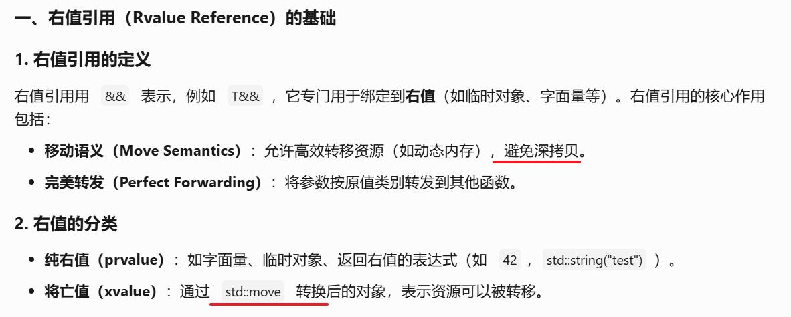
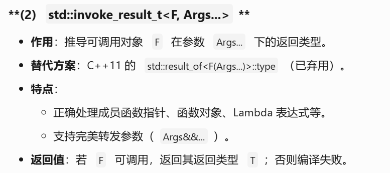
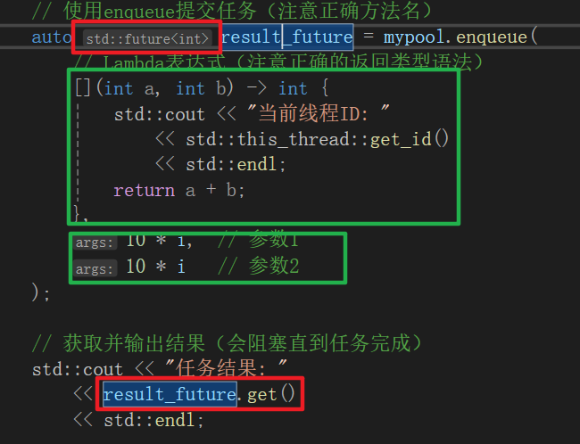
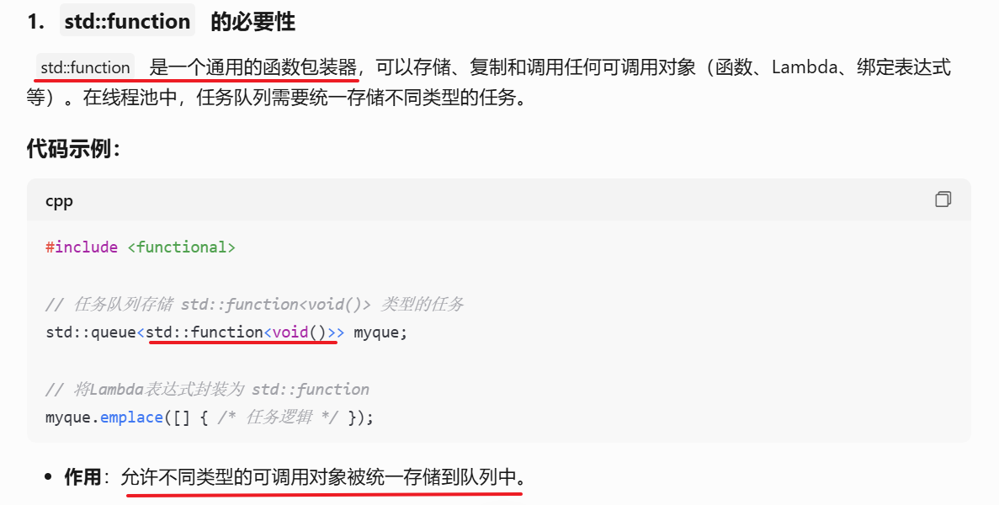
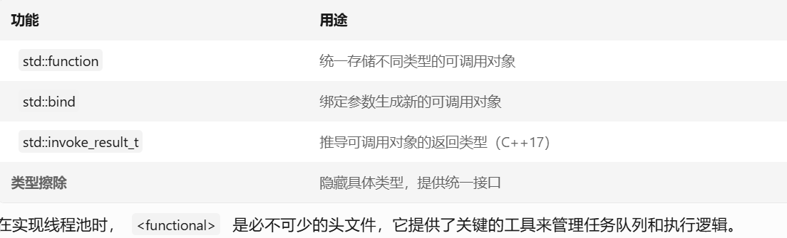
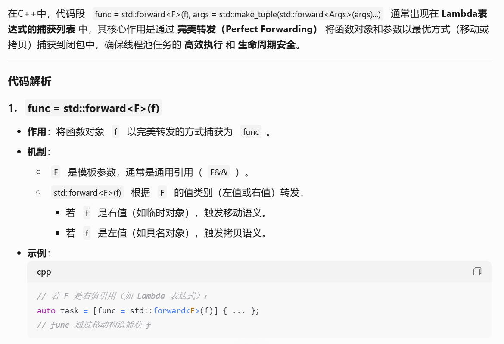
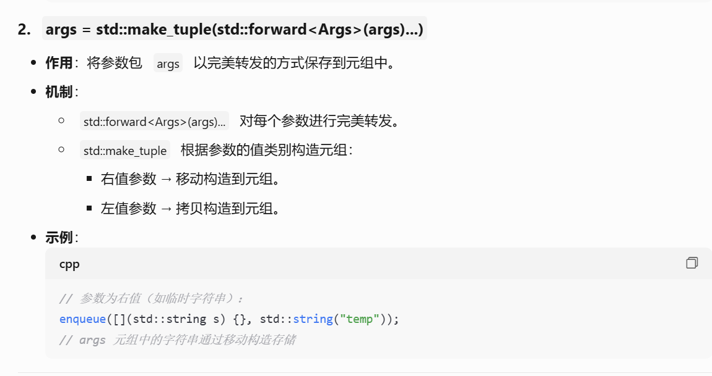
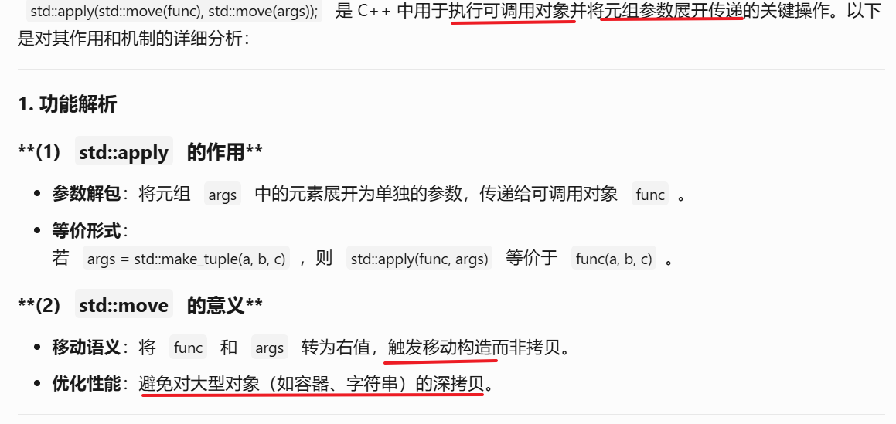
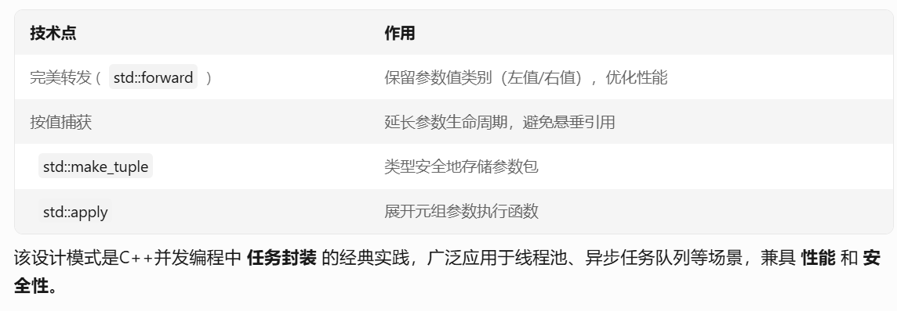

[TOC]

### 代码

```cpp
// Copyright belongs to the author --YanWei.
#pragma once

#include <atomic>
#include <functional>
#include <future>
#include <mutex>
#include <queue>
#include <thread>
#include <tuple>
#include <type_traits>

/**
 * @brief 线程池类，用于管理多个工作线程并分发任务
 */
class ThreadPool {
public:
    /// 关闭模式枚举
    enum class ShutdownMode {
        Immediate,    // 立即停止所有线程
        DrainFirst     // 执行完剩余任务再停止
    };

    /**
     * @brief 构造函数
     * @param threadnums 线程数量
     * @throw std::invalid_argument 当线程数为0时抛出
     */
    explicit ThreadPool(size_t threadnums);

    /// 析构函数（自动调用shutdown）
    ~ThreadPool();

    // 禁用拷贝和移动语义
    ThreadPool(const ThreadPool&) = delete;
    ThreadPool(ThreadPool&&) = delete;
    ThreadPool& operator=(const ThreadPool&) = delete;
    ThreadPool& operator=(ThreadPool&&) = delete;

    /**
     * @brief 提交任务到线程池
     * @tparam F 可调用对象类型
     * @tparam Args 参数类型包
     * @param f 可调用对象
     * @param args 调用参数
     * @return std::future 用于获取异步结果
     */
    template <typename F, typename... Args>
    auto enqueue(F&& f, Args&&... args)
        -> std::future<std::invoke_result_t<F, Args...>>;

    /**
     * @brief 关闭线程池
     * @param mode 关闭模式（默认执行剩余任务）
     */
    void shutdown(ShutdownMode mode = ShutdownMode::DrainFirst);

private:
    /// 工作线程执行函数
    void worker();

    // 成员变量
    std::atomic<bool> isstop;          // 停止标志（原子操作保证可见性）
    std::mutex mtx;                    // 任务队列互斥锁
    std::condition_variable cv;        // 条件变量
    std::vector<std::thread> workers;  // 工作线程集合
    std::queue<std::function<void()>> myque;  // 任务队列
};

/* 模板实现必须放在头文件中 */
template <typename F, typename... Args>
auto ThreadPool::enqueue(F&& f, Args&&... args)
-> std::future<std::invoke_result_t<F, Args...>>
{
    // 推导函数返回类型（C++17特性）
    using return_type = std::invoke_result_t<F, Args...>;

    // 创建打包任务（使用shared_ptr管理生命周期）
    auto task = std::make_shared<std::packaged_task<return_type()>>(
        // 使用lambda捕获参数包（完美转发）
        [func = std::forward<F>(f),
        args = std::make_tuple(std::forward<Args>(args)...)]() mutable
        {
            // 展开参数包并执行函数（C++17的apply）
            return std::apply(std::move(func), std::move(args));
        });

    // 获取与任务关联的future对象
    std::future<return_type> future = task->get_future();

    { // 临界区开始
        std::lock_guard<std::mutex> lock(mtx);
        if (isstop.load()) {
            throw std::runtime_error("Enqueue on stopped ThreadPool");
        }

        // 将任务封装为void()类型存入队列
        myque.emplace([task = std::move(task)]() {
            (*task)(); // 执行打包任务
            });
    } // 临界区结束

    cv.notify_one(); // 唤醒一个工作线程
    return future;
}
```

```cpp
// Copyright belongs to the author --YanWei.
#include "ThreadPool.h"
#include <stdexcept>

/**
 * @brief 构造函数初始化线程池
 * @param threadnums 线程数量
 */
ThreadPool::ThreadPool(size_t threadnums) : isstop(false)
{
    if (threadnums == 0)
        throw std::invalid_argument("Thread count must be positive");

    workers.reserve(threadnums);  // 预分配空间
    for (size_t i = 0; i < threadnums; ++i) {
        // 创建并启动工作线程
        workers.emplace_back([this] {
            worker();
            });
    }
}

/**
 * @brief 关闭线程池
 * @param mode 关闭模式
 */
void ThreadPool::shutdown(ShutdownMode mode)
{
    { // 临界区开始
        std::lock_guard<std::mutex> lock(mtx);
        isstop = true;
        if (mode == ShutdownMode::Immediate) {
            myque = {};  // 清空任务队列
        }
    } // 临界区结束
    cv.notify_all();  // 唤醒所有线程
}

/**
 * @brief 析构函数自动关闭线程池
 */
ThreadPool::~ThreadPool()
{
    shutdown();  // 默认使用DrainFirst模式

    for (auto& worker : workers) {
        if (worker.joinable()) {
            try {
                worker.join();  // 等待线程结束
            }
            catch (...) {
                // 实际项目应记录日志
            }
        }
    }
}

/**
 * @brief 工作线程执行循环
 */
void ThreadPool::worker()
{
    while (true) {
        std::function<void()> task;

        { // 临界区开始
            // 正确加锁（使用 unique_lock 配合条件变量）
            std::unique_lock<std::mutex> lock(mtx);  // 修正变量名

            // 等待条件满足（自动释放锁，唤醒后重新加锁）
            cv.wait(lock, [this] {
                return isstop.load() || !myque.empty();
                });

            // 终止条件：停止标志且队列为空
            if (isstop.load() && myque.empty()) {
                return;  // 退出前自动释放锁
            }

            if (!myque.empty()) {
                task = std::move(myque.front());
                myque.pop();
            }
        } // 临界区结束（自动释放锁）

        if (task) {
            try {
                task();  // 执行任务
            }
            catch (...) {
                // 实际项目应处理异常
            }
        }
    }
}
```

```cpp
// Copyright belongs to the author --YanWei.
#include <iostream>
#include "ThreadPool.h"

int main() {
    try {
        // 创建包含4个工作线程的线程池
        ThreadPool mypool(4);  // 正确构造函数调用

        // 提交20个任务
        for (size_t i = 0; i < 20; i++) {
            // 使用enqueue提交任务（注意正确方法名）
            auto result_future = mypool.enqueue(
                // Lambda表达式（注意正确的返回类型语法）
                [](int a, int b) -> int {
                    std::cout << "当前线程ID: "
                        << std::this_thread::get_id()
                        << std::endl;
                    return a + b;
                },
                10 * i,  // 参数1
                10 * i   // 参数2
            );

            // 获取并输出结果（会阻塞直到任务完成）
            std::cout << "任务结果: "
                << result_future.get()
                << std::endl;
        }
    }
    catch (const std::exception& e) {
        std::cerr << "发生异常: " << e.what() << std::endl;
    }
    return 0;
}

```

### 语法分析语词分析

#### 1、目标代码：
```cpp
#include <future>
    template <typename F, typename... Args>
    auto enqueue(F&& f, Args&&... args)
        -> std::future<std::invoke_result_t<F, Args...>>;
```
> 注意点：
1：模板template<>  中的 **typename...** 用于声明一个模板参数包 Args 0/n个类型参数； 下面的**Args...** 表示参数包扩展
2：右值引用 **&&**  

    引用折叠规则：类型T&& && 折叠成 T&& ；其他折叠成T&
3：std::future< T > 模板类，表示一个异步操作的最终结果，这里的T与图中同理
4: std::invoke_result_t<F, Args...> ：

5:调用


#### 2、目标代码：
```cpp
#include <atomic>
   std::atomic<bool> isstop;          // 停止标志（原子操作保证可见性）
```
> 注意点：
> 1：为什么声明为原子变量？
> 答：**原子类型的主要作用是保证对该变量的操作是原子的，即不可分割的。** 意味着当一个线程在写入isstop时，其他线程在读取或写入这个变量时不会看到中间状态，从而避免数据竞争。**原子操作保证可见性指的是当一个线程修改了原子变量，其他线程能够立即看到这个修改。** 原子操作默认使用memory_order_seq_cst（顺序一致性），它保证了操作的全局顺序，所有线程看到的操作顺序是一致的。当主线程将isstop设置为true时，工作线程能够及时看到这个变化，从而正确退出循环。
> (使用普通的bool类型，并配合互斥锁来保护可以实现相同的效果但互斥锁会增加开销)

#### 3、目标代码
```cpp
#include <functional>
    std::queue<std::function<void()>> myque;  // 任务队列
```
>注意点:
1:

2:


#### 4、目标代码
```cpp
    /* 模板实现必须放在头文件中 */
template <typename F, typename... Args>
auto ThreadPool::enqueue(F&& f, Args&&... args)
    -> std::future<std::invoke_result_t<F, Args...>> {
    // 推导函数返回类型（C++17特性）
    using return_type = std::invoke_result_t<F, Args...>;

    // 创建打包任务（使用shared_ptr管理生命周期）
    auto task = std::make_shared<std::packaged_task<return_type()>>(
        // 使用lambda捕获参数包（完美转发）
        [func = std::forward<F>(f),
         args = std::make_tuple(std::forward<Args>(args)...)]() mutable {
            // 展开参数包并执行函数（C++17的apply）
            return std::apply(std::move(func), std::move(args));
        });

    // 获取与任务关联的future对象
    std::future<return_type> future = task->get_future();

    { // 临界区开始
        std::lock_guard<std::mutex> lock(mtx);
        if (isstop.load()) {
            throw std::runtime_error("Enqueue on stopped ThreadPool");
        }

        // 将任务封装为void()类型存入队列
        myque.emplace([task = std::move(task)]() {
            (*task)(); // 执行打包任务
        });
    } // 临界区结束

    cv.notify_one(); // 唤醒一个工作线程
    return future;
}
```

>注意点：
1：std::packaged_task<return_type()> 中packaged_task< >模板类，封装一个可调对象，异步执行任务并返回结果，这里封装的任务task是调用enqueue时传入相关对象， 可配和future操作,

```cpp
[func = std::forward<F>(f),
         args = std::make_tuple(std::forward<Args>(args)...)]()mutable
 ```
>2：Lambda表达式捕获的中 
使用完美转发 std::forward是为了保持每个参数的值类别，避免不必要的拷贝，尤其是当参数是临时对象时，可以移动而不是复制。

args = std::make_tuple(std::forward<Args>(args)...)，这里将参数包args展开并完美转发到std::make_tuple中，生成一个元组。


>3apply


>4：技术点
