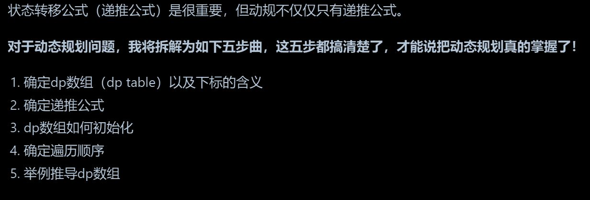
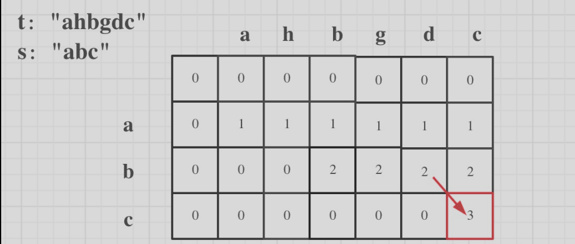

### 动态规划学习过程

- 动规是由前一个状态推导出来的，而贪心是局部直接选最优的，



第一步是确定dp数组和下标的含义。这里的关键是明确dp数组代表什么状态，以及每个下标对应的具体含义。比如，**在背包问题中，dp[i][j]可能表示前i个物品放入容量为j的背包时的最大价值。** 这一步需要根据具体问题定义状态。

第二步是确定递推公式。这是动态规划的核心，也是最难的部分。递推公式描述了**如何从已知的状态转移到新的状态。** 例如，斐波那契数列的递推式是F(n) = F(n-1) + F(n-2)。需要确保递推关系正确无误，否则整个动态规划过程就会出错。

第三步是初始化dp数组。不同的初始化方法会影响最终结果。例如，在**最长递增子序列问题**中，可能需要将dp数组初始化为1，因为每个元素本身就是一个长度为1的子序列。**初始化时要考虑边界条件和初始状态** 的合理性。

第四步是确定遍历顺序。**动态规划的遍历顺序通常取决于状态转移的方向。** 如果是二维数组，可能需要先遍历物品再遍历容量，或者反过来。错误的遍历顺序可能导致重复计算或遗漏某些状态。例如，**在背包问题中，如果正序遍历容量，就会变成完全背包问题，而逆序则是0-1背包问题。**

第五步是通过举例推导dp数组。这一步可以帮助验证前面的步骤是否正确。选择一个具体的例子，手动计算每个状态的值，检查是否符合预期。例如，用数字三角形问题来演示，逐步填充dp数组，确保每一步的计算都符合递推公式

---
### <a href = 'https://leetcode.cn/problems/is-subsequence?envType=study-plan-v2&envId=leetcode-75'>392.判断子序列</a>

```C++
class Solution {
public:
    bool isSubsequence(string s, string t) {
        int n = s.size(), m = t.size();
        vector<vector<int>> dp(n + 1, vector<int>(m + 1 ,0)); //dp二维数组记录长度
        for(int i = 1; i <= n; i++)
        {
            for(int j = 1; j <= m; j++)
            {
               if(s[i-1] == t[j-1])
                    dp[i][j] = dp[i-1][j-1] + 1;
               else
                    dp[i][j] = dp[i][j-1]; //只需要"删除" tj
            }
        }
        return dp[n][m] == n;
        
    }
};

/*
dp解法思路: 首先确定dp[i][j]的含义 表示以下标i-1结尾的s 和以下标j-1结尾的t 的相同序列子序列长度为dp[i][j],
dp递推公式： if(s[i-1] == t[j-1]) -> dp[i][j] = dp[i-1][j-1] + 1  \
          if(s[i-1] != t[j-1]) -> 此时相当于t要删除元素,相当于s[i-1] == t[j-2]的结果 dp[i][j] = dp[i][j-1] \
dp数组初始化: dp[0][0] = 0  dp[0][j] = 0  dp[i][0] = 0 
dp遍历顺序： dp[i-1][j-1] -> dp[i][j] \ dp[i][j-1] -> dp[i][j]  从上到下从左到右
*/
```
- 留有初始化的位置 0
- for(从1开始)
- 只需"删除"  't 
