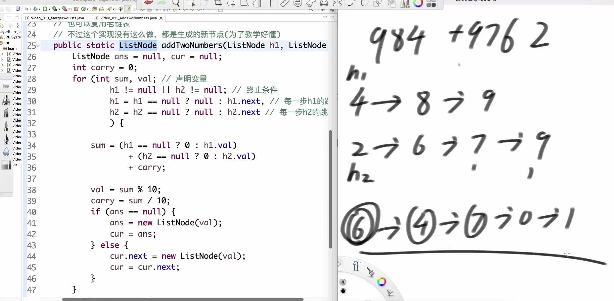
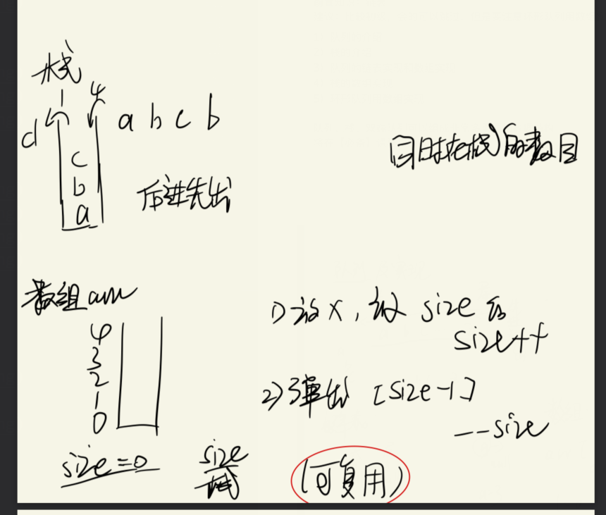
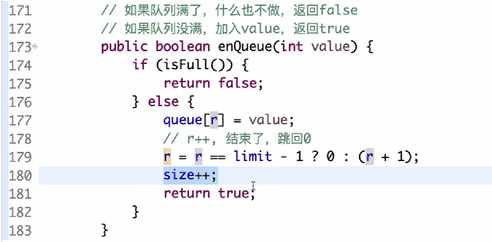
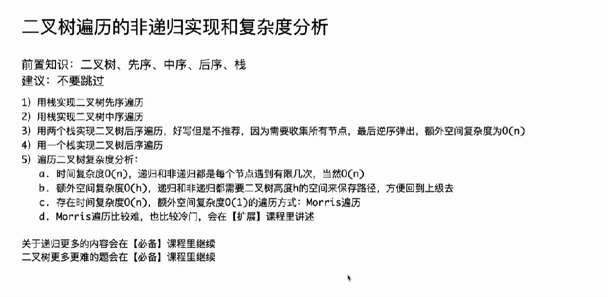

[TOC]

### 二进制位运算

**看04左程云**


### 三傻
选择  冒泡   O(n*n)
插入 固定最差 O(n*n)


### 对数器


### 二分搜索
  
有序

无序
162.寻找峰值

TBC89`_@TS}DZVT_A)N.png>)

二分答案


### 时间复杂度和空间复杂度


O(1)常数操作： 数组寻址 通过偏移量
  hash 常数慢
  位>>算>>寻>>哈希

  **当随机行为做算法核心，不能用最差情况估计复杂时间杜**

#### 常见错误
**一个while不是O(n)**


**N+N/2+N/3+N/4+++N/N 是 O(N*logN)**


---


#### 等差数列


动态数组的扩容代价

---
#### 数据结构算法简介


---


### 链表

#### 反转链表


#### 合并链表


#### 链表相加




#### 划分链表


---

### 队列和栈





#### 013循环队列




C++设置循环队列实现
```cpp
class MyCircularQueue {
private:
    int head;
    int tail;// 0-3
    int limit; //容量 1-4
    int size; //动态大小 
    vector<int> queue; //队列

public:
    MyCircularQueue(int k) {
            this->queue = vector<int>(k);
            head = tail = limit = size = 0;
            this->limit = k;
    }
    
    bool enQueue(int value) {
        if(isFull()){
            return false;
        }else{
            queue[tail] = value;
            tail = tail == limit - 1 ? 0 : (tail + 1);
            size++;
            return true;
        }
    }
    
    bool deQueue() {
        if(isEmpty()){
            return false;
        }else{
            head = head == limit - 1 ? 0 : (head + 1);
            size--;
            return true;
        }
    }
    
    int Front() {
        if(isEmpty()){
            return -1;
        }else{
            return queue[head];
        }
    }
    
    int Rear() {
        if(isEmpty()){
            return -1;
        }else{
            int last = tail == 0 ? limit - 1 : tail - 1;
            return queue[last];
        }
    }
    
    bool isEmpty() {
        return size == 0;
    }
    
    bool isFull() {
        return size == limit;
    }
};
```


#### 014队列栈相互实现


##### 232.栈实现队列


##### 队列实现栈


##### 155.最小栈


---
**用数组替换栈**


---
#### 双端队列


##### 双向链表实现双端队列


##### 固定数组实现双端队列


---


### 二叉树


#### 三种序的遍历
##### 递归


##### 递归序


##### 非递归



---


---
**中序**


---
**两个栈的后序**


**一个栈的后序**


---


---


