[TOC]

### 堆结构与堆排序

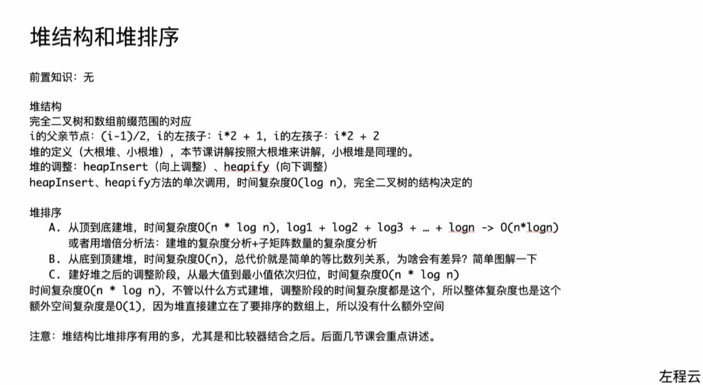

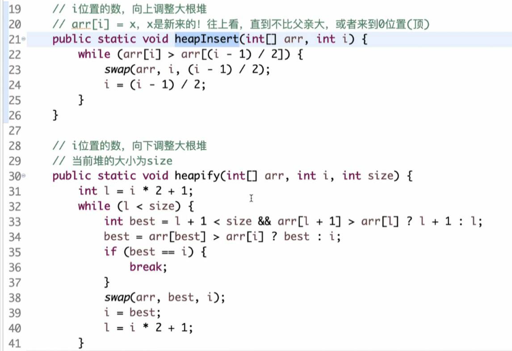

**best**评选出最强的孩子
如果有右孩子并且右孩子比左孩子的值大则best为右孩子
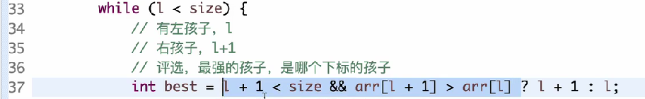

如果最强孩子有父节点的值大则 一个小子树的比较

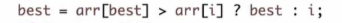

---

#### 堆排序

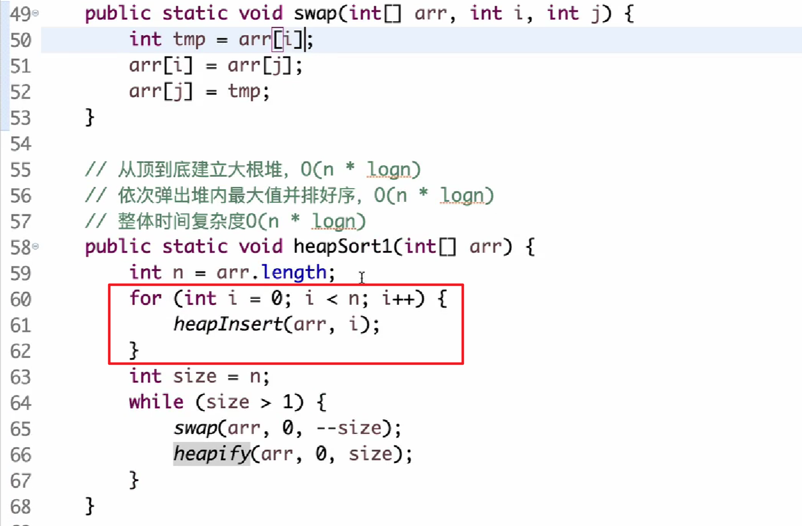

> 先建立大根堆 heapinsert
> 将大根堆的数与最后一个数交换swap
> 再调整交换后的size-1的大小的堆-》大根堆heapify
> 再次重复swap

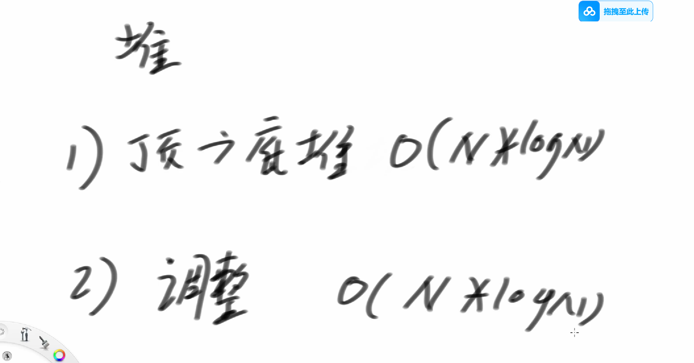

**上述是从顶到底建堆的方式；；我们从底到顶建堆能够优化成O(logN)**

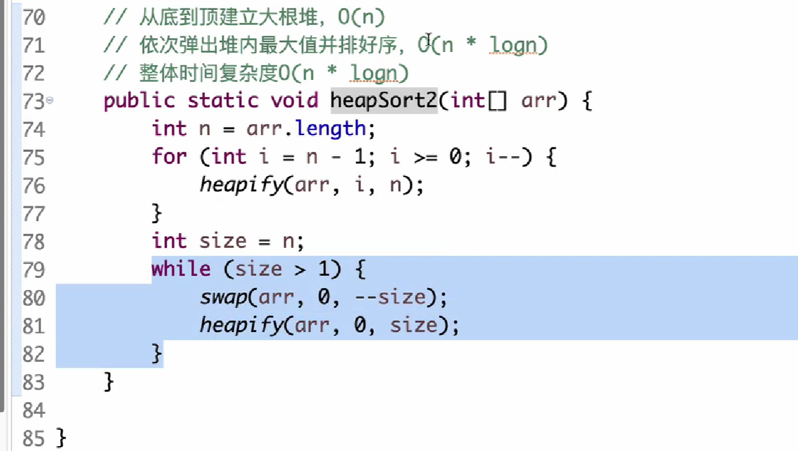

##### 从底到顶建堆
每个顶子树决断出 大顶子堆
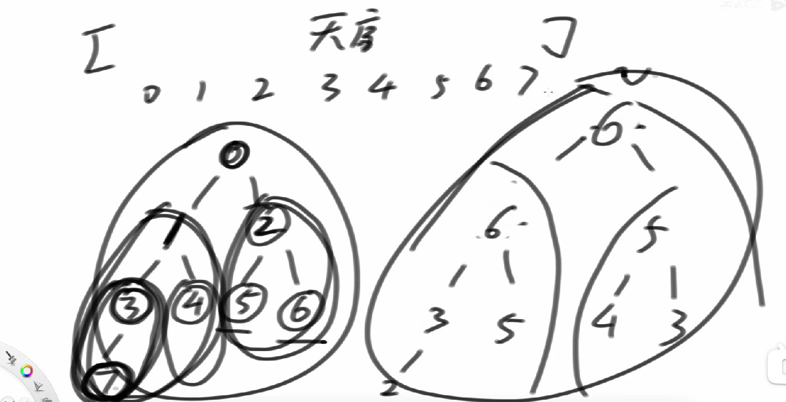

##### 时间复杂度
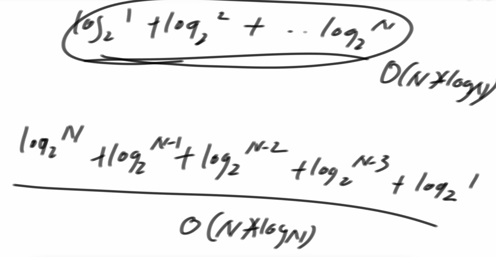
建大根堆和排序都是

---
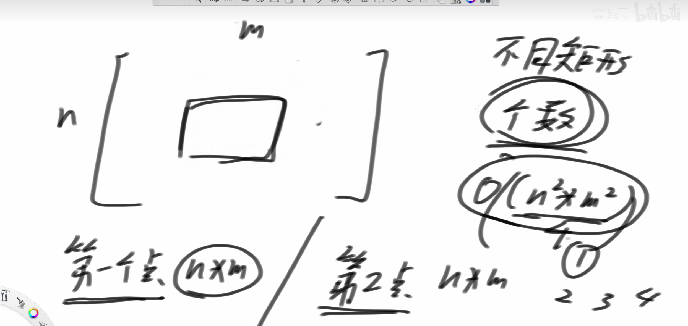

---
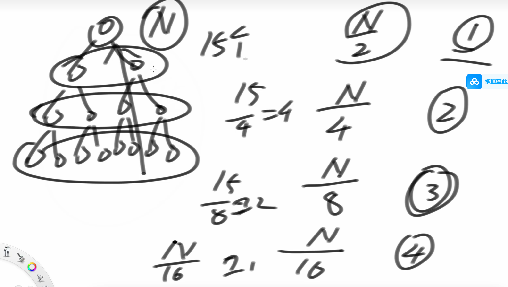

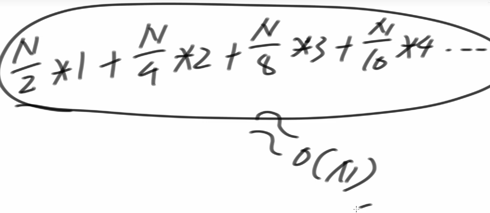

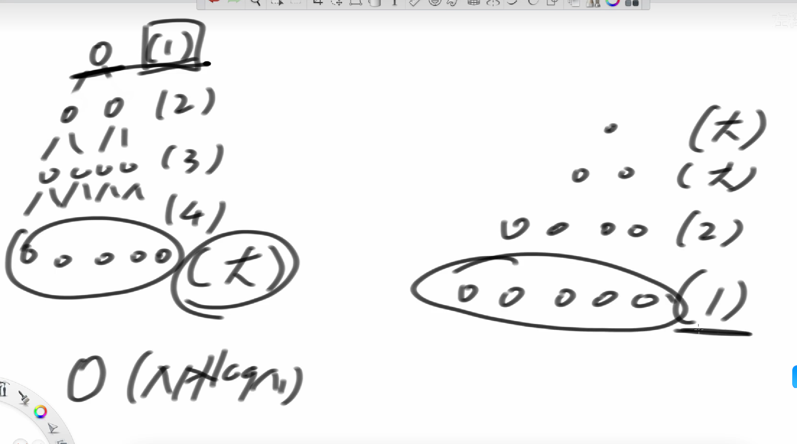

大部分承担(1)

---

### 哈希表，有序表，比较器的用法

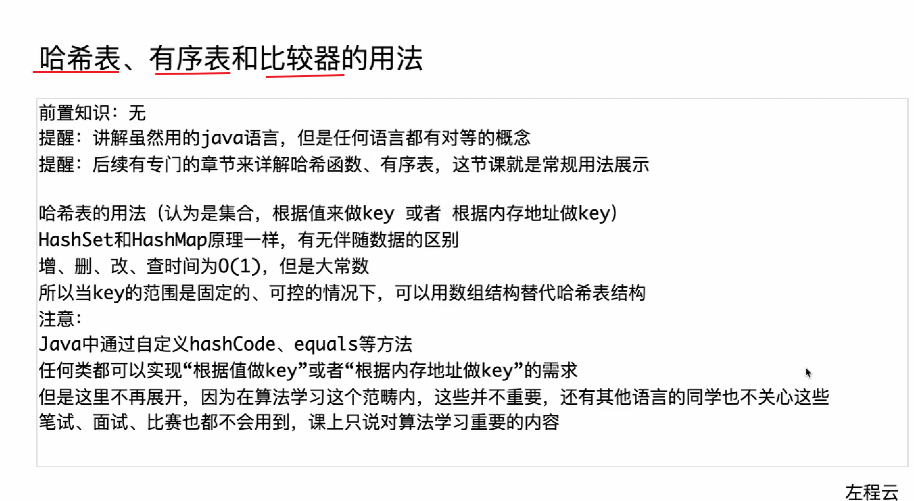

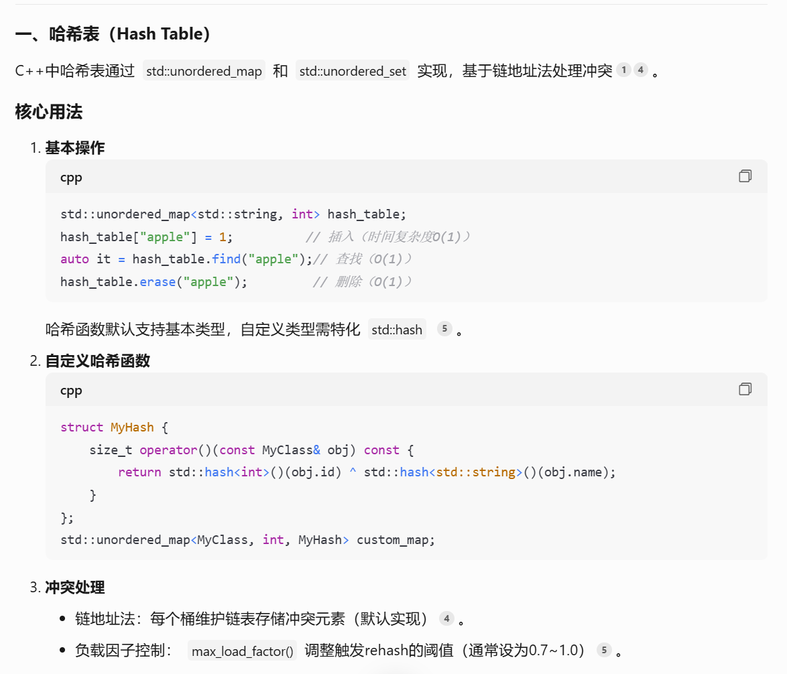
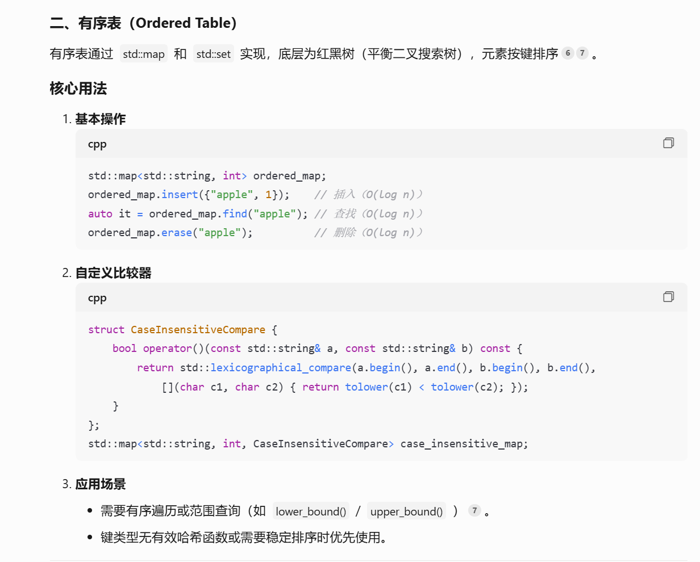

---

### 堆结构常见题
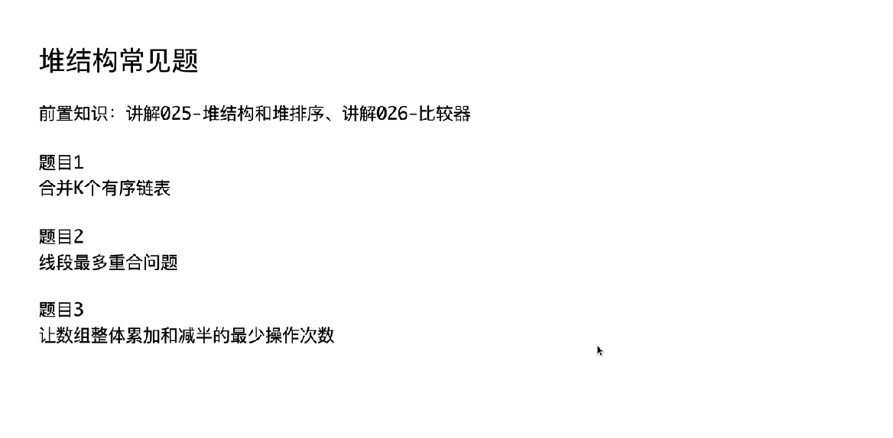

