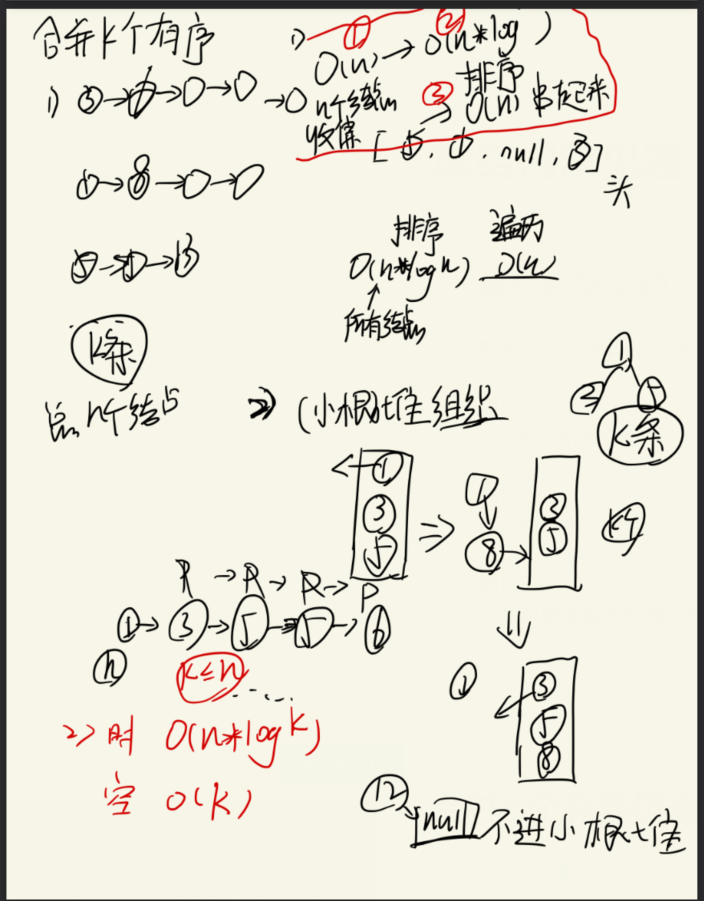
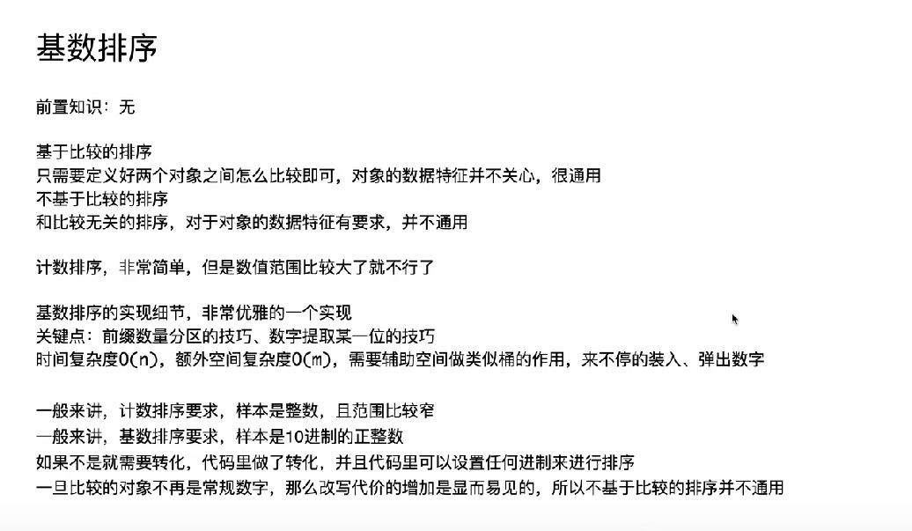
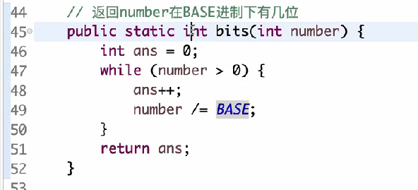

[TOC]


### 堆结构与堆排序


**best**评选出最强的孩子
如果有右孩子并且右孩子比左孩子的值大则best为右孩子


如果最强孩子有父节点的值大则 一个小子树的比较


---

#### 堆排序


> 先建立大根堆 heapinsert
> 将大根堆的数与最后一个数交换swap
> 再调整交换后的size-1的大小的堆-》大根堆heapify
> 再次重复swap


**上述是从顶到底建堆的方式；；我们从底到顶建堆能够优化成O(logN)**


##### 从底到顶建堆
每个顶子树决断出 大顶子堆


##### 时间复杂度

建大根堆和排序都是

---


---


大部分承担(1)

---

### 哈希表，有序表，比较器的用法


---

### 堆结构常见题


#### 078.合并K个有序链表


 
 

##### C++ 实现
``` cpp
#include <vector>
#include <queue>
using namespace std;

struct ListNode {
    int val;
    ListNode *next;
    ListNode(int x) : val(x), next(nullptr) {}
};

class Solution {
public:
    ListNode* mergeKLists(vector<ListNode*>& lists) {
        // 自定义小根堆比较器
        struct Compare {
            bool operator()(ListNode* a, ListNode* b) {
                return a->val > b->val;
            }
        };
        
        priority_queue<ListNode*, vector<ListNode*>, Compare> heap;

        // 将非空链表头加入堆
        for (ListNode* head : lists) {
            if (head) {
                heap.push(head);
            }
        }

        if (heap.empty()) return nullptr;

        // 初始化合并后的链表头
        ListNode* pre = heap.top();
        heap.pop();
        ListNode* res = pre;
        
        // 将第一个节点的后续节点入堆
        if (pre->next) {
            heap.push(pre->next);
        }

        // 持续合并后续节点
        while (!heap.empty()) {
            ListNode* cur = heap.top();
            heap.pop();
            
            // 连接链表节点
            pre->next = cur;
            pre = cur;
            
            // 将当前节点的后续节点入堆
            if (cur->next) {
                heap.push(cur->next);
            }
        }

        return res;
    }
};
```

#### 线段最多重合


##### C++实现 STL
```cpp 
#include <queue>
#include <algorithm>

int computeWithSTL(vector<vector<int>>& lines) {
    sort(lines.begin(), lines.end(), 
        [](auto& a, auto& b) { return a[0] < b[0]; });
    
    priority_queue<int, vector<int>, greater<int>> minHeap;
    int maxCount = 0;
    
    for (auto& line : lines) {
        while (!minHeap.empty() && minHeap.top() < line[0]) {
            minHeap.pop();
        }
        minHeap.push(line[1]);
        maxCount = max(maxCount, (int)minHeap.size());
    }
    return maxCount;
}

```

##### 手动实现最小堆
```cpp

#include <vector>
#include <algorithm>
using namespace std;

class LineOverlapCalculator {
private:
    vector<int> heap;

    // 上浮调整
    void swim(int index) {
        while (index > 0 && heap[index] < heap[(index-1)/2]) {
            swap(heap[index], heap[(index-1)/2]);
            index = (index-1)/2;
        }
    }

    // 下沉调整
    void sink(int index) {
        int n = heap.size();
        while (2*index + 1 < n) {
            int child = 2*index + 1;
            if (child + 1 < n && heap[child+1] < heap[child]) {
                child++;
            }
            if (heap[index] <= heap[child]) break;
            swap(heap[index], heap[child]);
            index = child;
        }
    }

public:
    int compute(vector<vector<int>>& lines) {
        // 根据线段起点排序（第一维升序）
        sort(lines.begin(), lines.end(), 
            [](const vector<int>& a, const vector<int>& b) {
                return a[0] < b[0];
            });

        int maxOverlap = 0;
        heap.clear();

        for (const auto& line : lines) {
            int start = line[0];
            int end = line[1];

            // 弹出所有已失效的线段
            while (!heap.empty() && heap[0] < start) {
                heap[0] = heap.back();
                heap.pop_back();
                if (!heap.empty()) sink(0);
            }

            // 插入当前线段终点
            heap.push_back(end);
            swim(heap.size()-1);
            
            // 更新最大重叠数
            maxOverlap = max(maxOverlap, (int)heap.size());
        }

        return maxOverlap;
    }
};

```

#### 2208.数组整体累加和减半的最小次数


##### C++实现


###  基数排序



#### 前缀数量分区 + 提取数字 技巧


#### 有负数




---
#### 进制BASE决定什么


### 所有排序算法总结


#### 稳定性
选择不稳定


冒泡稳定  相等不换


插入稳定  


归并稳定  先考虑左边的


快排不稳定


堆排不稳定


---


