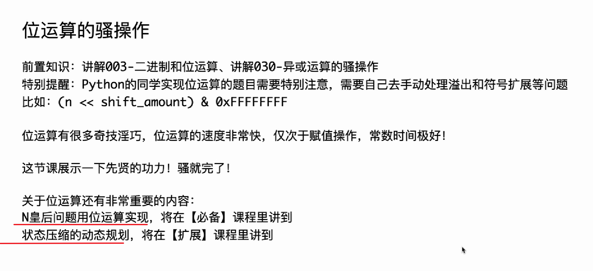
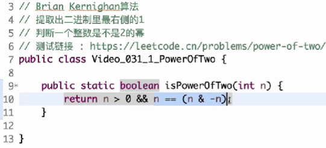
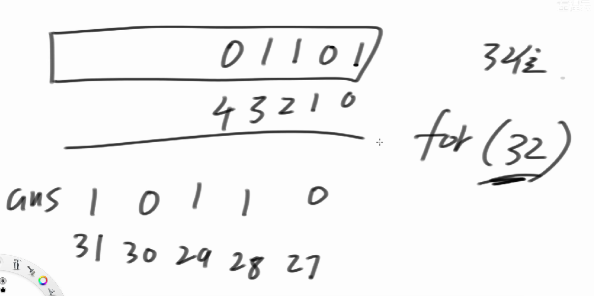
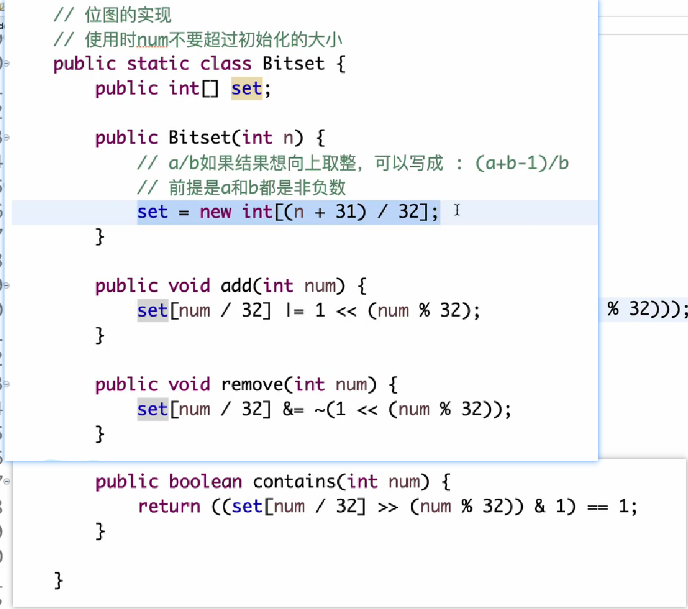

[TOC]

## 位

### 二进制 位运算

### 异或
#### 黑白球

#### 无进位相加

#### 题目

##### 异或交换两值

##### 异或不用比较运算符返回最大值

((n >> 31) 将32位的符号位偏移到0 [31 .... 0])  
负数得1  非负得0  异或^1   1^1 = 0  0^1 = 1

a - b = 负 -> b大
        非负正 -> a大

c -> ((>>> 31)^1) = 非负 1 -> a大  /负 0 ->b大

c特别小会溢出

---
无问题的

return A   AB符号是否相同

return B 

##### 找到缺失的数字

k -> 10长度0-10    [0 .缺.. 9] 

(0-10  异或^和) 异或^([0...9]不缺数的异或和)  = 缺的数

##### 数组中找唯一的出现的奇数的次数

[  ] 奇数a  其他偶数

##### Brian Kernighan提取二进制状态下最右侧的1

n  : 0110 1000
~n : 1001 0111
~n+1:1001 1000  n相反数

n&(~n+1) : 0000 1000
=> n&(-n) 

##### 数组中两个奇数次 其他偶数次

[]  a,b奇数次  其他偶数次

eor1 = a^b (不相同一定有1)=> [00001000]
a,b第3位不一样                    3210 

3位是1  3位不是1
[-----] [-----]
    a      b
或  b      a

eor2遍历第三位上不是1的数 异或  得a或b
eor2 = a or b
a:  b = eor1  ^ eor2 [a^b^a] = b
b:  a = eor1 ^ eor2[a^b^a] = a

##### 数组中只有一种数出现小于m次，其他书出现m次 返回小于m次的数

----
### 位运算

#### 题目

---
##### 判断一个整数是不是2的幂

只有一个 1

Brian Kernighan提取最右侧的1

---
##### 判断一个数是不是3的幂_笑

---
##### 返回大于等于n的最小2的幂

n:  00100100    n=36   >=36的 64 2^8

-1  >>>刷  +1  == 最近的2的幂

---
##### 范围[l...r]内所有数字&的结果

---

---
##### 反转二进制 逆序 大牛

---

思路：

---
##### 返回一个数二进制中有几个1 爽 --31左程云

---
思路 
长度为一的计数变成长度为二的计数

---

### 位图 32.未听全

#### 原理

限制：  连续的范围不能过大 / 初始化的时候就准备好空间

用比特bit存值

#### 题目

