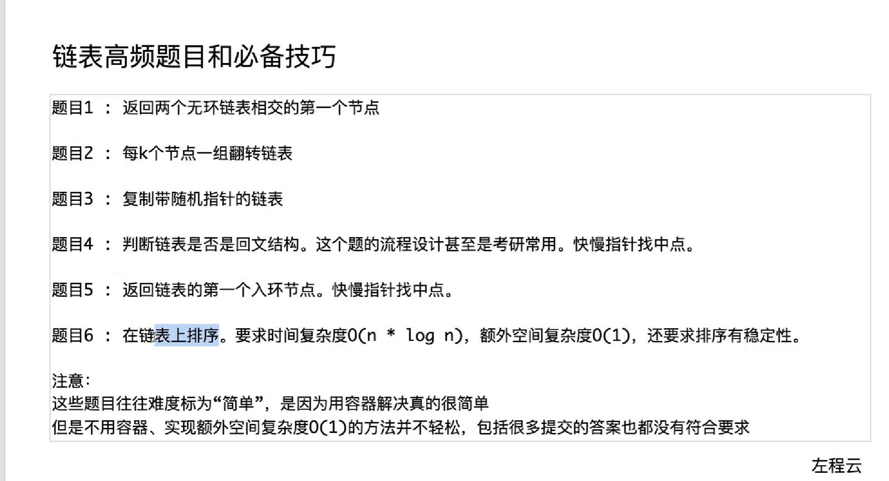
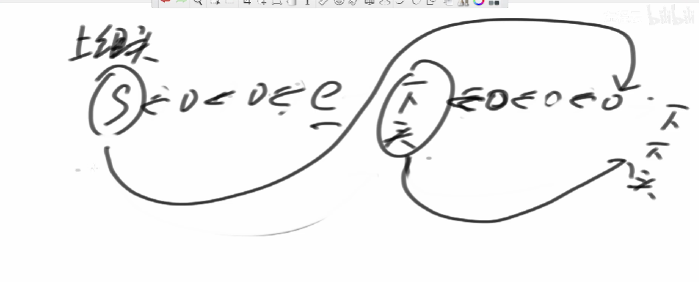

[TOC]

## 链表高频题





---

### 题目

#### 两个无环链表相交的第一个交点

注意是结构上的不是节点值上的

https://leetcode.cn/problems/intersection-of-two-linked-lists/

```cpp
/**
 * Definition for singly-linked list.
 * struct ListNode {
 *     int val;
 *     ListNode *next;
 *     ListNode(int x) : val(x), next(NULL) {}
 * };
 */
class Solution {
public:
    ListNode* getIntersectionNode(ListNode* headA, ListNode* headB) {
        // unordered_map  记录
        if (headA == nullptr || headB == nullptr) {
            return nullptr;
        }
        // 获取两个链的长度，记录 然后长的先走差值
        // 可优化 直接使用headA headB 代替a,b
        int deff{};
        ListNode *a = headA, *b = headB;
        //获得两个链表的长度
        while (a->next) {
            a = a->next;
            ++deff;
        }

        while (b->next) {
            b = b->next;
            --deff;
        }

        if (a != b)
            return nullptr;
        //取最长链作为a
        if (deff >= 0) {
            a = headA;
            b = headB;
        } else {
            a = headB;
            b = headA;
        }
        //取绝对值
        deff = deff >= 0 ? deff : ~deff + 1;

        while (deff-- != 0)
            a = a->next;

        while (a != b) {
            a = a->next;
            b = b->next;
        }

        return a;
    }
};
```

### 每k个节点一组翻转链表
https://leetcode.cn/problems/reverse-nodes-in-k-group/



```cpp

/**
 * Definition for singly-linked list.
 * struct ListNode {
 *     int val;
 *     ListNode *next;
 *     ListNode() : val(0), next(nullptr) {}
 *     ListNode(int x) : val(x), next(nullptr) {}
 *     ListNode(int x, ListNode *next) : val(x), next(next) {}
 * };
 */
class Solution {
public:
    // 翻转流程：首先记录此时e节点的next用于将链表连接上，
    //然后用next = cur->next; 和cur = next; 去更新正在操作的cur结点
    // cur->next = pre; 和 pre = cur; 用于操作箭头的反转和 pre的更替
    void fanz(ListNode* s, ListNode* e){
        e = e->next;
        ListNode* pre = nullptr, *cur = s, *next = nullptr;
        while(cur != e){
            next = cur->next;
            cur->next = pre; //指空
            pre = cur;
            cur = next;
        }
        s->next = e;
    }
    //返回尾部结点  分组  边界
    ListNode* grepkre(ListNode* s, int k){
        while(--k != 0 && s){
            s = s->next;
        }
        return s;
    }

    ListNode* reverseKGroup(ListNode* head, int k) {
        //  a->b->c->d->e->f->g->h->i->j->k->nullptr
        //  先进行第一个k的考虑
        ListNode* s = head;
        ListNode* e = grepkre(s,k);
        if(e == nullptr) return head;

        head = e;

        fanz(s,e);

        ListNode* lteam_e = s;

        //
        while(lteam_e->next){
            s = lteam_e->next;
            e = grepkre(s,k);
            if(e == nullptr) return head;

            fanz(s,e);
            lteam_e->next = e;
            lteam_e = s;
        }
        return head;
    }
};
```

### 复制带随机指针的链表
https://leetcode.cn/problems/copy-list-with-random-pointer/


## 数据结构设计高频题


## 二叉树高频题


