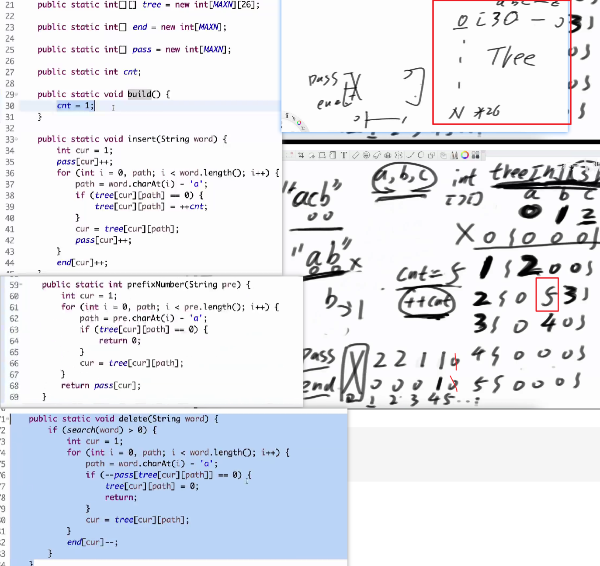

https://leetcode.cn/problems/implement-trie-ii-prefix-tree/

https://www.nowcoder.com/practice/7f8a8553ddbf4eaab749ec988726702b


### 前缀树原理


没有路新建节点，有路复用结点
精准查找 e
开头查找 p


#### 类的实现


```cpp
#include <string>
#include <unordered_map>
using namespace std;

class TrieNode {
public:
    int passCount;  // 经过该节点的字符串数量
    int endCount;   // 以该节点结尾的字符串数量
    unordered_map<char, TrieNode*> children;

    TrieNode() : passCount(0), endCount(0) {}
};

class Trie {
private:
    TrieNode* root;

    // 辅助函数：检查字符串是否存在于树中
    bool _exist(const string& word) {
        TrieNode* node = root;
        for (char ch : word) {
            if (!node->children.count(ch)) return false;
            node = node->children[ch];
        }
        return node->endCount > 0;
    }

public:
    Trie() { root = new TrieNode(); }

    ~Trie() {
        // 实际项目中建议用智能指针，此处简化处理
        delete root;
    }

    void insert(string word) {
        TrieNode* node = root;
        node->passCount++; // 根节点passCount统计总词数
        for (char ch : word) {
            if (!node->children.count(ch)) {
                node->children[ch] = new TrieNode();
            }
            node = node->children[ch];
            node->passCount++;
        }
        node->endCount++;
    }

    int countWordsEqualTo(string word) {
        TrieNode* node = root;
        for (char ch : word) {
            if (!node->children.count(ch)) return 0;
            node = node->children[ch];
        }
        return node->endCount; // 直接返回结束计数
    }

    int countWordsStartingWith(string prefix) {
        TrieNode* node = root;
        for (char ch : prefix) {
            if (!node->children.count(ch)) return 0;
            node = node->children[ch];
        }
        return node->passCount; // 经过该节点的数量即前缀数量
    }

    void erase(string word) {
        if (!_exist(word)) return; // 确保删除的单词存在

        TrieNode* node = root;
        node->passCount--; // 更新根节点计数
        for (char ch : word) {
            TrieNode* child = node->children[ch];
            child->passCount--;
            // 清理无效节点
            if (child->passCount == 0) {
                node->children.erase(ch);
                delete child;
                return; // 后续节点已被清理，无需继续
            }
            node = child;
        }
        node->endCount--; // 减少结束计数
    }
};
```
#### ACM
```cpp

#include <iostream>
#include <string>
#include <vector>
using namespace std;

const int MAXN = 100010; // 根据题目数据范围调整
const int CHAR_SIZE = 26;

class Trie {
private:
    struct TrieNode {
        int pass{}; // 经过该节点的次数
        int end{};  // 以该节点为结尾的次数
        vector<TrieNode*> children;

        TrieNode(){
            children.reserve(CHAR_SIZE);
        }
        
    };
    
    TrieNode* root;

public:
    Trie() {
        root = new TrieNode();
    }

    void insert(string word) {
        TrieNode* node = root;
        node->pass++;
        for (char ch : word) {
            int idx = ch - 'a';
            if (!node->children[idx]) {
                node->children[idx] = new TrieNode();
            }
            node = node->children[idx];
            node->pass++;
        }
        node->end++;
    }

    void del(string word) {
        TrieNode* node = root;
        node->pass--;
        for (char ch : word) {
            int idx = ch - 'a';
            node = node->children[idx];
            node->pass--;
        }
        node->end--;
    }

    bool search(string word) {
        TrieNode* node = root;
        for (char ch : word) {
            int idx = ch - 'a';
            if (!node->children[idx] || node->children[idx]->pass <= 0) {
                return false;
            }
            node = node->children[idx];
        }
        return node->end > 0;
    }

    int prefixCount(string prefix) {
        TrieNode* node = root;
        for (char ch : prefix) {
            int idx = ch - 'a';
            if (!node->children[idx] || node->children[idx]->pass <= 0) {
                return 0;
            }
            node = node->children[idx];
        }
        return node->pass;
    }
};

int main() {
    ios::sync_with_stdio(false);
    cin.tie();

    int m;
    cin >> m;
    Trie trie;
    
    while (m--) {
        int op;
        string word;
        cin >> op >> word;
        
        if (op == 1) {
            trie.insert(word);
        } else if (op == 2) {
            trie.del(word);
        } else if (op == 3) {
            cout << (trie.search(word) ? "YES" : "NO") << endl;
        } else if (op == 4) {
            cout << trie.prefixCount(word) << endl;
        }
    }
    return 0;
}
```


#### 静态数组实现




#### ACM
```cpp

#include <iostream>
#include <vector>
using namespace std;

const int CHAR_SET = 26; // 小写字母字符集大小

// Trie 节点结构体
struct TrieNode {
    vector<int> children; // 子节点索引（用 vector 动态管理）
    int pass{};             // 经过该节点的次数
    int end{};              // 以该节点为结尾的次数

    // 构造函数初始化
    TrieNode() : children(CHAR_SET, 0) {}
};

class Trie {
private:
    vector<TrieNode> nodes; // 动态存储所有 Trie 节点
    int idx{1};                // 当前可用节点索引（根节点从 1 开始）

public:
    Trie() : {
        nodes.emplace_back(); // 索引 0 占位（不使用）
        nodes.emplace_back(); // 初始化根节点（索引 1）
    }

    // 插入单词（时间复杂度：O(L)，L 为单词长度）
    void insert(const string& word) {
        int p = 1; // 根节点起始
        nodes[p].pass++; // 根节点经过次数+1
        for (char ch : word) {
            int c = ch - 'a';
            if (nodes[p].children[c] == 0) { // 子节点不存在
                nodes.emplace_back();         // 动态添加新节点
                nodes[p].children[c] = ++idx; // 更新子节点索引
            }
            p = nodes[p].children[c]; // 移动到子节点
            nodes[p].pass++;           // 更新经过次数
        }
        nodes[p].end++; // 单词结束次数+1
    }

    // 查询单词是否存在（时间复杂度：O(L)）
    bool search(const string& word) {
        int p = 1;
        for (char ch : word) {
            int c = ch - 'a';
            if (nodes[p].children[c] == 0 || nodes[p].pass == 0) 
                return false; // 路径不存在或已被删除
            p = nodes[p].children[c];
        }
        return nodes[p].end > 0; // 检查是否为有效结尾
    }

    // 统计前缀出现次数（时间复杂度：O(L)）
    int prefixCount(const string& prefix) {
        int p = 1;
        for (char ch : prefix) {
            int c = ch - 'a';
            if (nodes[p].children[c] == 0 || nodes[p].pass == 0)
                return 0; // 前缀路径不存在
            p = nodes[p].children[c];
        }
        return nodes[p].pass; // 返回经过次数
    }

    // 删除单词（假设操作合法，时间复杂度：O(L)）
    void erase(const string& word) {
        if (!search(word)) return; // 确保单词存在
        int p = 1;
        nodes[p].pass--; // 根节点计数-1
        for (char ch : word) {
            int c = ch - 'a';
            p = nodes[p].children[c];
            nodes[p].pass--; // 逐层递减计数
        }
        nodes[p].end--; // 结尾计数-1
    }
};

// ACM 模式输入输出处理
int main() {
    ios::sync_with_stdio(false); // 禁用同步加速输入输出[4,7](@ref)
    cin.tie(nullptr);

    int T;
    cin >> T;
    Trie trie;

    while (T--) {
        int op;
        string s;
        cin >> op >> s;

        if (op == 1) trie.insert(s);
        else if (op == 2) trie.erase(s);
        else if (op == 3) cout << (trie.search(s) ? "YES" : "NO") << endl;
        else if (op == 4) cout << trie.prefixCount(s) << endl;
    }
    return 0;
}

```


### 前缀树题目

#### 接头密钥


先算好a的前缀  然后将b中的去a中搜索

 -# 隔断

差值非常大，，横向换纵向"stirng->char"


 


#### 数组中两个数的最大异或值


将数组中的数 建一个前缀树  
每个数去 异或   走期望路径


找max数 的前导0 从最左侧1开始考虑


---
```cpp
#include <vector>
#include <climits>
#include <algorithm>

using namespace std;

class Solution {
private:
    // 前缀树节点存储结构（数组模拟实现）
    static const int MAXN = 3000001; // 预分配足够大的空间
    vector<vector<int>> tree;        // tree[i][0/1] 表示节点i的左右子节点索引
    int cnt;                         // 当前已使用节点数量
    int high;                        // 最高有效位位置

    // 计算数字的二进制最高有效位位置
    int computeHigh(int num) {
        if (num == 0) return 0;
        unsigned unum = num; // 转换为无符号数处理前导零
        return 31 - __builtin_clz(unum);
    }

    // 构建前缀树
    void build(const vector<int>& nums) {
        cnt = 1; // 根节点从1开始
        int max_num = *max_element(nums.begin(), nums.end());
        high = computeHigh(max_num);
        for (int num : nums) {
            insert(num);
        }
    }

    // 插入数字到前缀树
    void insert(int num) {
        int cur = 1;
        for (int i = high; i >= 0; i--) {
            int bit = (num >> i) & 1;
            if (tree[cur][bit] == 0) {
                tree[cur][bit] = ++cnt; // 分配新节点
            }
            cur = tree[cur][bit];
        }
    }

    // 计算当前数字在前缀树中的最大异或值
    int maxXor(int num) {
        int ans = 0;
        int cur = 1;
        for (int i = high; i >= 0; i--) {
            int bit = (num >> i) & 1;
            int want = bit ^ 1;        // 希望遇到的位（异或最大）
            if (tree[cur][want] == 0) { // 该路径不存在则回退
                want ^= 1;
            }
            ans |= (bit ^ want) << i;  // 更新异或结果的当前位
            cur = tree[cur][want];
        }
        return ans;
    }

    // 清理前缀树（重置节点）
    void clear() {
        for (int i = 1; i <= cnt; i++) {
            tree[i][0] = tree[i][1] = 0;
        }
    }

public:
    int findMaximumXOR(vector<int>& nums) {
        // 初始化前缀树结构[1](@ref)
        tree.resize(MAXN, vector<int>(2, 0));
        build(nums);
        
        int ans = 0;
        for (int num : nums) {
            ans = max(ans, maxXor(num));
        }
        
        clear(); // 清理复用内存[1](@ref)
        return ans;
    }
};
```

#### 在二维字符数组中搜索可能的单词

https://leetcode.cn/problems/word-search-ii/

```cpp


```


### 欠  构建前缀信息技巧

