[TOC]

## 课程大纲

### CMake

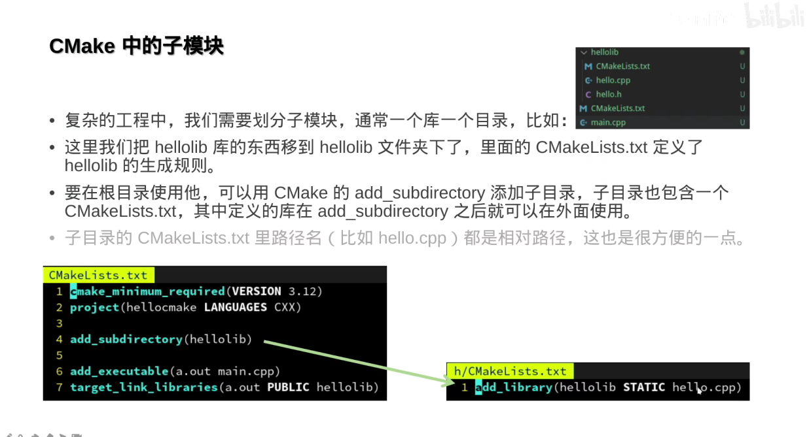

CMake子模块
可以CMakeLists套CMakeLists

---
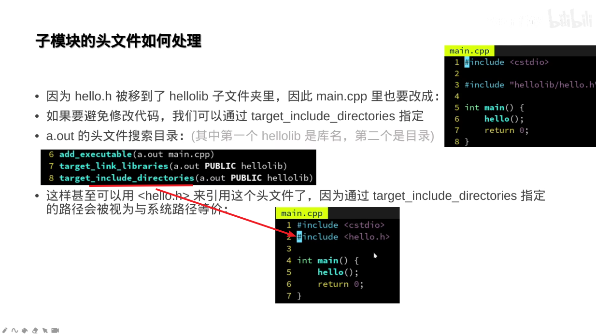

"" 是同目录下可用

非同目录要么用 路径
要么把对应的非同目录的文件编成一个lib库 然后去linklib(如果加上includedirectories就可以使用 <> 去包含 认为是一个库文件)

---

上述 的a.out用到libhello这个库时候需要指定搜索路径#include <hello.h>  ；此时如果还有别的b.out需要这个lib库时必须得再次指定搜索路径； 再有其他out需要用到这个lib时 我们必须需要重复的执行指定操作。为了避免这种重复的操作。我们可以在对应lib库中 去指定 .当前路径 ，然后如下
public会传播  private反
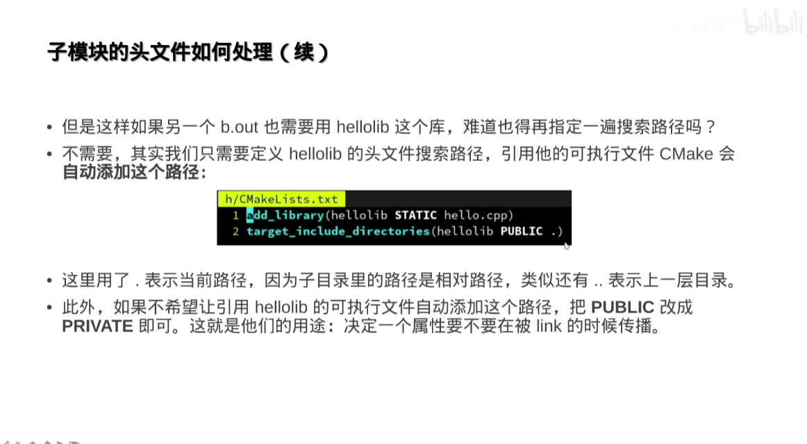

---
类似指令
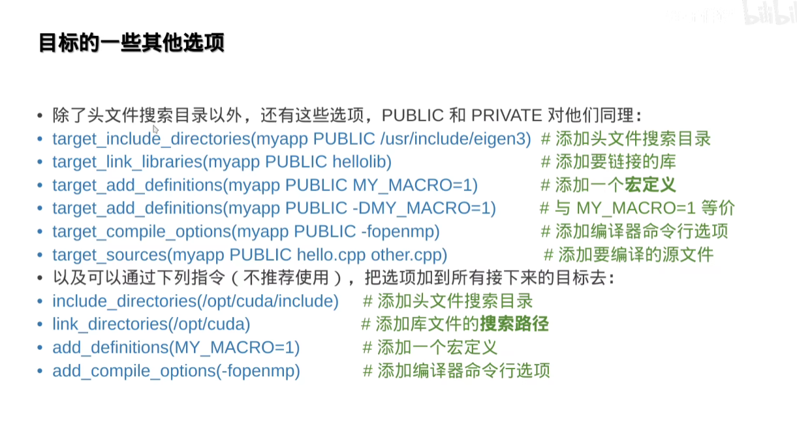

第三四个类似于在文件中添加一个 #define 宏定义

第五个编辑器会 加一个  g++ flag 如下  public:链接myapp的也会享有该flag
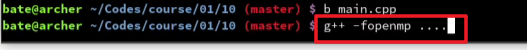

---

不推荐第一个是它会让所有的目标都去对应目录下搜索  target的第一个是指定一个目标搜索

不推荐第三个会把宏定义加入到每一个目标上

---
### 一些好用的库
头文件引入较合适
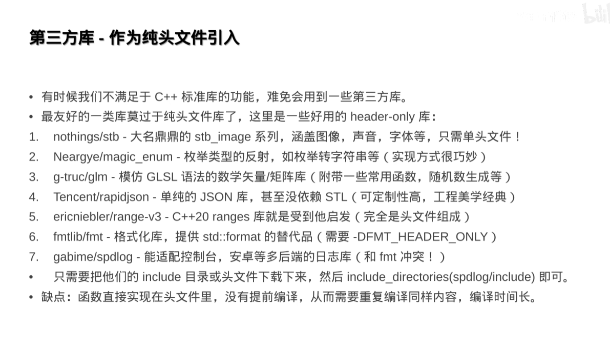
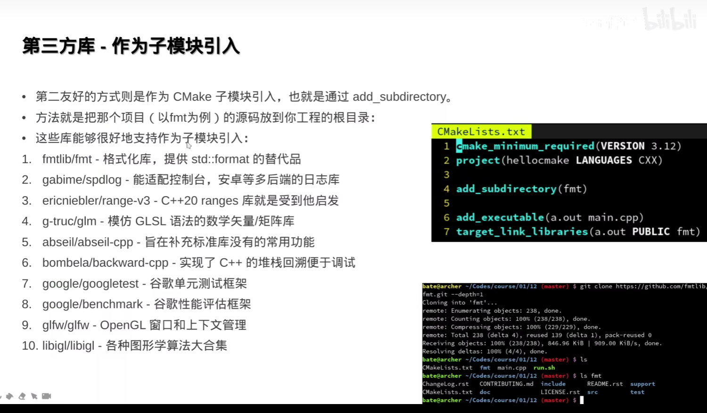

---

sin(valarray)  C++98
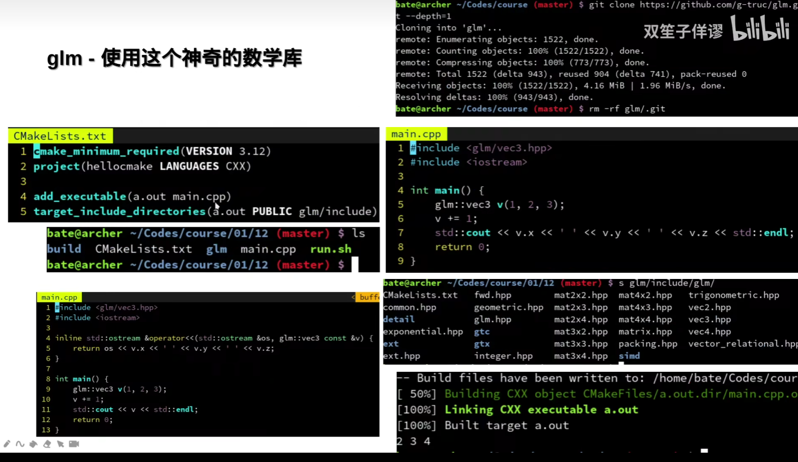
spdlog引入了fmt  如果引用两个作为子模块会形成菱形引用

git clone ..... --depth=1 clone起来更快不想做贡献的话
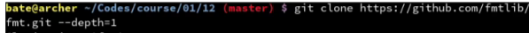

原装会解决一些子模块引入的问题
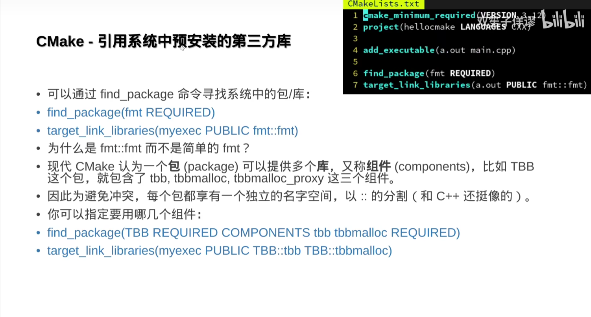

---
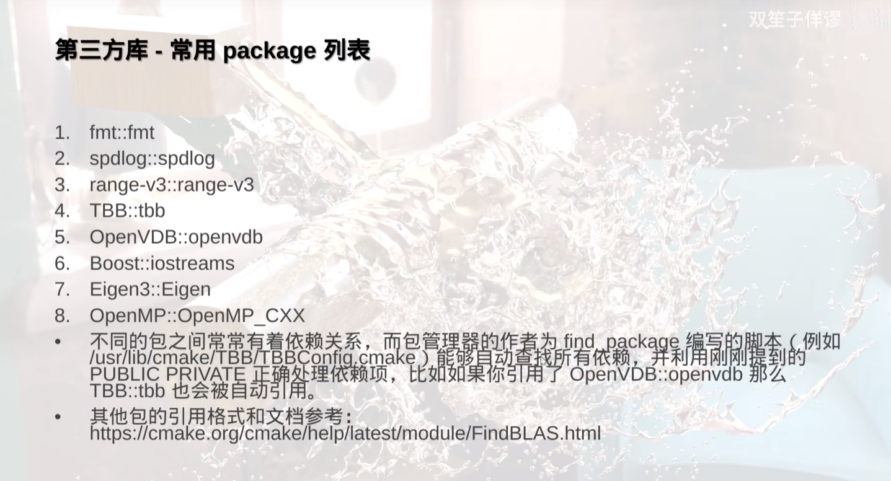

---
### 包管理器
包管理器不同   安装库
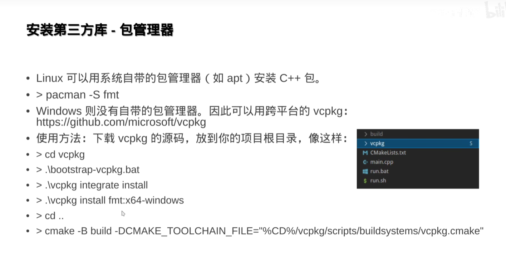

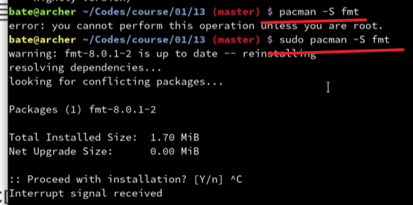

ubuntu 包管理器是
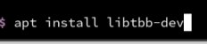

---

## 作业 CMake工程级别使用能力
