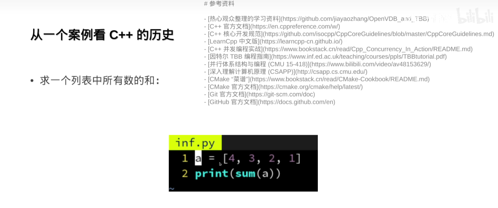
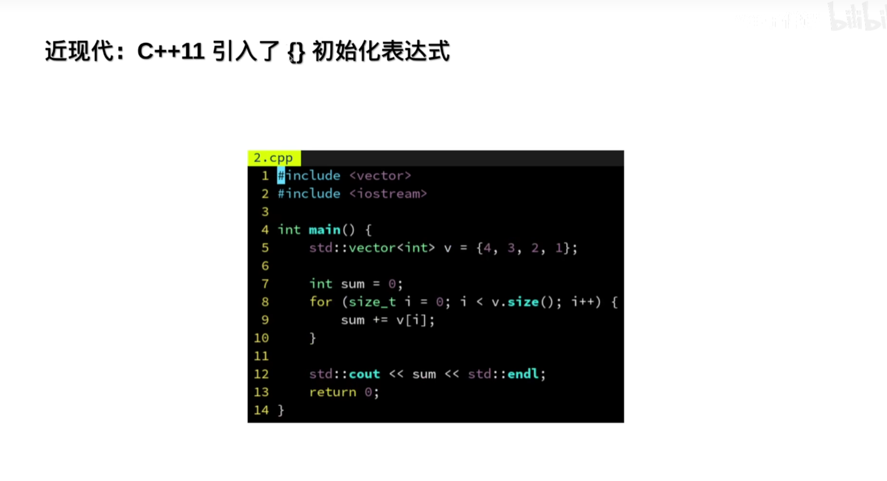
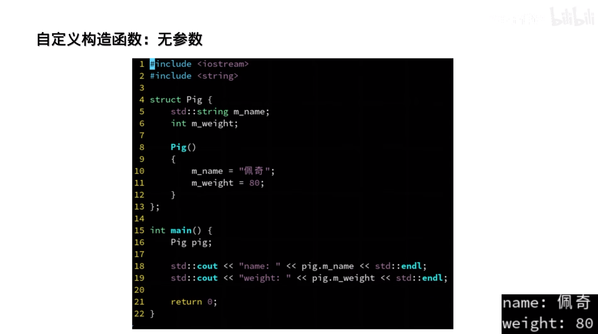
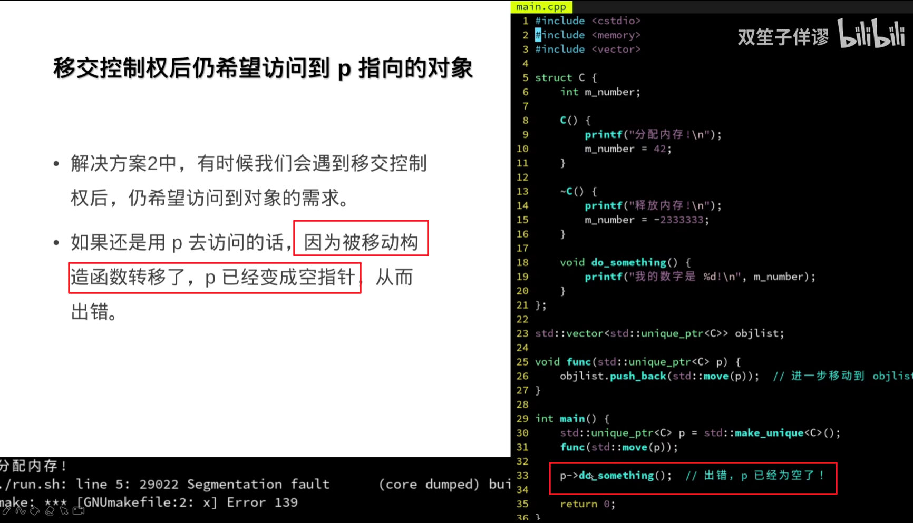
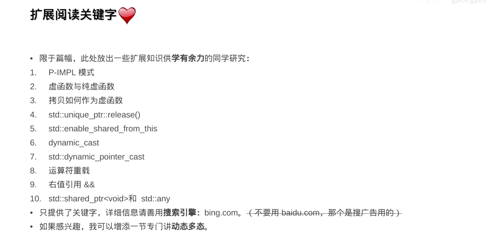

## 现代C++入门

### C++11 14 17 20 初步了解

---
基于迭代器的，，像list这种的也能正常使用

---
for_each是一个模板函数 可以支持任何具有begin和end迭代器的容器

---
Lambda表达式
C++11引入

C++14 允许auto

---
vector< T>
C++17 CTAD编译期参数推断，如tuple \pair  就不需要make_pair帮手了
运行时没有额外开销

numeric
C++17引入常用数值算法

ranges
C++20引入区间

mudule
C++20引入模块
import <>

C++20函数参数为auto

C++20引入coroutine协程和generator生成器

C++20引入format

### C++有哪些面向对象思想？

#### 封装

#### RAII
##### 资源获取即初始化 
尽量不去使用new delete

##### 避免犯错

##### 异常安全
throw异常后会自动调用已创对象的析构

#### RAII离不开构造函数

---
无参构造 : 先初始化为空后又赋值 两次

---
初始化表达式 ：直接初始化
类成员的const一定要使用初始化表达式，因为避免const变量空初始化 后再拷贝赋值给一个const变量

---
多参构造

---
单参构造

---
单参隐式构造(陷阱)

---
单参显示构造(陷阱)

避免陷阱的体现

---
explicit对多参也有作用

---
使用{} 和 () 调用构造函数区别
{}需要避免变窄转换

---
默认构造 POD plain old data

解决POD陷阱方案

---
加 {} 进行零初始化 nullptr
   obj=  { ， }  右边相当于一个整体 进行隐式转换
   obj{ ， } 一个一个 个体

---
初始化列表 C++11 

C++20支持 指定名称跳顺序  要求所有数据成员public

---
CTAD 编译时参数推断

---
自定义构造函数后若还想要一个默认构造函数 ：=default

---
拷贝构造函数   区别于指向同一个对象 copy一个新的对象操作

---

---
=delete

---
拷贝赋值函数

返回 &   是为了支持链式等号 a=b=c

---
全家桶
拷贝默认都是深拷贝
智能指针是浅拷贝 最好只有智能指针采用

---
学废啦

---
##### 实现一个简单有问题的Vector类

---
##### 三五法则

---
1、定义了析构函数，则必须同时定义或删除 拷贝构造函数和移动构造函数 --若不，默认拷贝函数对指针进行浅拷贝，会析构free指针两次，资源释放两次，出错。

---
2、拷贝赋值函数

---
为什么区分拷贝和移动
移动拷贝 深拷贝
移动： 接管所有权 被移动的对象数据情况

---
移动
swap  move

---

---
记得写noexcept

---
构造函数总结

彻底学废了

### 内存管理

#### unique_ptr

new C 如果C是POD随机初始化内存    new C() 零初始化

封装:不变  一组操作时原子的要么全做要么全不做  且都是处于正确状态
##### 禁用拷贝

##### 只是对其操作

##### move它的所有权

##### move希望再次访问它

##### 提前获得原始指针 

##### 但不能在再次操作前删除它

---

#### shared_ptr

多线程需要去考虑sharedptr的原子性

##### 只要sharedptr?不要uniqueptr?  循环引用

#### weak_ptr不计数  解决循环引用

weaker.lock() 会+1 然后出作用域-1  本行？

---
C++ 中的对象都是深拷贝；只有sharedptr和weakptr是浅拷贝 而 uniqueptr则是禁止了拷贝 只有move移动

---
### 三五法则什么时候需要考虑

### 扩展

### 作业 

https://github.com/parallel101/hw02

#### 1.P-IMPL模式
PIMPL（Pointer to ​IMPLementation）是C++中实现接口与实现分离的核心技术，通过隐藏实现细节显著提升代码的封装性、编译效率和二进制兼容性。

#### 6.dynamic_cast
C++中唯一具有运行时类型检查能力的类型转换操作符，主要用于多态的安全转换。
