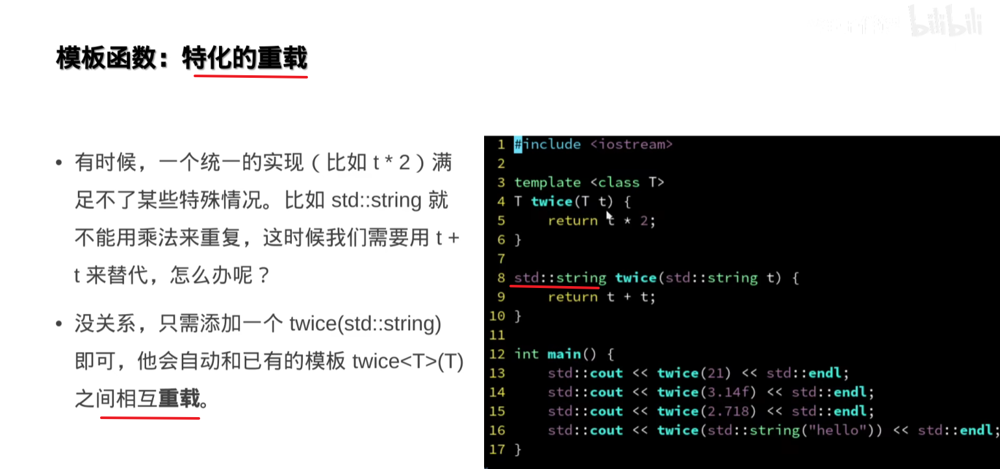
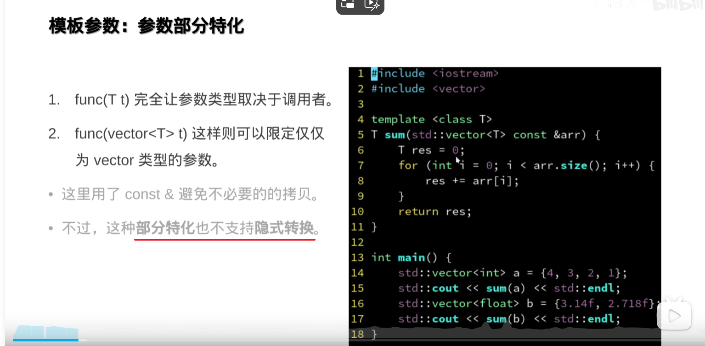
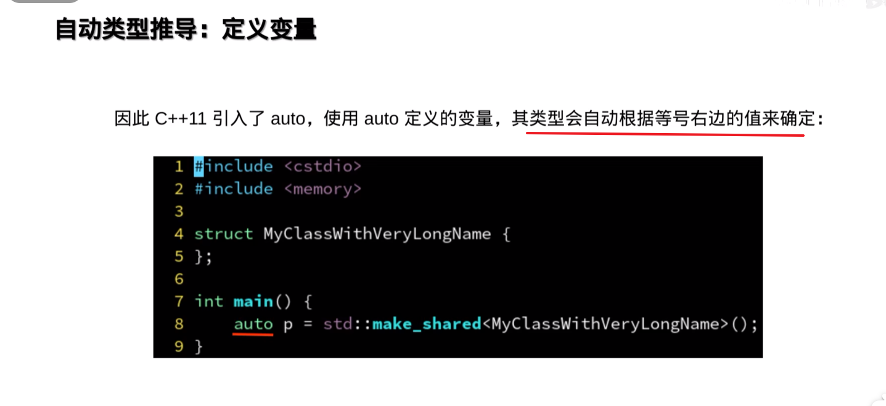
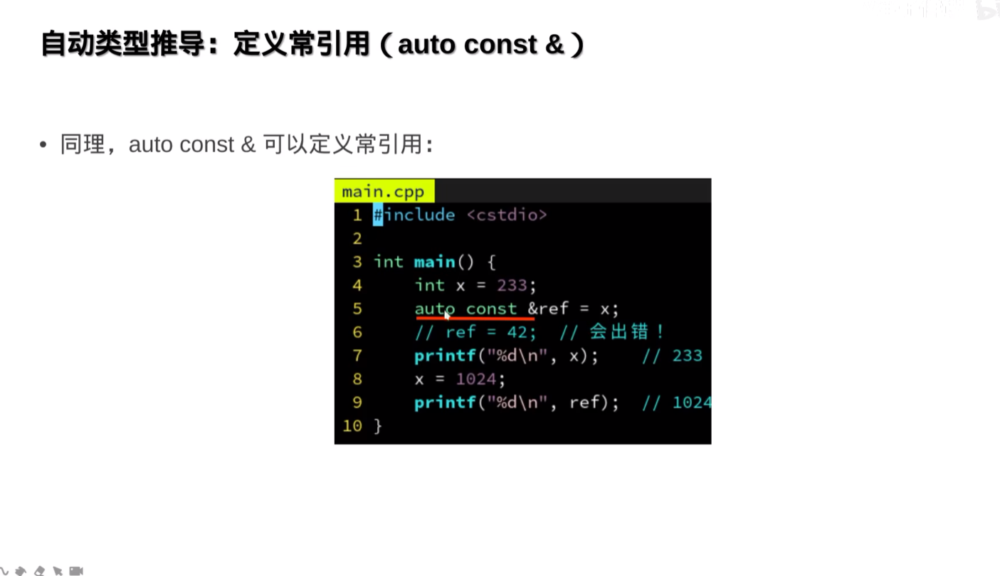
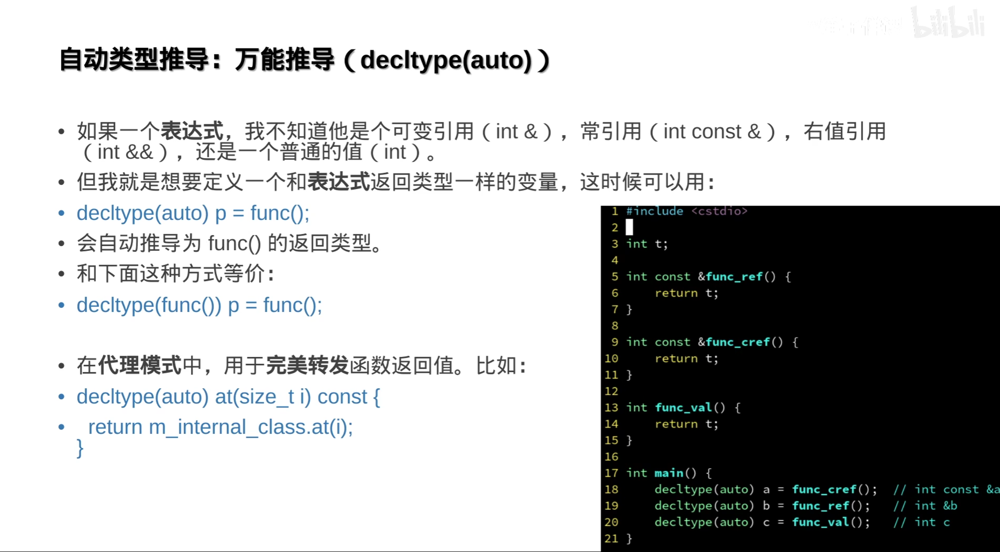
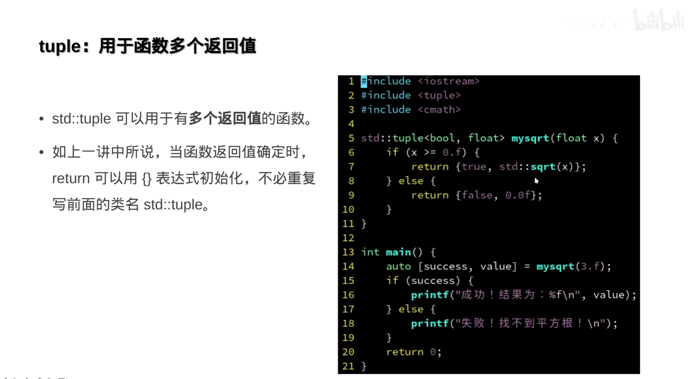

[TOC]

## 作业 待补
https://github.com/parallel101/hw03

## 模板函数
### 模板函数参数

#### 为什么需要模板

#### 定义

#### 自动推导参数类型

#### 特化的类型重载

#### SFINEAE
SFINAE是Substitution Failure Is Not An Error的缩写，意思是**当模板参数替换失败时，编译器不会报错，而是将该模板从候选函数中剔除。**这允许我们**根据类型特性选择不同的模板实现，从而实现编译时的多态。**
总结使用SFINAE的步骤：定义类型特性、使用enable_if启用/禁用模板、提供特化或重载版本，并测试各种类型的调用情况。同时，指出C++17之后的更简洁方法（如if constexpr）作为备选方案，但SFINAE在C++11/14中仍然是主要手段。

---

#### 默认参数类型 无法自动推断

#### 整数int\enum做模板参数

#### 多个模板参数 
自动推断

#### 参数模板部分特化  不支持隐式转换

---
#### 为什么支持整数作为参数模板

#### 为什么过度使用模板，编译会变慢
因为每一次模板被实例化，就会编译一次

---
### 模板的应用
#### 编译期优化案例

---
会自动生成两个函数 一个<true> 一个<flase>
具体要看编译器是不是智能点

---
#### 编译器分支

---

### 模板的难题
#### 编译期常量的限制

---

#### 编译期常函数

---
#### 移到另一个文件中定义出错

#### 延迟编译

##### 代理模式

#### 重载<< | 打印 a vector< T>

#### 配合运算符重载

#### inline  垃圾  上个时代产物 对函数没什么用

编辑器会自己判断会不会inline， 

编译器放到它寄存器里？  他自己会   

模板
static  func

---
### 学废了

---

## 自动类型推导

### 自动类型推导
#### 为什么需要自动类型推导auto

#### 定义变量

#### 局限性

#### 函数返回值

#### C++特性 引用(int &)

#### C++特性 常引用(int const&)
ref必须被初始化

#### 自动引用(auto &)

#### 自动常引用(auto const &)

const_cast 绕开const  不安全

#### 函数返回引用

#### 懒汉单例模式

c++标准规定 static一个对象，只有在第一次进入时才会初始化

#### 理解右值

#### 理解const

#### 查看类型名的小工具

#### 获取对象类型 decltype
少个float

#### typeid

#### std::is_name_v<a,b> 判断两个类型是否一样

#### C++14 _v _t

#### 万能推导decltype(auto)

decay 退化

#### using

#### decltype 例子

#### typename  C++11 14

#### 废了

## 函数式编程

### 函数也是对象
#### 函数作为参数 传函数的起始地址

等价函数指针

#### 函数作为模板类型

### Lambda表达式

#### 结构

#### 闭包

#### 常饮用避免拷贝 [&]捕获指针

#### 作为返回值  匿名

#### 作为返回值 的问题

#### 作为返回值 解决 [=] 捕获值

#### 如何避免用模板参数

[] 退化成指针了

#### lambda + 模板

#### C++20 <class T>

#### 用途举例

##### yield

##### 立即求值

##### 局部实现递归

#### 还有别的

#### 废了

### 常用容器

#### tuple

##### 打包多个类型 get引用

##### 结构化绑定

##### 用于函数多个返回值

#### optional

##### value_or

##### value()  抛异常

##### * ->

##### bool() 等价 

#### variant

##### 安全的union

##### get<>

##### 判断类型 holds_alternative<>()

##### index()

##### null_opt  查查 

##### visit

##### visit 支持多个参数

##### visit 可以有返回值

