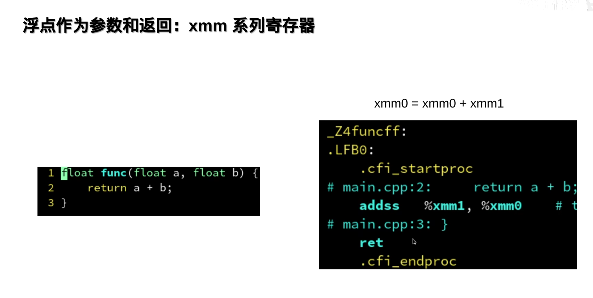

[TOC]

## 汇编语言

### 寄存器
#### x64架构下的寄存器模型

CPU 里面的  ； 比内存读取快

RIP当前执行代码的地址

YMM/XMM  支持两个double一起计算加法  效率高
float 也用它 常用高效
#### 通用寄存器 64

局部变量 存到寄存器 更快

rax共用 eax

avx521 zmm
avx ymm  256
sse xmm 128

#### 命名规则和含义

### AT&T Intel 汇编语言

### gcc 用的是更麻烦的AT&T

#### 返回值：通过eax传出
头部： 一个简洁  一个标记多少行

#### 前6个参数通过 寄存器...传入

把寄存器%  存入堆栈rsp中 -4 -8... 指的是堆栈上的地址
生命周期与rsp密切相关？

 

#### 开启优化： -O3

只用 -4(%a)  高效

#### 32乘法运算: imull

SISC 复杂指令集

#### 64乘法： imulq

#### 整数加法乘法： 被优化成leal  读地址

#### 指针访问对象： 线性访问地址

movslq 将32位esi转换成 64rsi

#### 指针的索引尽量用size_t

#### 浮点数做参数和返回: xmm系列寄存器

### 什么是xmm系列寄存器

#### addss是什么意思

#### 为什么需要SIMD？

### 第一章：化简

#### 编译器优化：代数化简

#### 编译器优化：常量折叠

#### 编译器优化： 放弃优化情况

#### 内存分配在堆上和栈上的容器

#### constexpr :强制编译器在编译期求值

### 第二章：内联

#### 调用外部函数 ： call指令

有一个声明，，实际实现在另一个文件中

#### 优化： 从call变jmp

#### 25:50 欠

