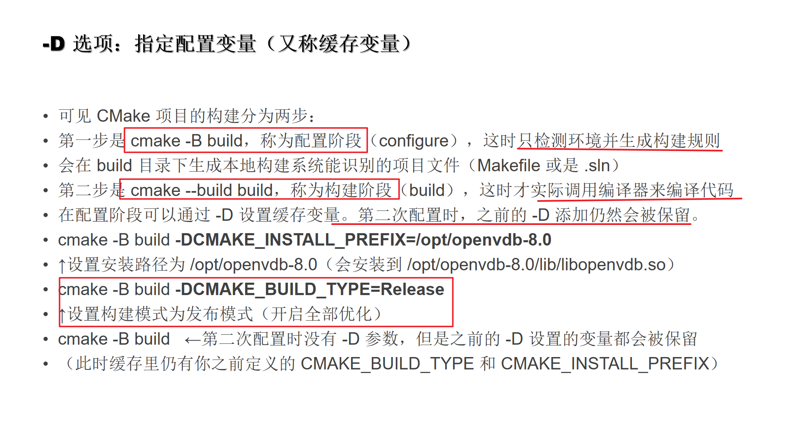
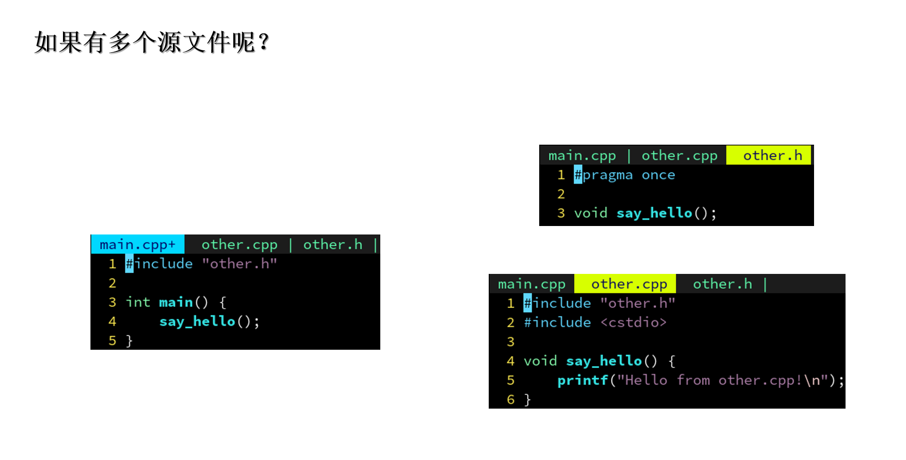
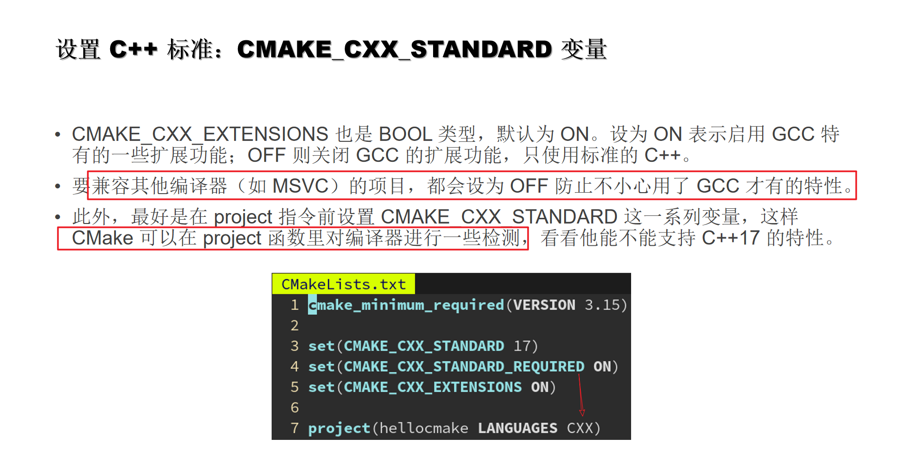
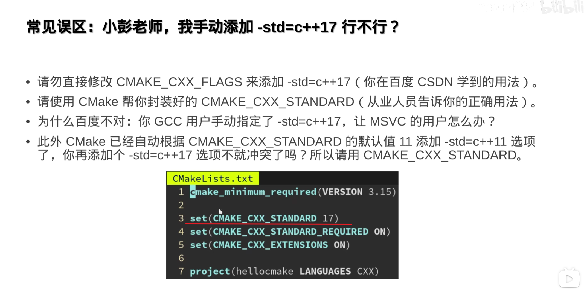
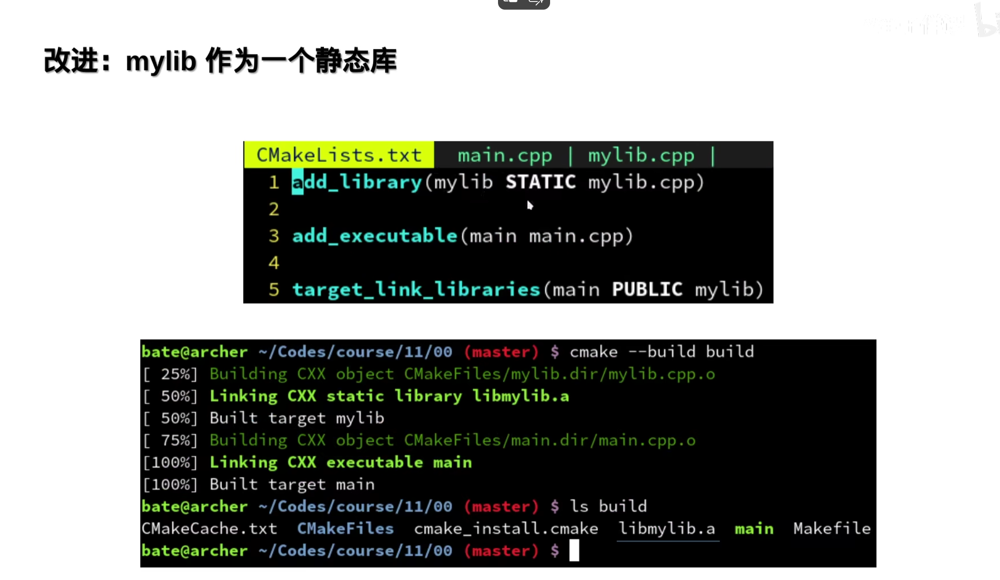
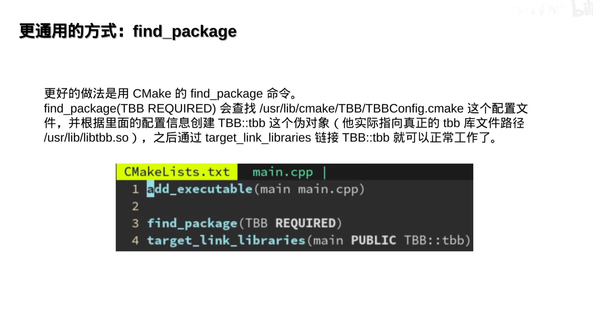
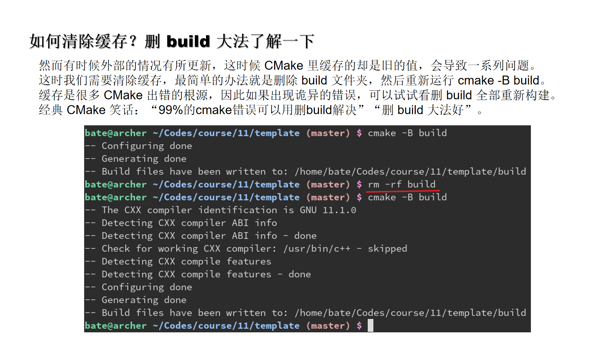
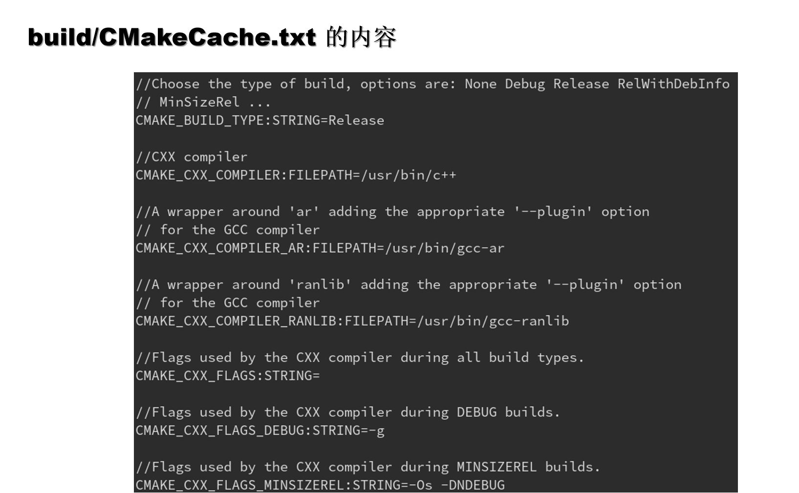
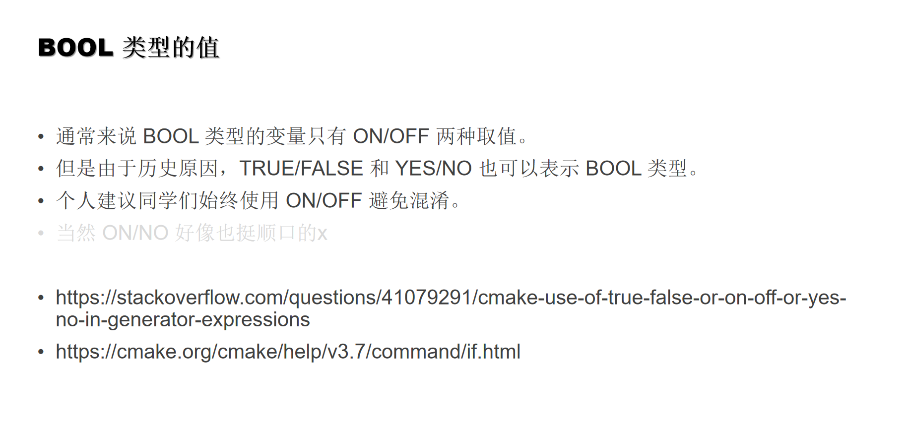
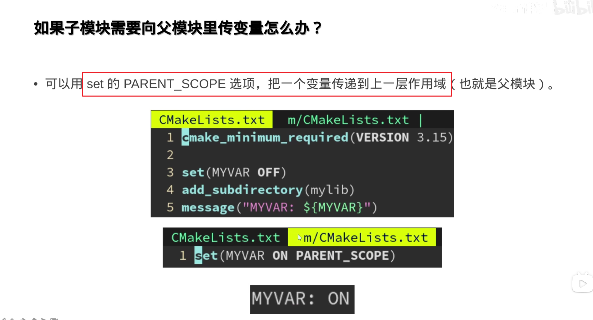

[TOC]

## 

### 为什么学现代CMake？

### 命令行

#### -B 构建cmake

#### -D 配置变量

#### -G 生成器Ninga

### 添加源文件

#### 一个源文件

#### 多个源文件

#### 源码在子文件夹 建议都放到src下

---
### 项目配置变量

#### CMAKE_BUILD_TYPE 调试发布

#### project: 初始化项目信息

https://cmake.org/cmake/help/latest/command/project.html

#### project: LANGUAGES

#### project: VERSION
显示版本号

#### project: 一些描述

#### C++标准： CMAKE_CXX_STANDARD

https://crascit.com/2015/03/28/enabling-cxx11-in-cmake/

#### CMAKE的 ${} 表达式

#### CMAKE cmake_minimum_required 指定最低版本
https://runebook.dev/zh-CN/docs/cmake/command/cmake_minimum_required#policy-settings

#### cmake --version

#### cmake 更新

#### tools

#### 一个CMakeLists.txt 标准模板

### 链接库文件

#### add_executable

#### target_link_libraries

#### add_library

#### 对象库 OBJECT
https://www.scivision.dev/cmake-object-libraries/

#### 静态库

#### 动态库

#### BUILD_SHARED_LIBS

#### 常见坑点：动态库无法链接静态库

动态库 ：内存中的地址会变化 指定PIC
静态库 ： 地址不变换 没指定

---
### 对象的属性

#### set_property

#### set_target_properties

#### set

#### 错误示例

#### windows 动态链接库

##### 解决

---

### 连接第三方库

#### 案例 TBB

#### find_package ——QT

#### QT

#### PUBLIC

#### 老年案例

### 输出与变量

#### message

### 变量和缓存

#### 缓存

##### 重复执行 cmake -B build 

##### 清除缓存

##### find_package缓存机制

##### 设置缓存变量set

##### 常见问题

##### 更新缓存 删build

https://www.cnblogs.com/Braveliu/p/15614013.html

#### 案例

已经进缓存了

option ccmake可以看到

### 跨平台与编辑器

#### Cmake中定义宏

#### target_compile_definitions

#### 生成器表达式
https://cmake.org/cmake/help/latest/manual/cmake-generator-expressions.7.html#genex:PLATFORM_ID

https://cmake.org/cmake/help/latest/variable/CMAKE_LANG_COMPILER_ID.html#variable:CMAKE_%3CLANG%3E_COMPILER_ID

#### 指定编辑器

#### vimrc
如何安装插件
github.com/archibate/vimrc

### 分支与判断

#### BOOL

#### if

### 变量与作用域

#### 父子模块变量传播

#### 独立作用域

#### 环境变量 访问

#### 缓存变量 访问

#### ${} 找局部变量 | 缓存变量

#### if (DEFINED)

#### if (DEFINED ENV{xx})

#### bash设置环境变量尝试

export X=1
echo $X
/
X=3 env

#### 其他建议

##### CCache

##### run伪目标

##### configure伪目标

### 其他

