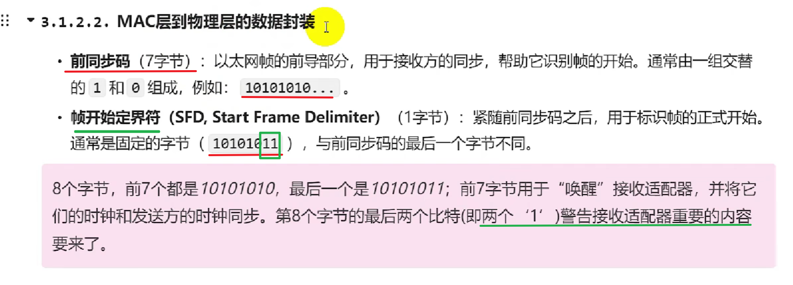
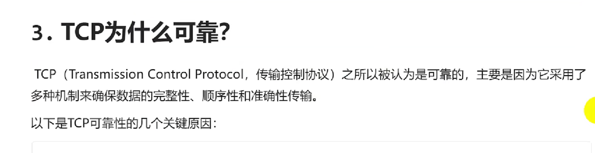

[TOC]

## 网络基础

### 协议和分层

#### 协议

**要素**

#### 分层

### 数据组织和传输

> 使用 IP  MAC地址 C->S
> 使用端口 找到对应进程
> 
#### 流程

### TCP/IP四层模型、MAC和IP

#### TCP/IP四层模型

> 应用层的HTTP.. 相当于货物；传输层的TCP相当于搬运工具；网络层IP相当于导航；网络接口层相当于高速路。

**TCP四层详解**

#### 数据链路层的工作机制

##### MAC

> 64 - 46 = 18(6+6+2+4)
> 

#### 网络层工作机制
##### 网络层功能

##### IP协议

##### IP数据报格式

---

### ARP协议

#### 工作流程

#### ARP协议包格式

#### ARP请求应答示例

### 主机通信WAN

> 主机A通过ARP 找到局域网网关的MAC地址，封装数据给网关，网关**通过IP进行下一跳寻找到广域网路由** ，期间更新设备MAC地址；找到主机B所在的局域网网关发送ARP请求（用IP寻），主机B应答返回会MAC。

#### 流程

---
### TCP协议

#### TCP

#### TCP特点

#### TCP为什么可靠（重要）

#### TCP包头格式解析

####  TCP包头示例

---

### TCP三次握手和四次挥手

#### TCP协议的过程

#### 三次握手
（三次握手有很多问答）

#### 四次挥手

#### 抓包测试
wireshark

---

###  字节序 大端小端

#### 大端存储小端存储

#### 为什么有大小端转换问题？

#### 如何检查自己的电脑是大端还是小端？

#### C++20 大小端处理函数

---

## socket编程与TCP协议 (核心)

### socket

### 网络通信的三要素

### socket与TCP的关系

### 如何使用socket编程（流程）

### TCP服务端实现
在linux系统上部署

---

### sockaddr_in结构体

---

### socket重要数据结构和函数解析

#### socket函数

---

#### setsockopt函数

---

**SO_REUSEADDR 选项是否必须？**

---

---
#### bind函数

----
#### listen函数

---

#### accept函数

---
#### recv函数

**recv() 返回值等于 0 TCP连接关闭**

---
#### send函数

---
#### close函数

---
#### connect函数

---
### TCP客户端实现

---
### C/S交互和其他延伸

