[TOC]

## 网络基础

### 协议和分层

#### 协议

**要素**

#### 分层

### 数据组织和传输

> 使用 IP  MAC地址 C->S
> 使用端口 找到对应进程
> 
#### 流程

### TCP/IP四层模型、MAC和IP

#### TCP/IP四层模型
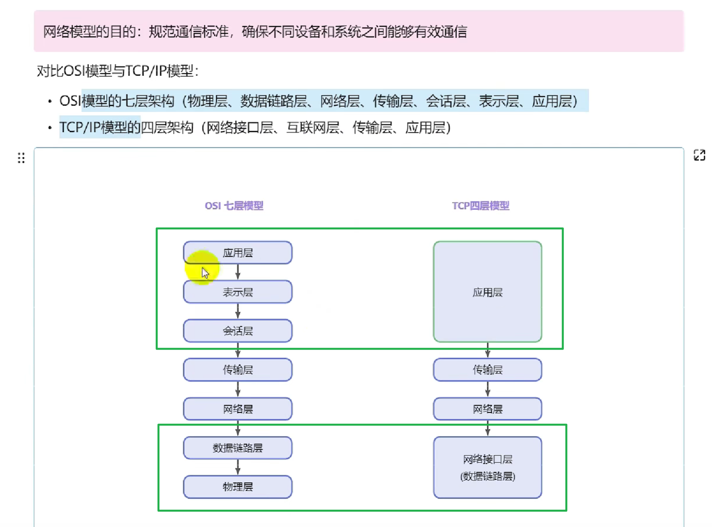
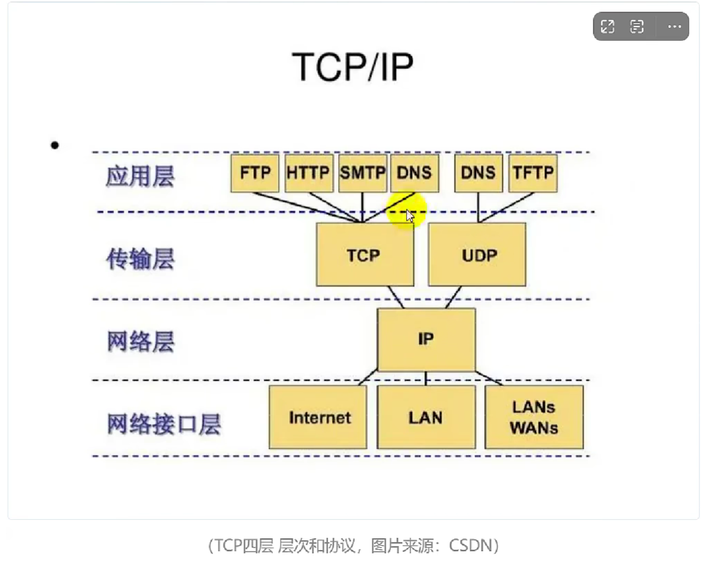
> 应用层的HTTP.. 相当于货物；传输层的TCP相当于搬运工具；网络层IP相当于导航；网络接口层相当于高速路。

**TCP四层详解**

#### 数据链路层的工作机制

##### MAC

> 64 - 46 = 18(6+6+2+4)
> 

#### 网络层工作机制
##### 网络层功能

##### IP协议

##### IP数据报格式

---

### ARP协议

#### 工作流程

#### ARP协议包格式
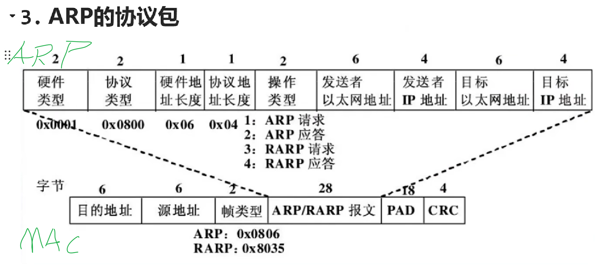

#### ARP请求应答示例

### 主机通信WAN

> 主机A通过ARP 找到局域网网关的MAC地址，封装数据给网关，网关**通过IP进行下一跳寻找到广域网路由** ，期间更新设备MAC地址；找到主机B所在的局域网网关发送ARP请求（用IP寻），主机B应答返回会MAC。

#### 流程

---
### TCP协议

#### TCP

#### TCP特点

#### TCP为什么可靠（重要）

#### TCP包头格式解析

####  TCP包头示例

---

### TCP三次握手和四次挥手

#### TCP协议的过程

#### 三次握手
（三次握手有很多问答）

#### 四次挥手

#### 抓包测试
wireshark

---

###  字节序 大端小端

#### 大端存储小端存储

#### 为什么有大小端转换问题？

#### 如何检查自己的电脑是大端还是小端？

#### C++20 大小端处理函数

---

## socket编程与TCP协议 (核心)
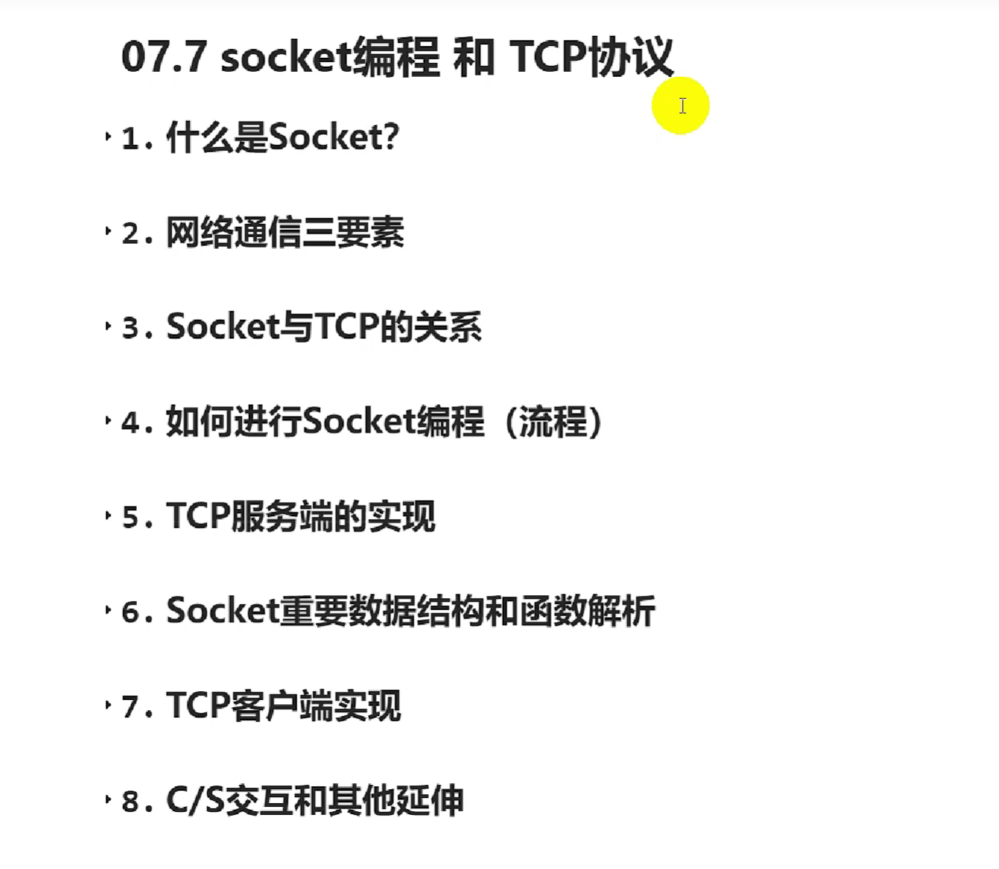

### socket

### 网络通信的三要素

### socket与TCP的关系

### 如何使用socket编程（流程）

### TCP服务端实现
在linux系统上部署

---

### sockaddr_in结构体

---

### socket重要数据结构和函数解析

#### socket函数

---

#### setsockopt函数

---

**SO_REUSEADDR 选项是否必须？**
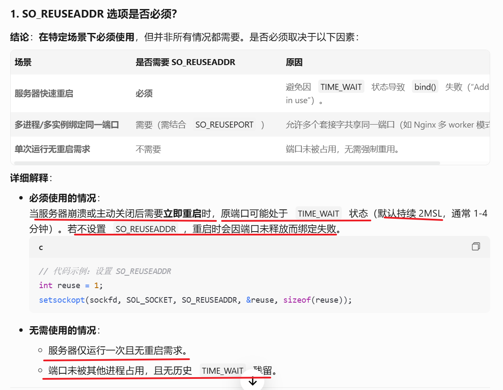

---

---
#### bind函数

----
#### listen函数

---

#### accept函数

---
#### recv函数

**recv() 返回值等于 0 TCP连接关闭**

---
#### send函数

---
#### close函数

---
#### connect函数

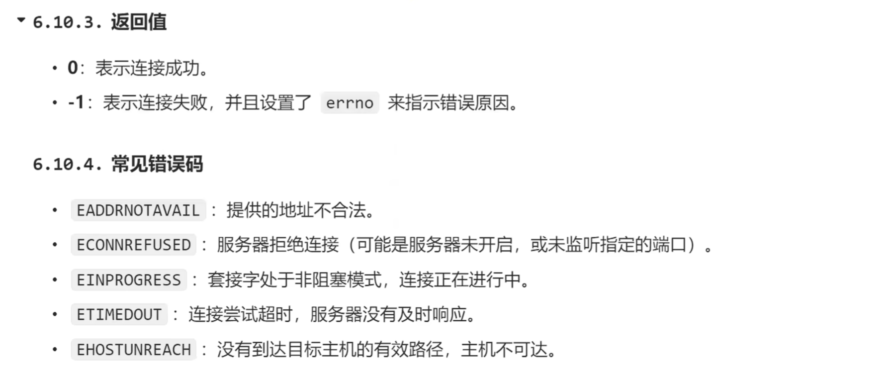

---
### TCP客户端实现

#### Windows版本

---

#### Linux版本

---
**服务端**

**客户端**  填写自己的服务器IP

**结果**

---
### C/S交互和其他延伸

#### 如何实现一对一聊天

---
##### 服务端代码实现

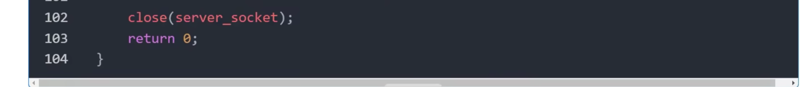

##### 客户端代码实现

##### 说明和改进

----

#### 常见的服务端高并发方案

---

##### 多线程/多进程模型

---

##### I/O多路复用 （epoll用的比较多）

---

##### 异步I/O

---

##### 事件驱动框架

---

##### Reactor模式

---

##### Proactor模式

---

##### 协程

---

#### 使用epoll改进的例子

---

## socket编程和UDP协议

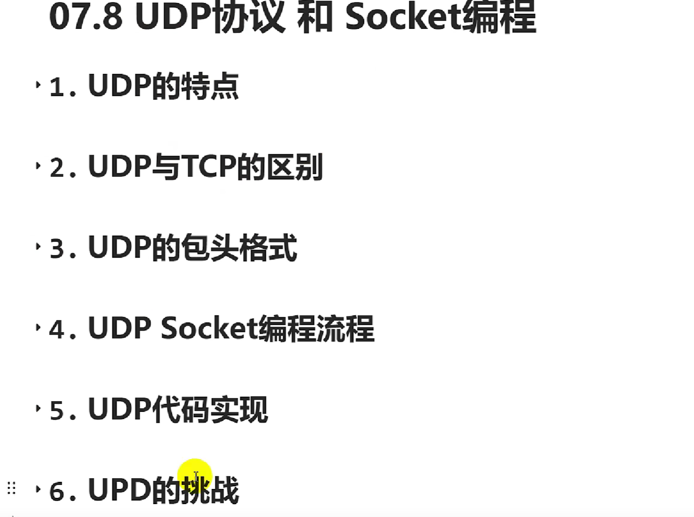

---
### UDP特点

---

### UDP与TCP的区别（面试高频题）

---

### UDP包头格式

---

### UDP socket编程流程

---

### 代码实现

#### 服务器

---
#### 客户端

##### Linux

---

##### Windows

##### 实现示例

---

---

#### 函数细节

---

##### recvfrom函数

---

##### sendto函数

---
##### 关于<ws2tcpip.h>

---
##### WSADATA结构体

---
##### memset函数

### UDP的挑战

---

## IP 单播 广播 组播 任播

### IP

---

---
**回环地址**127.0.0.1

---

---

### 单播

---

### 广播

---

---
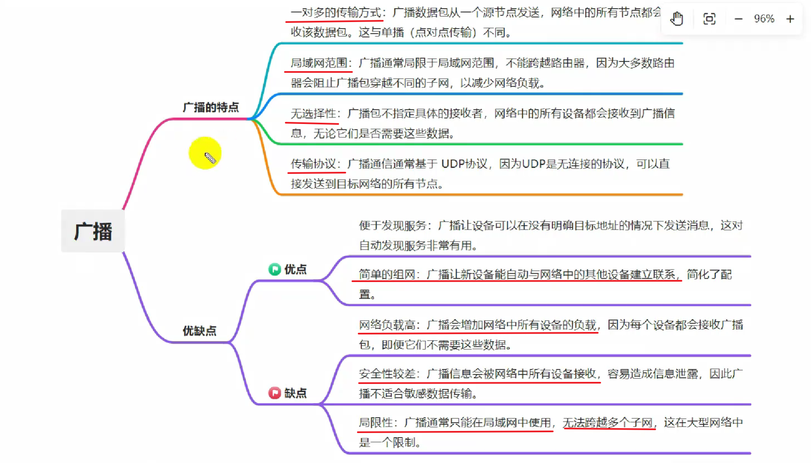

---

---

---

---
#### 代码示例

---
**Linux发送端**

---
**Windows发送端**

---
##### 代码说明解释

--

---
### 组播
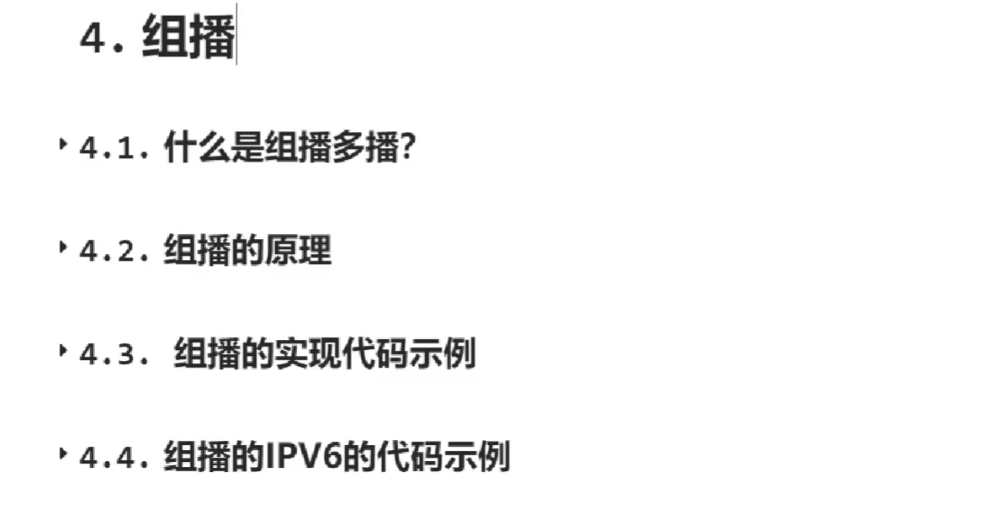

---

---
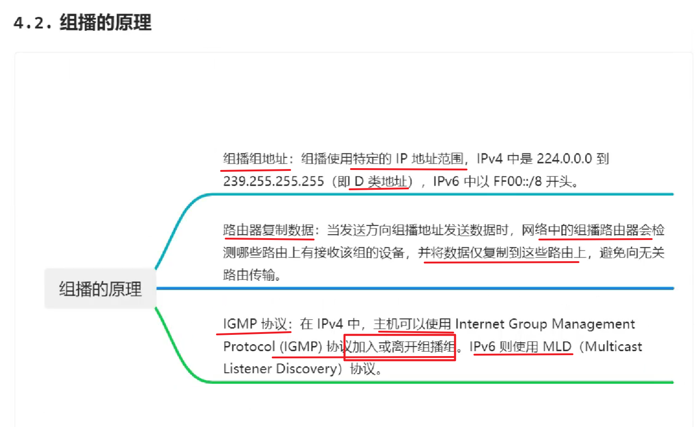

---

---
#### 代码

---
#### 发送端Windows版

---
#### 接收端Windows版

---
#### 函数参数注意事项

---

#### 待补充Linux版

----
#### IPv6组播代码

**剩余代码上面差不多**

---

### 任播

**多个主机绑定同一个IP，动态选择一个**

---

---

---
#### 示例

---
#### 代码（发送和接收）

---

---

---

### 播的比较

---

## HTTP s

---
### 基础知识

#### 一次http请求过程

---
##### 底层过程

